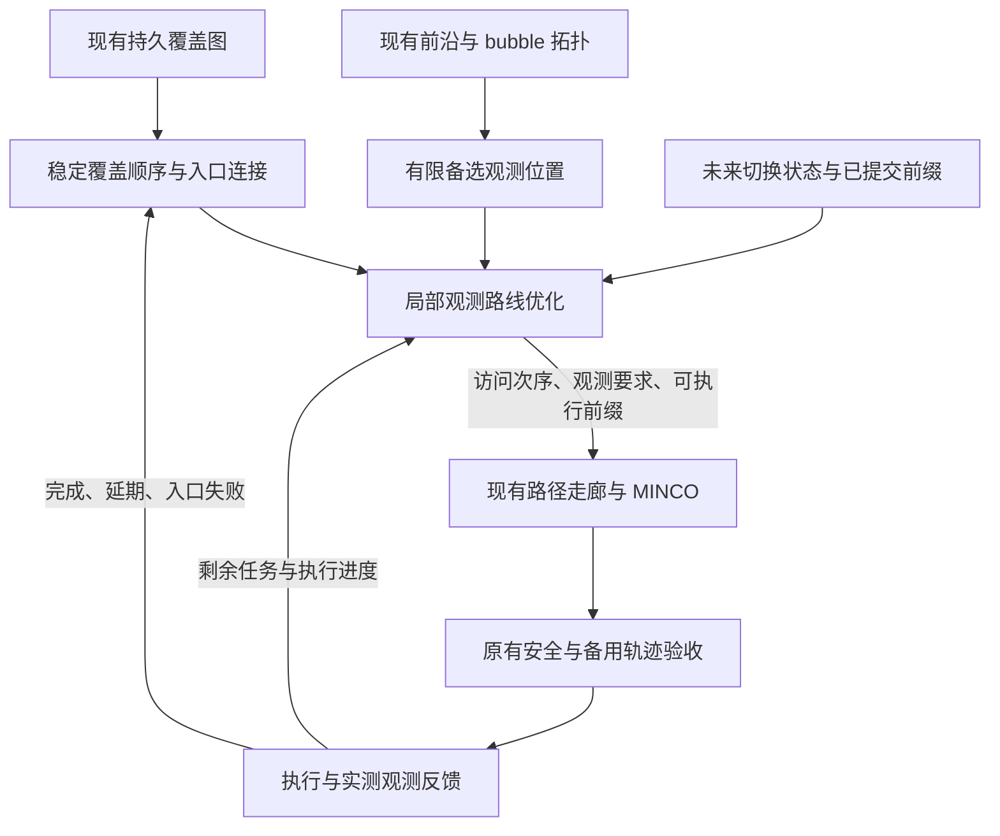

**覆盖意图驱动的局部观测路线优化方案（2026-09-11，设计稿）**

目标是在当前 General Planner 内补齐覆盖意图与执行之间的结构联系，减少无效掉头、回访、过早制动和停滞。保留持久覆盖地图、点云前沿、bubble 拓扑、MINCO 和已有安全提交机制，通过一个覆盖专用的局部观测路线层改进协作。本文是完整分析和设计，不是已实现的功能或性能结果。

“优于 EPICON”作为实验验收目标：在相同传感器、运动约束和独立覆盖标准下，探索完成率不下降，达到目标覆盖的时间、长停滞和无效回访减少。更复杂的表示和后端不能自行证明更高性能，也不承诺在所有地图、算力和噪声条件下全面占优。

**1. 对 FALCON、EPICON 和现状的准确定位**

FALCON 的关键联系是：保留 coverage path 剩余区域节点的先后关系，让当前区域及首个相关区域的视点插入其中；部分视点可安排在离开当前区域之后。它因此既表达长程意图，也允许局部任务延期。论文将该问题建模为带 precedence constraints 的 SOP，随后单独细化视点并在自由空间生成轨迹。[FALCON，第 V-B、V-C 节](https://arxiv.org/html/2407.00577#S5.SS2)

核对的 EPICON 版本是 `18a15586fcdd0a5848a96e80c0a213dae9670aeb`。其公开主链把未知节点与普通视点共同排序，并从后续未知节点获得局部细化的出口；细化实际调用 Dijkstra，输出一个候选子序列。被删去的视点并不因此被证明不可达、无观察价值或以后不需要再访问；这是必须补上的任务管理语义。仓库包含 SOP 实现不代表主链运行了 SOP。[EPICON 局部细化](https://github.com/ZikangYuan/epicon/blob/18a15586fcdd0a5848a96e80c0a213dae9670aeb/global_planner/exploration_manager/src/fast_exploration_manager.cpp#L140)

当前 General Planner 已有覆盖顺序、多个补漏入口、运动时间估计、观测球通过检查、安全前缀、备用轨迹和受阻报告。主要缺口是：这些信息尚未形成一个统一的、带覆盖顺序约束和观测任务语义的局部路线问题。详细 EPICON 审查见[前一份分析](epicon_exploration_refactor_analysis_20260911.md)。

**2. 当前源码中的具体断点**

| 位置 | 当前行为 | 对效率与鲁棒性的影响 |
| --- | --- | --- |
| `CoverageGuidanceManager::clusterPenalty()` | 将区域顺序压成每个候选的代价；`preferredClusterIds()` 提供候选偏好 | 入口、出口、区域之间的先后关系在跨层传递时丢失 |
| `FastExplorationManager::planGlobalPath()` | 普通视点优先；补漏执行需等待普通池耗尽；综合代价选首点后固定首点运行 TSP | 覆盖意图影响普通选择，但无法直接重排局部任务到后续区域之间；TSP 很难纠正已经确定的首点 |
| `FrontierManager::selectBestViewpoint()` | 每个簇最终给出一个代表位置和 yaw | 若最适合从另一侧通过的视点已被淘汰，路线优化只能迁就当前代表点 |
| `CoverageObservationContext` | 当前仅描述一个位置球 | 连续观测主要是对当前目标追加延续，尚非多任务路线的完整执行接口 |
| `general_planner_adapter.cpp` | 已有严格的路径、动力学、观测与提交验收 | 上游较粗的可达代价与最终可提交性仍有差距；优化成功也不一定能及时提交 |
| 区域/任务身份 | 有 `stable_id`，但 active target 的键依赖当前 `zone_id`；未知分组还受近远尺度与合并影响 | 当顺序升级为约束后，必须保证跨更新同一约束仍指向同一区域/入口 |

最后一项不是仅根据字段名判断：`buildPlan()` 每轮通过扫描与连通分量重建区域编号，active target 使用 `stableGroupId("active:" + zone_id)`。这个哈希具有确定性，但区域重编号后并不自动保持实体身份。现有入口别名与失败历史可复用，仍需要区域及分裂/合并的显式对应关系。

覆盖图以相邻体素连接区域，代价主要来自区域中心距离及未知惩罚。这适合长程近似，不能直接证明门洞、楼梯入口或狭窄连接具有运动可执行性。把当前 CP 顺序硬化之前，应提升近场入口连接的证据等级。

对应源码：[覆盖结构](../src/Planner/general_planner/include/general_core/exploration/exploration_utils/coverage_guidance/coverage_types.h)、[覆盖构建](../src/Planner/general_planner/src/general_core/exploration/exploration_utils/coverage_guidance/coverage_guidance_manager.cpp)、[前沿视点](../src/Planner/general_planner/src/general_core/exploration/exploration_utils/frontier_manager/frontier_manager.cpp)、[全局决策](../src/Planner/general_planner/src/general_core/exploration/highspeed/fast_exploration_manager.cpp)、[执行上下文](../src/Planner/general_planner/include/general_core/exploration/highspeed/coverage_motion_policy.h)。

**3. 增加的中间层及其边界**

覆盖层负责“还要推进到哪些区域”；中间层负责“这次如何观察并通过”；后端负责“从实际状态安全、平滑地执行”。当前 FSM 仍管理任务启动、暂停、安全恢复和终止，不再额外平行维护一套完整探索 FSM。

正常运行时由中间层统一拥有本轮访问序列。原综合首点选择器保留为显式旧策略对照或中间层不可用时的降级入口，不能在新路线产生后再次独立改写首点。合法的安全重规划不受序列保持限制。

**4. 将 coverage intention 变成结构信息**

一次覆盖快照至少应包含：稳定区域身份、接下来若干 anchor、anchor 的先后关系、每个区域的入口/出口候选、相关观测任务、可延期任务、地图依赖与版本。建议先看当前区域及后续 2—3 个 anchor；这是计算预算起点，不是固定理论最优值。

必须区分三类对象：

| 对象 | 含义 | 是否能直接执行 |
| --- | --- | --- |
| 未知区域代表点 | 未来探索意图和长程路线代价的参考 | 不能仅凭该身份执行 |
| 入口或连接节点 | 从已知自由空间接近某区域的连接候选 | 通过局部地图和路径验证后才可执行 |
| 观测任务 | 指定目标表面/未知边界及可接受的观测位置、朝向 | 满足观测条件和运动要求后可执行 |

全局层可以对未知连接保留带不确定性的预测；局部层只能提交经过验证的连续自由前缀。远期 anchor 不可直接到达时，应执行朝它推进的边界观测，或更换其入口，而不是要求 MINCO 穿过未知。

因此结构约束主要是 `q1 ≺ q2 ≺ q3`、任务归属及允许插入区间，不是强制经过每个 CP 中心坐标。墙体、门和楼梯需要多个独立入口，避免用几何中心将不同侧或不同楼层混为一体。

顺序约束只在本轮意图有效且对应连接仍成立时保持。入口失效、关键新连通性出现、窗口内无可执行动作或持续无进展时，应扩大窗口、改入口或请求覆盖层重排；不能靠硬锁保证所谓一致性。

**5. 保留有限备选视点，而非过早固定每簇一个点**

前沿采样、观测质量计算和拓扑连接继续复用。中间层前的输出改为：每个入选任务保留少量不被支配的备选观测位置，例如从不同入口可达、不同 yaw、对出口方向更顺的代表。初始建议每任务最多 2—3 个，局部总量控制在约 6—8 个任务；优先限制总节点数和时间预算，不能让两个上限相乘后无限扩大。

备选筛选依据是有效观测、入口连接、净空与通过方向。明显观测更少、连接更差且运动更困难的备选可去除。高速度下当前不能直接到达，不能自动推导为在整条路线中不可用：应区分“当前首段不可行”和“经过前一任务减速/转向后可行”。

安全门仍然是硬约束。延期候选不应先套用从当前速度直接到它的全部首段反向限制，也不能跳过真正执行它时的动态验证。

**6. 局部路线问题：有先后约束、有观测任务、允许延期**

令 `s` 为未来提交切换状态；`Q` 为顺序固定的短覆盖骨架；`V_g` 为任务 `g` 的备选观测位置。求从 `s` 出发、将观测任务插入 `Q` 的开放路线。一个可实现的优化形式是：

\[
\min_{\pi}\quad
\widehat T_{\mathrm{exec}}(\pi)
+\widehat V_{\mathrm{suffix}}(\pi)
-\lambda_G\widehat G_{\mathrm{unique}}(\pi).
\]

约束包含：覆盖 anchors 的先后关系；每个任务的备选位置互斥或明确允许的组合；已经承诺且仍有效的观测要求；碰撞/连接/动力学约束；执行前缀的已知自由与制动要求；局部时间/长度预算。

这里 CP rank 不再作为可被其他 reward 抵消的奖励。`T_exec` 使用同一运动模型评估完整路线；`V_suffix` 只估计窗口之外或终端状态连接到后续意图的代价，若相同则可省去，不能重复计算窗口内边。`G_unique` 是沿路线去重后的预计新增观测，`lambda_G` 有明确的时间/观测收益量纲，而非再叠加一套区域、wait、debt、return 偏好。

必需任务约束优先于收益。除了正在执行的有效观测，还应从延期任务中按确定规则晋升有限的、已经验证可执行的任务，防止低收益侧房永远被排除。任务是否必需应由任务状态规则决定，不能只把每个任务的 reward 越积越大。

若当前阶段的任务都属于必须完成的固定集合，可直接去掉收益项，求最小执行时间的带组选择和先后约束路线。若允许部分任务延期，则必须同步输出延期归属和重新考虑条件。不能仅求普通最短路并丢弃未选节点。

仅有执行过入口、没有新的可观测目标，且没有新的拓扑推进时，不应反复生成零收益迁移。低收益可作为探索通道所必需的成本，但须记录其预期推进目标和失败期限。

**7. 比 EPICON 局部筛选更完整的任务保存机制**

局部规划输出应明确三部分：本轮执行任务、未来插入任务、当前不可执行任务。被延期的任务保留目标空间、区域/连通分量、备选入口、最近观测结果和下次考虑条件。

建议的逻辑生命周期是 `PENDING → PLANNED → EXECUTING → VERIFYING → OBSERVED`。规划未选中保持 `PENDING` 并登记延期；一次入口失败进入对应入口的 `DEFERRED` 状态。区域 `BLOCKED` 需要入口和观察尝试审计，不能由一次路线落选产生。这些是中间层内部任务状态，不要求给 ROS FSM 增加同名枚举。

避免永久饥饿的条件包括：局部任务数量有界；已验证可达的延期任务在有限次同区域决策后进入必需集合；区域退出审计检查尚有任务的归属；安全或地图变化可以暂停该保证，并解释原因。对持续不稳定或确实不可达的环境，不声称有限时间完整覆盖的数学保证。

观测收益不能直接累加每个视点的 frontier 数。两个位置看到同一批边界时，应对稳定体素/表面标识去重；可用有限采样集合或位图估计，不需要为全部候选重新遍历全地图。地图变化使预测有误时，以后续实测更新任务。

**8. 顺滑性必须进入整条路线代价和边界状态**

首段使用实际未来切换时刻的 P/V/A/J 和 yaw 状态，后续段携带有限的进入/离开方向与速度状态。单纯每条边都从零速度估时，会再次把可连续通过的路线算成若干停车动作。

代价应反映可达到的速度、转弯降速、制动、垂向运动及 yaw/FOV 要求。位置移动和 yaw 可以同时进行时不能机械相加；使用联合可行时间或相应下界，必要的观测停留再单独计入。不能仅依据直线距离与最大速度评估路径。

低成本实现可以先使用路径端部切向、转角与离散速度档位，对候选序列快速估时，再对优胜序列做真实动态路径和速度剖面复核。若采用仅含 `(visited_mask,last_node,anchor_progress)` 的动态规划，它对带历史速度/转向的模型并非精确；需要增加有限运动状态或保留多标签，明确近似性质。

后端只接收优胜计划的安全前缀和必要观测约束，保留当前几何修复与降速重试规则。不要对所有排列运行 MINCO；后端验证失败可反馈一个入口/局部几何冲突，再在同一预算内尝试下一方案。

**9. 从“通过目标球”提升到“在移动中完成观测”**

`CoverageObservationContext` 可以扩展为有界观测任务序列：任务身份、可接受空间区域、yaw/FOV 条件、需要看到的边界集合，以及最小有效观测条件。第一步允许复用已有观测球；之后应使其范围由实际可见性支持，避免所有任务都被硬化为半径很小的必经点。

优化后验证位置轨迹进入所选观测区域、yaw 与感知要求相容；执行中验证真实里程计及新点云证据。到达或穿过是执行事件，收到足够新观测是覆盖完成事件。二者分离后可以继续沿安全路线移动，同时等待有界的地图反馈，而不用每个点停住等待更新。

若点云过期或预期观测没有发生，应对任务重新评估。对已经被其他路径观测完成的任务允许释放旧约束；释放必须依据更新证据，不是仅因全局选择换了一个候选。

保留已实现的走廊顺序保护和轨迹经过检查。跨窄门、急回转、观测必须驻留、延续未知或无法提供安全制动时，允许计划内减速/停车。目标是消除由决策断裂引起的无效停车，不是取消物理上必要的停车。

末状态区分：可继续的滚动边界、需要停车的观测边界、任务终止边界。只有安全延续、动力学和备用轨迹验证通过时才使用非零末速度。未来未知 anchor 的存在不构成非零末速度许可。

**10. 将任务稳定性与轨迹稳定性分开**

应保持的是短期有效意图和已提交的安全执行前缀；尚未提交的远端视点可以随地图细化。当前目标锁可以演变为这种前缀保持机制，不能长期锁住一个位置，仅靠冷却和反复失败解锁。

每轮局部优化获取一个不可变 coverage snapshot，关联 frontier/地图依赖和任务身份。构建候选、计算 rank/约束、输出计划过程中不应混读不同 coverage 版本。提交前重新验证涉及的空间、观测和起点状态。

地图任意更新不应使全部缓存失效。缓存按入口、路径影响范围、净空余量、运动起点条件及观测依赖失效；涉及当前执行安全的变化立即处理。区域拆分/合并维护身份对应，避免任务进度和失败计数随着中心点或分辨率变化消失。

覆盖图已有异步工作线程，可继续低频更新；局部路线按任务进度、连接变化和执行截止时间触发。传感器、实时安全和轨迹执行不能等待组合优化完成。具体重规划提前量应依据实测规划时延分布与安全执行剩余时间设置，同时保留硬截止和制动后备；P95/P99 估计本身不是最坏情况安全保证。

**11. 有界求解与失败处理**

初始建议约 6—8 个局部任务、每任务少量备选、2—3 个覆盖 anchors。覆盖层保留更远顺序，中间层不构建全场视点排列。构造可行初解后，用保持 anchor 先后关系的插入、交换和备选替换改进；规模允许时使用带状态标签的动态规划/束搜索。所有改进都受时间预算限制，并保留当前最好可行解。

复用拓扑连接和候选边缓存；先做便宜的可行性/观测过滤，再计算昂贵连接；只对排名靠前的序列做动态复核和后端优化。预算应覆盖视点重验证、路径连接和后端验证，不能只限制序列求解器。

失败分层处理：

| 失败 | 下一步 | 不应产生的结论 |
| --- | --- | --- |
| `HEAD`/提交时刻错过 | 更新切换状态，在安全命令允许时重试 | 区域不可探索 |
| 某入口路径失败 | 换同任务的其他入口/连接，保留入口历史 | 整个未知分组无效 |
| `SPATIAL`/走廊冲突 | 换局部路径或有限几何修复 | 只要继续降速就一定成功 |
| `DYNAMICS` | 调整通过状态、速度与局部顺序 | 必须永久放弃观测 |
| 已执行但无观测收益 | 校验点云、FOV和遮挡，换观测方向或延期 | 到达就代表已完成 |
| 当前窗口无可行计划 | 扩窗、换 anchor 入口或请求重排 | 等待旧失败目标自动变好 |

原有受限 CAUTION、入口失败预算和 `BLOCKED` 仍保留。新路线层不得把空解直接映射为 `FINISH`。

**12. 当前部件如何调整**

| 当前部件 | 调整方式 |
| --- | --- |
| 持久体素、分组、覆盖统计 | 保留；增加区域身份对应、近场入口连接与结构快照 |
| `preferredClusterIds` | 用于预算内候选生成；不再代替局部结构约束 |
| `clusterPenalty` | 新策略中退出主要顺序决策；旧策略/无 guide 降级可保留 |
| `future_return` | 新策略由覆盖后缀和延期任务承担其职责后移除；候选边仍可复用 |
| wait/pass debt/region bias | 合并为任务延期与窗口规则；避免与结构顺序重复表达同一意图 |
| goal lock | 收窄为有效执行前缀与短期意图保持，安全失效可立即解除 |
| 普通与补漏的严格执行后备池 | 新策略中改为统一任务接口；未知意图始终参与结构，实际动作仍须满足不同证据要求 |
| 单簇最佳视点 | 增加有界备选输出，默认旧接口保留给其他模式 |
| 安全前缀/连续观测/走廊保序 | 保留并接入计划中的观测序列 |
| MINCO 核心、boundary mapping | 本设计不要求修改 |
| 其他任务模式 | 继续使用默认接口，覆盖上下文按调用传递 |

这不是把新机制全部加到旧总代价后面。覆盖模式的新策略接管一段明确的决策链，同时逐项停止使用已被替代的偏好；底层几何、感知和轨迹能力继续复用。

**13. 实现顺序与验收关口**

1. **接口和证据先行。** 增加稳定 anchor/入口身份、不可变结构快照、任务到区域的关联及延期记录。用影子输出比较新旧选择，不改变执行。测试区域重编号、分裂/合并、楼层隔离与地图版本变化。
2. **局部结构优化接管首点。** 在当前已知可行视点上求带 anchor 顺序的局部路线，先不同时改变轨迹后端。验证 anchor 顺序、任务延期不丢失、窗口无解扩展和规划时间预算。
3. **有限备选与运动估时。** 让局部路线选择更合适的入口、位置和朝向，增加方向/速度标签与真实动态复核；用消融判断其对成功率和算量的净收益。
4. **观测序列与执行一致。** 扩展覆盖上下文和实际观测验证，复用现有 MINCO、安全与提交机制；检查中间任务没有被走廊简化删除，后续默认调用不残留覆盖约束。
5. **恢复反馈和重复状态收敛。** 合并新策略中重复的锁/奖励，完成长期延期公平性、有限恢复和结束审计回归。

主要落点是 `coverage_types.h`、`coverage_guidance_manager`、新增覆盖专用局部路线模块、`fast_exploration_manager`，然后才是前沿备选接口、`fsm_utils`、`coverage_motion_policy.h` 和 `general_planner_adapter` 的衔接。新增配置只控制覆盖模式；现有源码 launch 用于对照，发布包二进制需要独立构建与验证，不能默认同步。

**14. 怎样证明最终效果优于 EPICON**

需要两个层次的对照：

- **整系统对照：** EPICON 原版、当前 General Planner、新方案，统一传感器、任务范围、起点、执行器限制和外部评价。保留各自内部表示，但使用同一观察覆盖判据。安全约束差异必须明示，不能把放宽约束换来的速度计作路线优势。
- **同后端消融：** 在同一个 General Planner 地图与后端上比较当前策略、复现的 EPICON 风格混合排序/出口细化策略、新的顺序约束与观测任务策略。第二项须标记为 EPICON 风格复现，不冒充 EPICON 原版实验。

评价空间在试验前固定，采用独立于规划器的观测统计；模拟器真值只给评估器，不能泄漏给规划器。有效体素集合若包含无法观测的墙体内部，不得临时改变分母来宣布完成；可以预先定义有依据的可观测任务集合，同时报告全任务范围内剩余未知和不可认证部分。

建议覆盖走廊侧房、环路、多楼层楼梯、窄门、稀疏大场景、遮挡死角，并加入点云延迟、局部噪声和起点扰动。每类至少安排多次同条件成对试验；10 次/场景可作为初始计划，再按波动和资源调整。原版 EPICON 的 `FINISH` 不直接当作达到公共覆盖标准。

| 维度 | 主要指标 |
| --- | --- |
| 鲁棒性 | 公共任务完成率、碰撞/安全验收、错误成功报告、无法恢复的停滞 |
| 效率 | T50/T80/T90 或公共覆盖目标耗时、行程、重复区域进入、每米新观测 |
| 顺滑性 | 同覆盖阶段低速占比、最长静止、无效制动、反向切换、加速度/jerk 的峰值与分布 |
| 实时性 | 规划与后端延迟的中位数/P95/最大值、提交超时、CPU/内存 |
| 完整性 | 延期任务是否再次考虑、终止时剩余未知、入口耗尽原因 |

超过时间预算或提前 `BLOCKED` 的运行作为失败/截尾结果保留，不能只比较成功样本耗时。用成对结果及置信区间区分真实收益与随机拓扑/线程时序波动。判断收益时先满足安全和公共完成率要求，再比较效率与顺滑性，避免牺牲探索完整度获得更好速度曲线。

作为项目内部的预设目标，可以要求目标覆盖耗时中位数相对基线减少约 10%，低速累计减少约 20%，同时公共完成率不下降、没有新增安全违规；这些数字是待试验确认的工程目标，不是现有证据支持的预测。与 EPICON 的比较也必须满足同样前提，不能用早停或仅某个表现最好的覆盖阈值证明领先。

**15. 本次结论的证据边界**

静态源码与 FALCON 原文支持引入结构化局部路线这一方向。当前已有闭环报告表明上轮达到 80% 的耗时改善，但低速累计没有改善，说明“单点修复与策略叠加”尚未形成统一收益，见[覆盖停滞报告](coverage_stall_fix_20260911.md)。本设计尚未运行，不能据此断言已超过 EPICON。

取证优先关联一次任务决策、局部路线、路径搜索、优化尝试、提交和执行结果。完整 L-BFGS 逐迭代记录只在求解器原因不明时深入；现有[轨迹优化 trace 设计](trajectory_optimization_trace_design_20260911.md)仍是设计稿，不能将其当成已采集到的证据。
