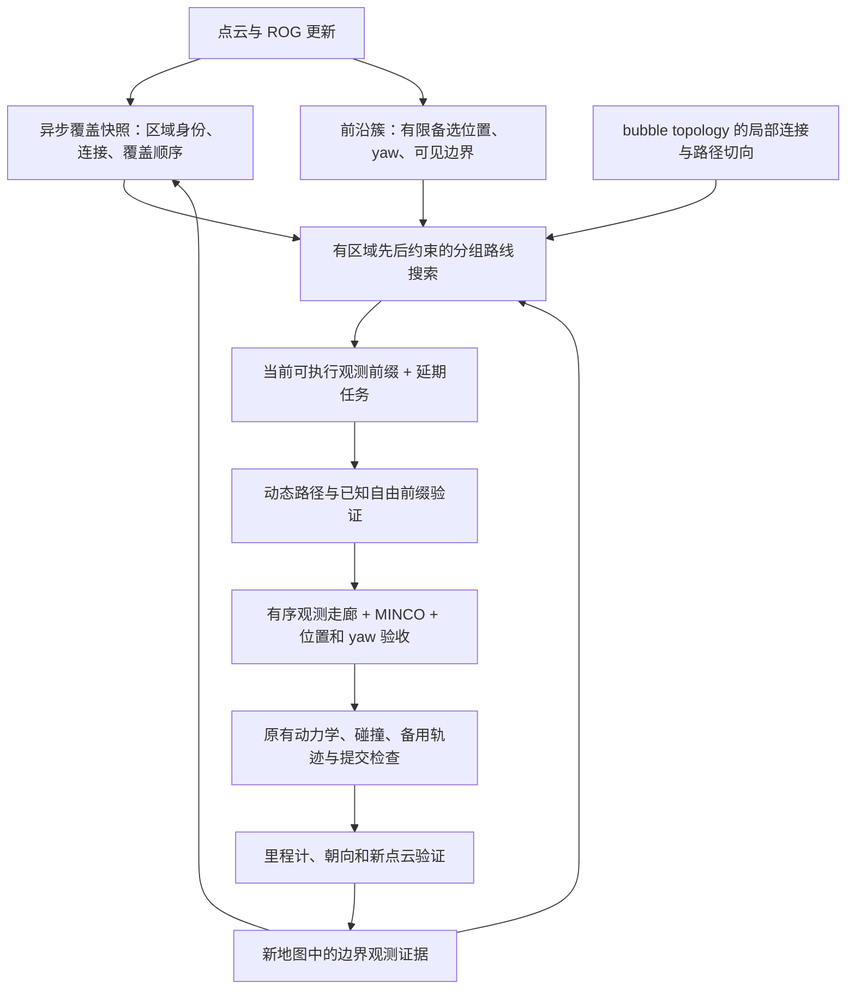

**覆盖意图与观测路线实现记录（2026-09-11）**

本轮在源码版 General Planner 中加入覆盖专用的局部路线层，沿用现有点云前沿、ROG、bubble topology、MINCO、安全备用轨迹和终止审计。入口是 `roslaunch task_planner exploration.launch coverage_route_enabled:=true`。新路线层当前默认关闭：闭环已接通，但性能验收未通过。它不要求替换地图或修改 MINCO 边界映射。

验证结果见本文末尾。结构实现与性能结论分开：目前没有相同传感器、场景和覆盖判据下的 EPICON 原版对照，不能据此声称已经超过 EPICON。

**来源与采用的逻辑**

- [FALCON V-B/V-C](https://arxiv.org/html/2407.00577#S5.SS2)：保留区域节点的先后关系，将局部观测任务插入覆盖骨架，允许部分任务位于后续区域之间。
- [EPICON 源码，核对版本 18a15586](https://github.com/ZikangYuan/epicon/blob/18a15586fcdd0a5848a96e80c0a213dae9670aeb/global_planner/exploration_manager/src/fast_exploration_manager.cpp)：未知区域参与远期选择，后续覆盖意图反过来改变当前局部访问序列。详见本仓库已有的 EPICON 审查文档。
- 本实现继续使用 General Planner 的显式空间状态及执行后端；采用有界分组路线搜索，没有将 EPICON 的停止/完成规则或整套地图搬入工程，也不是论文 SOP 的精确求解实现。

**运行流程**



一次 `planGlobalPath()` 获取一个不可变覆盖快照。候选偏好、区域归属、短覆盖骨架及远期连接代价来自该快照；实际安全性在路径及提交阶段用当前地图重新验证。

近场观测之间的边来自原有 topology 搜索，保留路径长度、端部切向和弯曲信息。远期 anchor 之间的边来自覆盖区域图的连通代价，其中未知连接明确只是预测。未知区域中心不进入 `global_tour_` 的可执行点列，不能据此命令飞机飞入未知。补漏候选进入同一任务窗口前，仍须通过原有自由接近点、观测射线和失败入口筛选。

**区域身份与任务身份**

新增 `CoverageComponentIdentity` 使用前后两轮体素成员重叠匹配区域。区域重编号不改变身份；分裂时最大重叠部分继承；合并时一个确定的前身继承；自由/未知语义变化不会复用同一个区域身份。active target 不再对当轮 `zone_id` 做哈希。

未知远期分组仍沿用已有 fine/macro 分组及入口失败别名机制。它们的代表区域另有稳定 `region_id`，宏分组合并不是一个具有永久不变身份的物理房间。窗口内失效的 anchor 立即删除，短意图保持期到期后允许按新覆盖图重排。

普通观测任务通过可见边界重叠、区域身份和近邻位置关联，不能仅用重聚类后的数字 ID 作为任务身份。未选任务保留延期计数，并可重新进入候选生成的优先集合。等待足够长且多次延期的任务，每轮至多一个进入必需集合；安全可达性或窗口预算不满足时保留延期，不能把求解失败算作任务完成。

**局部路线求解**

实现文件为 `coverage_route_policy.h` 和 `coverage_local_route.cpp`，默认窗口最多 8 个任务、每任务 2 个备选、3 个 anchor。备选位置互斥。最终候选窗口保留近场名额，并为覆盖相关及长期延期任务保留名额，避免在末尾按距离截断时丢掉覆盖意图。搜索标签保留已访问任务、anchor 进度、进入方向、速度、观测集合及当前执行前缀。

目标由整段运动时间近似与去重观测收益构成。转弯会降低通过速度，后续视点不统一按从零加速/到零停车估时；位置与 yaw 可以并行完成时取联合时间下界。边界集合使用固定大小位图估计重叠，碰撞会低估收益，不会产生执行安全许可。

anchor 的先后关系是约束，不是一个可被收益抵消的 rank 奖励。首次经过虚拟 anchor 之前的普通/补漏动作组成可执行前缀，其后的任务保留为未来任务。恢复观测有独立的收益与入口验证过程，因此执行前缀到首次恢复动作处截断，不能提前假定它已完成。

补漏观测结束当前可执行前缀，其停车及后续重新加速进入路线估时。未知意图通过区域后缀表达，不人为生成可见边界或给同一意图重复奖励。

新的路线层直接拥有本轮首目标和后续顺序，不再运行旧的 `CandidateCostBreakdown`、`future_return` 和固定首点 TSP 来改写结果。旧策略可以通过配置关闭新路线层后用于对照。

搜索采用有限宽度多标签束搜索，不保证全局最优。组合搜索默认预算 5 ms，局部成对拓扑连接预算 35 ms；预算是检查点之间的软时限，一次进行中的拓扑搜索仍可能使总时延略超限。视点生成、拓扑图更新和后端优化不包含在这两个数值内。缺失的近场连接保持无效，求解无解时使用已验证的单动作降级并保留其余任务，不把欧氏直线伪装成可执行路径。

**观测执行与反馈**

`CoverageObservationContext` 支持最多三个有序观测区域，包含位置、半径、yaw 容差和任务身份，按调用传递。默认调用仍不带覆盖约束。

后端在现有安全走廊中插入有序观测门，保留走廊顺序；终点已经由 MINCO 硬边界约束，不额外生成退化的终点走廊。仅终点观测不关闭原后端的走廊简化；中途观测和几何修复保留有序走廊；覆盖观测及几何修复继续验证实际轨迹的已观测自由空间。优化之后按顺序检查实际位置曲线，再检查位置/yaw 联合条件。任何检查失败均不能替换当前已提交命令；连续观测失败可以退回同一个首观测任务的停车方案。

执行时要求真实里程计进入观测球、朝向满足容差、近期收到有效点云。已提交前缀中的下一个观测任务可直接接续，保留现有安全检查。通过事件携带已提交观测门的稳定任务 ID，候选刷新不改变该事件归属，重复事件不重置证据版本，随后进入 `VERIFYING`。更新过的前沿快照和任务原始采样边界中至少 70% 的独立传感器观测证据，才能将该局部任务记为 `OBSERVED`；如果已经从其他有效位置获得这些证据，可以在到达旧视点之前完成任务。该采样阈值不改变全局覆盖分母或完成条件。仅未出现在本轮候选窗口内不能证明已观测。证据独立记录在传感器可信观测分类路径中，去噪、无效法向、黑名单等逻辑写入的 `DENSE` 标签不构成该证据。

普通任务的无进展检测绑定稳定任务身份，使用接近距离与实测边界证据；小幅视点抖动不重置计时。超时后复用入口冷却机制，空间上不同的同簇备选仍可尝试。

新路线允许在尚不能执行完整目标路径时，先验证并执行可制动的已知自由前缀。路径不足以支持安全继续时仍允许降速、停车或恢复。选定的观测 yaw 通过覆盖上下文传入后端，避免被普通路径末切向覆盖。新路线的续接方向允许最多 1.2 rad 转角，由后端限速及位置/yaw 检查决定能否通过；旧策略保持原来的 0.6 rad 配置。

**保留的边界与限制**

- 原有 `HEAD` 超时、几何/动力学失败、入口冷却、CAUTION 时限和 `BLOCKED` 审计继续存在。空路线不等于 `FINISH`。
- 全局覆盖仍统计固定有效体素中的实测已知比例。候选耗尽但有未知时不能报告成功。
- 路线速度模型是低成本近似。起步速度和 yaw 可来自预计切换状态，首边几何仍复用当前 odom 拓扑搜索，因此还不是严格的未来切换状态成对代价；完整 P/V/A/J、动力学和制动可行性由现有后端判断。
- 观测球与 yaw 容差是有限近似，不是任意姿态下完整 FOV 的解析证书；新点云和后续边界证据是必要反馈。
- 当前不是跨所有场景的覆盖完备性证明，也没有新增动态障碍预测器。
- target exploration、state2state、tracking、perching 和 swarm 不进入新的单机覆盖路线策略。MINCO 核心及 `boundary_mapping.hpp` 本轮未修改。发布目录中的独立二进制未自动同步。

**配置与排查**

源码 house 配置增加 `coverage_route/*`，其中 `coverage_route/enabled: false`。显式测试新策略：

```bash
roslaunch task_planner exploration.launch coverage_route_enabled:=true
```

`coverage_route_enabled:=false` 使用旧选择器。省略该参数时尊重所选 YAML，可继续通过 `exploration_config:=...` 指定配置。launch 的默认值和显式 true 已用 `roslaunch --dump-params` 核对。源码 runtime 内嵌探索仍读取自己的 YAML，不受该独立 launch 参数隐式覆盖。

日志 `[coverage route]` 输出地图版本、任务/anchor/前缀/延期数量、必需任务、组合搜索时间、路线层总时间和完整局部顺序。`V` 是观测任务，`A` 是虚拟覆盖 anchor。关注 `safe singleton fallback`、yaw/order mismatch、VERIFYING 和 OBSERVED，可区分组合路线、执行可行性和观测证据问题。

**验证记录**

构建环境：Docker `ros1_noetic`，工作区 `/root/ws/real_planner`。分析产物位于宿主机 `analysis/coverage_route_20260911/`，闭环使用隔离 ROS master，不复用用户运行中的 master。

已通过：

- `coverage_route_policy_self_test`：身份重编号/分裂/合并/语义变化、anchor 先后关系、不可达必需任务、备选互斥、承诺首段、未知连接不可执行、非有限代价拒绝，以及覆盖出口改变局部首访问方向。
- 原有 coverage motion、coverage guidance、coverage recovery identity、target directed exploration、target route runtime、planner status、planning retry、yaw candidate 共八项相关测试。
- 真实 ROG + MINCO 集成：单点连续通过、拐角观测、有序双观测、错误 yaw 和反序拒绝、失败保留原轨迹，以及之后默认调用不残留观测约束。
- 8 任务 × 2 备选 + 3 anchors 的纯路线压力例：100 次均得到有效解；本机首次测得最大约 3.58 ms。该数值不包含拓扑连接、前沿和轨迹优化，也不是最坏时延保证。

真实后端集成中，直线观测点通过速度约 2.97 m/s，拐角观测点约 2.81 m/s；这证明接口能够连续通过，不能代替完整场景效率测试。target runtime 的 state2state → target exploration 闭环到达 20 m 目标，约 13.43 s，未出现 coverage route / coverage motion 事件。最后的通过事件 ID 修正另外由集成用例验证，包括候选刷新、邻近任务隔离、重复事件及已过期任务。

闭环对照使用同一 house 场景和 `task_planner/exploration.launch`。`baseline` 是本轮改动前已有覆盖运动策略的运行，`optimized` 是最后一次新路线闭环，目录名不代表测试通过。后者在最终通过事件 ID 修正之前运行；该修正之后重编译并重跑集成用例，没有据此声称再次完成全场景测试。

| 指标 | 本轮改动前 baseline | 新路线最后一次闭环 |
|---|---:|---:|
| 达到 80% 覆盖的时间 | 114.36 s | 156.86 s |
| 到 80% 时累计速度 < 0.1 m/s | 20.77 s | 24.24 s |
| 到 80% 时路程 | 174.81 m | 219.77 m |
| 终止时覆盖率 | 84.99% | 85.22% |
| 终止时间 | 266.18 s | 258.51 s |
| 状态 | BLOCKED | BLOCKED |

这组结果是性能回退，不能作为“更顺滑、更高效”的验收结果。最后一轮的退出原因是 `candidate_search_exhausted_with_unknown_voxels`：仍有 5,248 个未观测有效体素、119 个未解决未知分组，当前 18 个 actionable targets 已耗尽尝试。它表示当前候选搜索受阻，既不是探索完成，也不是证明剩余区域永久不可达。

2026-09-14 复核更正：最后一轮的 12 条 `transit observation` 日志全部满足观测点等于轨迹引导终点，因此是终点观测，不能计作 12 次连续观测提交。按日志中的观测点到续接终点距离大于 0.1 m 统计，新路线为 0 条、baseline 为 2 条；几何续接本身也不能代替真实非零速度通过证据。`comparison.json` 保留原始日志计数字段并补充终点/续接分类。7 次 `continuation fallback` 实际表示观测上下文重试，该分支也可能由终点观测失败触发。

最后一轮另有 130 次已观测自由前缀准备、14 次有界几何修复（7 次成功）。组合求解耗时约 0.24 ms 中位数，路线层含局部连接约 15.7 ms 中位数。主要剩余问题位于路线假设与可执行观测前缀之间：远期选择虽已约束局部顺序，但后端经常只能接受部分推进，路线层尚未充分利用这些执行反馈；普通前沿耗尽后的补漏候选仍未解决最终覆盖停滞。不能仅靠继续增加 anchor 权重或提高速度上限处理这些问题。进一步的代码与等覆盖率日志复核见 [退化原因复核](coverage_route_regression_review_20260914.md)。

全部迭代结果保留在 `analysis/coverage_route_20260911/comparison_all.json` 及各自 bag 中：

| 迭代目录 | 到 80% 时间 | 退出/观察窗结束覆盖率 | 状态 |
|---|---:|---:|---|
| structural_v1 | 127.74 s | 81.55% | 270 s 时 RUNNING |
| structural_v2 | 117.05 s | 85.33% | 270 s 时 RUNNING |
| structural_v3 | 143.95 s | 85.48% | 270 s 时 RUNNING |
| structural_v4 | 186.27 s | 85.34% | 270 s 时 RUNNING |
| structural_v5 | 未达到 | 61.77% | BLOCKED，净空恢复耗尽 |

v2 曾降低低速停滞，但后续审查发现观测证据、恢复任务边界及执行约束仍需修正，不能用该中间结果代替最终实现表现。每版只有一次场景运行，存在传感器时序及进程调度差异；本轮没有 EPICON 原版同条件实验。

完整产物：`comparison.json/png`、`comparison_all.json/png`、`validation.json`、`observation_integration.log`、`target_regression_final/`、各轮 `run.bag`、`params.yaml`、`launch.log`、`result.json`。当前交付的是可独立启用、可复现评估的结构实现；覆盖效率和最终补漏仍未达到本次目标，因此默认不替换原策略。
