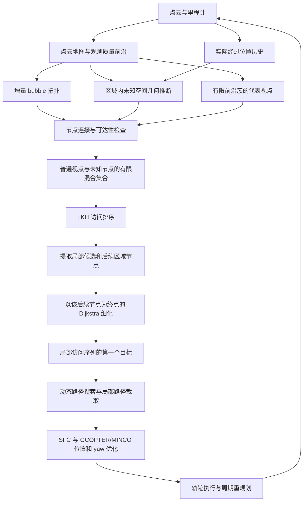
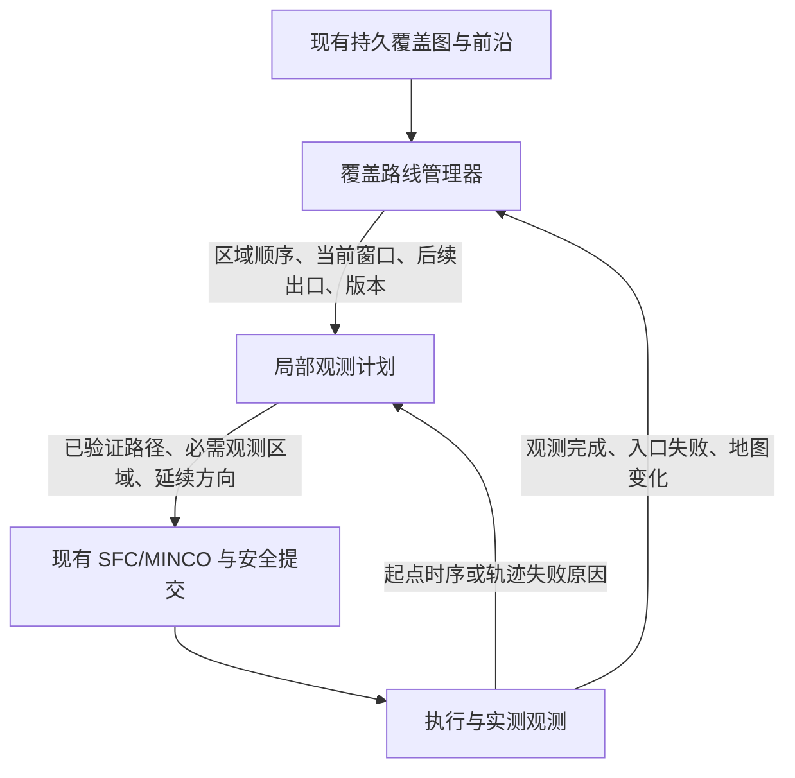

**EPICON 实际流程与当前覆盖探索的重构建议（2026-09-11）**

结论：适合将 EPICON 的“覆盖意图进入局部路径细化”作为重构参考。优先重构覆盖引导与局部决策之间的接口，保留当前地图、安全验收和轨迹后端。直接替换为 EPICON 的整个探索栈，不能保证解决停车、长时间恢复或完成误报。

本分析核对了公开仓库 `main` 的提交 `18a15586fcdd0a5848a96e80c0a213dae9670aeb`，以及本工作区包含前两轮覆盖优化的源码。EPICON 被下载到临时目录供静态审查，没有接入本工作区，也没有运行其闭环。本次只新增本文。以下“实际行为”来自源码；重构方案和预期收益是工程判断，不是已经验证的性能结论。没有取得论文全文，因此不将仓库中未执行的函数解释为论文算法的实际运行路径。

作者将该项目定位为点云地图上的覆盖路径引导探索，并明确以 EPIC 为基础、参考 FALCON。[项目说明](https://github.com/ZikangYuan/epicon/tree/18a15586fcdd0a5848a96e80c0a213dae9670aeb)

**1. 实际调用链**

这个图中的未知空间推断与碰撞验证用途不同。未知节点能影响路线，但“被推断为未知区域的代表点”本身不是安全自由空间的证明。

**2. 点云、前沿与未知区域分别表达什么**

前沿沿用 EPIC 风格的点云观测质量结构，增量更新簇，并对有限簇采样代表视点。视点生成先按粗略拓扑距离选取局部集合，再验证可达性、观察质量和 yaw。配置中的 `local_tsp_size` 限制这一步的规模。[前沿候选实现](https://github.com/ZikangYuan/epicon/blob/18a15586fcdd0a5848a96e80c0a213dae9670aeb/global_planner/frontier_manager/src/global_planning.cpp#L60)

未知区域来自另一条轻量几何推断链：保存实际经过位置，在更新区域内结合最近障碍距离和前沿距离构造轴对齐盒，将区域扣除这些盒后的剩余空间分块、按共享面连通关系聚类，生成加权中心。区域没有相交前沿时，代码会将其标记为已结束；未知节点主要从尚未结束的更新区域生成。这避免了为这项推断单独建立完整占据体素地图，但结果受前沿质量、轨迹采样和盒近似影响。[区域推断实现](https://github.com/ZikangYuan/epicon/blob/18a15586fcdd0a5848a96e80c0a213dae9670aeb/global_planner/pointcloud_topo/src/topo_skeleton_graph.cpp#L870)

对当前工程的判断：已有 ROG 和持久覆盖体素能够提供显式观测证据。第一阶段不需要换成这种几何近似；应该先让现有覆盖数据以正确的结构进入局部决策。点云未知推断可以在以后需要降低地图开销时单独评估。

**3. 全局意图怎样进入局部选择**

主入口 `planGlobalPath()` 的实际顺序是：生成普通视点；历史里程计节点超过 10 个后引入未知节点；进行连接检查；从混合集合中保留欧氏距离较近的最多 20 个节点；计算拓扑代价并运行 LKH。未知节点相关代价带惩罚。随后从访问序列取出局部候选和一个后续未知区域节点，后者作为局部细化的出口。[全局入口](https://github.com/ZikangYuan/epicon/blob/18a15586fcdd0a5848a96e80c0a213dae9670aeb/global_planner/exploration_manager/src/fast_exploration_manager.cpp#L413)

最有参考价值的是出口的作用：局部决策不只关心从当前位置去哪个视点便宜，也考虑经过该视点后，能否继续向覆盖路线要求的区域推进。局部最优因此与后续行进方向发生联系。

这与当前的“给每个视点加 coverage rank 代价”不同。例如，走廊两侧都有视点、下一个覆盖区域位于走廊前端时，带出口的局部计划可以比较“观察侧房再从前端离开”的完整局部代价，减少离开后又回来补看的机会。能否真正减少回访仍取决于可见性、入口连接和后续观测效果。

必须保留被跳过任务的记录。单纯朝出口走最短路，会有漏看侧房的倾向；因此迁移设计还需要必需观测集合、可延期任务和再次进入该区域的条件。

**4. 仓库中存在但主链没有执行的内容**

| 项目 | 核对结果 | 对参考方式的影响 |
| --- | --- | --- |
| SOP 求解器 | 仓库包含实现，但探索主流程没有调用 `solveSOP()` | 不能将当前公开主链描述为 FALCON 式 SOP 的直接复现 |
| `refineLocalTourHGrid()` | 实际调用 Dijkstra，对候选图求到后续区域节点的路径 | 允许选择候选子集，不保证访问全部候选，也没有显式保持原 TSP 的候选先后约束 |
| `calculateCostMatrix()` | 有近远距离混合代价实现，但主入口未调用该函数 | `hybrid_search_radius` 不能仅凭配置存在就被认为影响当前主链 |
| active-region 节点 | 存在生成和处理代码，但加入实际混合池的语句被注释 | 应按普通视点与未知节点的实际混合链理解 |
| 全局覆盖 | 当前池有最近 20 个节点限制，区域推断依赖更新集合 | 不能将其等同于每轮对所有持久未知区域求完整最优路线 |

以上来自调用点核对，而非模块命名推测。[局部细化函数](https://github.com/ZikangYuan/epicon/blob/18a15586fcdd0a5848a96e80c0a213dae9670aeb/global_planner/exploration_manager/src/fast_exploration_manager.cpp#L140)

**5. 后端与停车问题的关系**

局部 FSM 仍取访问序列的第一个目标做动态路径搜索，再传入局部轨迹后端；并没有将全部覆盖节点直接转成轨迹必须经过的约束。[局部调用](https://github.com/ZikangYuan/epicon/blob/18a15586fcdd0a5848a96e80c0a213dae9670aeb/global_planner/exploration_manager/src/fsm_utils.cpp#L31)

后端沿路径截取局部范围，用附近点云生成多面体走廊，再优化 MINCO 位置轨迹和 yaw。主探索轨迹的末速度、末加速度与末 jerk 设为零。因此连续移动依赖在到达停止端点前成功重规划，不能把其效率归因于所有轨迹都采用非零末速度。其碰撞检查主要使用点云距离球。[轨迹后端](https://github.com/ZikangYuan/epicon/blob/18a15586fcdd0a5848a96e80c0a213dae9670aeb/local_planner/minco_planner/src/planner_manager.cpp#L148)

FSM 中一般规划失败会调用停车；`NO_FRONTIER` 会进入 `FINISH`，并存在只剩单目标且到达时进入 `FINISH` 的路径。它没有当前工程这一套持久未知量、候选耗尽与 `BLOCKED/CONVERGED` 的完成审计。[执行与结束状态](https://github.com/ZikangYuan/epicon/blob/18a15586fcdd0a5848a96e80c0a213dae9670aeb/global_planner/exploration_manager/src/fast_exploration_fsm.cpp#L40)

因此，EPICON 对当前“掉头、回访、绕行”的参考价值较直接；对“后端连续失败导致停住”和“最后是否真正完成”的帮助，需要另外设计和验证。不能用换框架替代这两类问题的诊断。

**6. 与当前工程的实质差异**

| 层次 | 当前工作区 | EPICON 给出的启发 | 建议 |
| --- | --- | --- | --- |
| 未知表达 | 持久覆盖体素、自由/未知分组、稳定目标身份 | 点云几何证据即可产生长程引导节点 | 先保留当前观测证据，降低迁移变量 |
| 覆盖介入 | 普通阶段使用 preferred clusters 与 rank；执行补漏为严格后备池 | 未知区域在普通视点仍存在时就影响访问排序 | 每轮输出当前区域、后续出口和有限观测窗口 |
| 当前目标 | 综合代价选第一点，稳定目标选择后，再固定首点运行 TSP | 从带后续区域意图的局部细化结果导出下一目标 | 让一个局部计划同时决定本轮首点、后续观测与出口 |
| 运动连续性 | 动量代价、路线保留和部分连续观测已经实现 | 保持向后续区域推进有助于降低策略性掉头 | 保留现有运动约束，将其用于整个局部计划 |
| 安全与提交 | 已知自由、膨胀占据、边界、backup 和提交时序 | 原实现的验证模型更简单 | 保留当前模型，统一前后端使用的可行性证据 |
| 失败与结束 | 有入口身份、有限恢复、持久结果 | 原 FSM 不足以替代这些机制 | 继续保留并把反馈关联到区域、入口和计划版本 |

当前代码证据：

- [覆盖输出结构](../src/Planner/general_planner/include/general_core/exploration/exploration_utils/coverage_guidance/coverage_types.h)：已有 `map_version`、`frontier_version`、`ordered_targets`、稳定身份和多个接近点，是重构的可复用基础。
- [覆盖引导实现](../src/Planner/general_planner/src/general_core/exploration/exploration_utils/coverage_guidance/coverage_guidance_manager.cpp)：普通阶段通过 `preferredClusterIds()`、`clusterPenalty()` 提供偏好，尚不是带出口的局部计划。
- [全局目标选择](../src/Planner/general_planner/src/general_core/exploration/highspeed/fast_exploration_manager.cpp)：`CandidateCostBreakdown`、`selectStableGoalIndex()` 与固定第一点的 `route_mat` 形成现有决策顺序。
- [局部执行](../src/Planner/general_planner/src/general_core/exploration/highspeed/fsm_utils.cpp)和[轨迹适配层](../src/Planner/general_planner/src/general_core/exploration/highspeed/general_planner_adapter.cpp)：已有连续观测、已知自由前缀、几何修复和提交检查。

两个层次各有路线求解器本身不是错误。关键是全局输出是否成为局部问题的输入约束，以及局部实际执行是否能反馈全局进度。当前断点在这里。另需纠正旧审计文档的一点：当前 `future_return` 和后续 TSP 复用候选边矩阵，不能再称它们重复搜索了两遍同样的所有边；是否耗时过大应看实际规划时延。

**7. 建议的新接口和职责（尚未实现）**

覆盖路线管理器负责持久区域顺序和当前意图；局部观测计划负责在该意图下选择有限观测任务；轨迹后端负责满足运动与安全约束。具体职责如下：

1. 覆盖层输出稳定区域身份、当前及下一个区域、入口/出口候选、相关前沿组，以及地图和计划版本。对未知区域，输出用于引导的代表点和经过验证的自由侧入口，明确两者含义。
2. 局部层基于实际切换状态，评估通过若干观测区域并向出口推进的代价。建议先限制为 6—8 个候选，要求记录没有选择的任务为何延期。这个数量是初始工程预算，不是论文结论。
3. 采用分层选择：先满足碰撞、连接、制动和边界要求；再选择覆盖窗口内的可执行计划；最后在允许的方案之间比较时间和有效观测收益。窗口无可执行动作时必须允许扩大或切换，不能锁死区域。
4. 给后端传递路径之外的任务含义：哪些区域必须观测、哪些点只是路径控制点、何处可以结束、是否存在已验证延续。不得仅增加一个远端点，就默认中间观测一定完成。
5. 普通视点和补漏动作可以采用同一局部计划接口，但必须保留不同证据要求。覆盖层统一排序，不等于把未知区域中心直接作为可执行自由点。
6. 局部失败按 `PATH/SPATIAL/DYNAMICS/HEAD` 等原因反馈，并附入口与版本；只有观测效果或连接证据发生变化才更新对应任务状态。单次优化失败不能证明一个区域不可探索。

当前 `CoverageObservationContext` 只描述一个观测球。后续若扩大为多个观测任务，应设计逐项经过验证和实际观测消费机制，而不是用位置数组替代完整约束。`preserve_corridor_order` 可以继续作为工具，但不能把每个宏观 CP 节点都固化成必须经过的狭窄走廊，否则会再次引入绕行和降速。

**8. 建议的重构顺序**

| 阶段 | 改动 | 通过条件 |
| --- | --- | --- |
| 0：固定对照与记录 | 用当前版本建立基线，关联选点、路径、优化、提交、执行事件；完整求解器 trace 可分阶段接入 | 能区分规划阻塞、主动制动、轨迹失败、恢复等待和结束审计 |
| 1：接通覆盖意图 | 保留当前覆盖图，新增带后续出口的局部观测窗口和计划；通过覆盖专用配置选择新旧策略 | 在相同安全约束下减少访问顺序反复；其他模式保持原入口 |
| 2：计划与轨迹一致 | 从局部计划生成安全路径和观测区域，复用已有连续观测与提交机制 | 优化后不漏观测；真实经过后才消费任务；下一次默认调用无约束残留 |
| 3：合并状态所有者 | 统一区域进度、入口失败与延期任务管理，逐步移除重复评分和锁定状态 | 新状态能解释每次跳过/恢复；地图更新后有限重试；无无期限静止循环 |
| 4：按证据优化地图与算量 | 若测得地图开销是瓶颈，再评估点云未知推断或更稀疏的覆盖结构 | 内存/时延收益可量化，未知统计、楼层连通性和安全判定没有退化 |

阶段 1 的关键是将当前“先综合打分决定首点，再给剩余点排队”替换成“先求一个受覆盖出口引导的局部计划，再取其首个执行动作”。应以新策略整体接管覆盖模式的选择职责，避免在旧总代价里继续叠加一个 exit 权重。

`future_return`、wait/debt 和区域软偏好是否删除，应看新覆盖窗口是否确实承担了对应职责后逐项消融。简单删除它们但没有建立延期任务和区域返回机制，可能减少短期掉头却增加漏探索。短时执行保持、安全反向保护、失败退避仍然需要。

第一阶段涉及的主要文件是 `coverage_types.h`、`coverage_guidance_manager`、`fast_exploration_manager` 和覆盖专用计划接口；第二阶段才进一步改 `fsm_utils` 与 `general_planner_adapter` 的输入衔接。MINCO 核心、`boundary_mapping.hpp`、tracking、perching、state2state 无需随这一重构调整。

**9. 不宜原样迁移的实现细节**

除前述零末速度、停车失败分支和完成条件外，静态阅读还显示：未知节点的引入有历史节点数门槛；有限近邻池会弱化远区引导；局部 Dijkstra 不承担所有观测任务的覆盖保证；代价函数虽然接收速度和 yaw，但当前 `getPathCost()` 主要使用路径长度和高度变化，并未使用这些参数构造完整运动代价。

这些事实说明 EPICON 的优点集中在探索组织方式。当前已有的运动时间估计、真实观测经过检查、已知自由与备用轨迹约束仍有保留价值。原代码的空序列处理、不可达代价处理、并行更新和时间戳衔接也应在迁移前专项检查；本次未对这些潜在问题做运行复现，不据此声称其实际实验发生了故障。

**10. 怎样判断重构真的有效**

评价基线应是相同任务范围、地图、起点、传感器、速度限制及完成语义下的当前工程。EPICON 原版可以作为独立参考，但其 `FINISH` 与当前 `CONVERGED` 不能直接视为同等完成条件。

应记录：达到固定覆盖率的时间；低速累计与最长连续静止；同一区域重复进入次数和反向切换次数；每米行程的新观测量；后端一次成功率；不同失败类型占比；规划时延的中位数、P95 和最大值；错过提交时刻的次数；终止原因与剩余未知。固定覆盖率至少覆盖中期和后期，不能只选择一个表现最好的阈值。

验证场景应包含长走廊、两侧房间、环路、多楼层楼梯、狭窄入口，以及确实不可继续观测的死角。相同场景需要多次闭环，报告波动。开环 bag 回放适合比较决策和耗时，不能证明新轨迹的运动闭环覆盖效率。

本轮静态审查支持优先实施“覆盖出口 + 有限局部观测计划”的重构方向；尚不能给出它对当前 villa 的速度收益。已有验证显示当前停滞仍是混合问题，参见[覆盖停滞修复报告](coverage_stall_fix_20260911.md)。求解器内部原因可沿[轨迹优化记录设计](trajectory_optimization_trace_design_20260911.md)继续取证，但该设计稿目前还不是已启用的日志能力。
