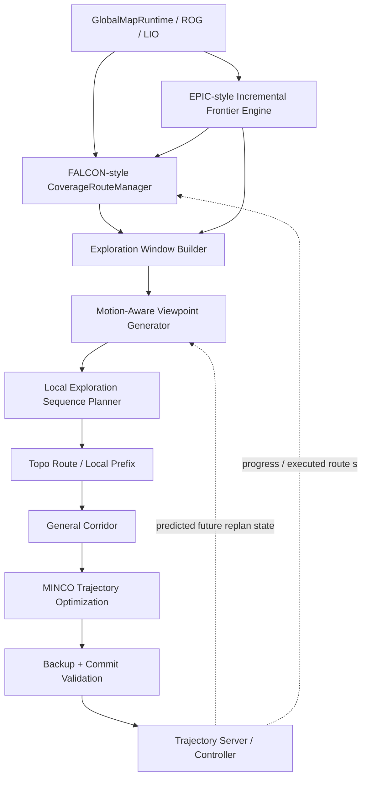

# General-Planner 探索架构重构设计

## FALCON 全局 Coverage 引导 + EPIC 高效点云探索 + 高速运动感知 Viewpoint

**目标仓库：** `KaireRiemann/General-Planner`  
**分析基线：** `deploy` 分支，2026-08-14  
**对照框架：** FALCON、EPIC  
**设计目标：** 在保留 General-Planner 现有高速轨迹规划、安全走廊、MINCO、backup trajectory 和 commit validation 的前提下，将探索前端重构为“长期 Coverage 意图 + 高频局部高效探索 + 高速运动感知 Viewpoint/Sequence”的统一体系。

---

## 1. 核心结论

当前 General-Planner 已经具备三块很强的基础能力：

1. **EPIC 风格的点云 frontier 前端**
   - 直接基于点云/稀疏标签维护 frontier；
   - 局部增量更新 frontier cluster；
   - 基于点云拓扑图进行可达性和路径代价估计；
   - 只对有限数量的近邻 cluster 重生成 viewpoint；
   - 使用固定柱面模板生成 viewpoint，并通过可见性选择 yaw。

2. **FALCON 风格的长期 Coverage Guidance 雏形**
   - 维护持久 coarse coverage map；
   - 建立 free/unknown zone adjacency；
   - 构造 ordered coverage route；
   - 为现有 frontier 提供 coverage rank / priority；
   - 在普通 frontier 耗尽后生成 reachable-unknown 的 safe approach target。

3. **明显强于 FALCON/原始 EPIC 的高速轨迹执行后端**
   - topo path；
   - General Corridor；
   - MINCO；
   - backup trajectory；
   - known-free commit validation；
   - rolling replan；
   - dynamic turn velocity；
   - controlled stop；
   - REORIENT / CAUTION 安全恢复。

但当前缺少的不是某一个单独算法，而是三个**结构性连接层**：

> **缺少 1：Coverage Route 没有成为唯一长期任务意图。**  
> 当前 coverage route 最终主要被压缩成 `preferredClusterIds()` 和 `clusterPenalty()`，然后普通 frontier selector 又重新决定“全局下一目标”。

> **缺少 2：Viewpoint 只是“静态生成后再做高速评分”，而不是从无人机未来运动状态出发生成。**  
> 当前已经实现 motion-aware scoring，但候选位置仍来自固定柱面模板，因此大量候选天生需要急转、刹停或回头，后续只能靠 hard gate / REORIENT 消除。

> **缺少 3：局部探索器输出的是单个 goal，而不是可连续执行的 viewpoint sequence。**  
> 轨迹层不知道当前 viewpoint 之后的 successor，因此无法可靠设置非零 terminal velocity，也无法提前保持下一段运动方向。

因此最终目标不应是简单的：

```text
FALCON + EPIC + General-Planner
```

而应是：

```text
FALCON-like Persistent Coverage Intent
                 ↓
EPIC-like Incremental Point-Cloud Frontier Engine
                 ↓
Motion-Conditioned Local Exploration Sequence
                 ↓
General-Planner High-Speed Trajectory Backend
```

其中最核心的变化是：

\[
\boxed{
\text{coverage route 从 cost bias 升级为长期约束与状态}
}
\]

以及：

\[
\boxed{
\text{viewpoint 从几何点升级为带运动语义的局部状态/过渡}
}
\]

---

# 2. 三个框架分别应该保留什么

## 2.1 FALCON：保留“全局空间访问顺序”

FALCON 最值得保留的不是某个具体 TSP 求解器，而是：

```text
Unknown / Active Space
        ↓
Hierarchical Decomposition
        ↓
Coverage Path
        ↓
Current / Next Coverage Region
        ↓
Local Frontier Planning
```

其关键思想是：

**局部 frontier 的选择不能重新破坏 coverage path 的长期顺序。**

也就是说，全局 coverage sequence

\[
\mathcal C=
(c_0,c_1,\ldots,c_N)
\]

应当是局部探索的约束，而不是一个弱奖励项。

FALCON 的局部 SOP 本质上是在做：

\[
\min_{\pi} J_{\mathrm{local}}(\pi)
\]

同时保持：

\[
\pi \;\text{consistent with}\; \mathcal C
\]

这比给 frontier 加一个 `coverage_weight` 更强。

---

## 2.2 EPIC：保留“点云域的低开销 frontier 更新与有限候选处理”

EPIC 真正值得保留的效率来源包括：

- 不要求维护复杂稠密探索数据结构来完成 frontier 提取；
- 点云投影、稀疏 cell 标签和局部 cluster 增量维护；
- 只对近邻有限数量 frontier cluster 重新生成 viewpoint；
- viewpoint cluster 先经过 topo reachability 筛选；
- 全局路径代价使用稀疏 topo 路径，而不是每对目标都重新在完整 voxel map 上做重搜索；
- 后端直接接 GCOPTER/MINCO 类局部轨迹规划器。

EPIC 的 `generateTSPViewpoints()` 本身就先按 rough topological distance 选 `local_tsp_size` 个 cluster，再对这些 cluster 重生成 viewpoint。

因此“EPIC 高效模式”在新的系统中应该被理解为：

> **高频层只处理局部、增量、有限候选，不重算全世界。**

而不是继续让所有 frontier 每个 global update 都参与完整 pairwise cost + TSP。

---

## 2.3 General-Planner：保留高速安全执行能力

以下模块不应为了“像 FALCON”而删除：

- `ROG Map`
- point-cloud topo / global topo
- `ParallelBubbleAstar / topoSearch`
- General Corridor
- MINCO
- `BackupTraj`
- commit known-free validation
- trajectory retry / velocity reduction
- controlled stop
- `REORIENT`
- `CAUTION`
- trajectory server
- predicted future replan head 的所有权

这些模块解决的是**可执行性和安全性**，与全局 exploration policy 是正交的。

正确的重构原则是：

```text
上层减少不合理目标
而不是
下层放宽安全约束去适应不合理目标
```

---

# 3. 当前框架的主要结构问题

## 3.1 Coverage Route 被降维成了“偏好集合 + 标量代价”

当前 CoverageGuidance 实际包含 ordered coverage targets，但进入 frontier 前端后主要变成：

```cpp
preferredClusterIds();
clusterPenalty(...);
```

这导致：

```text
ordered route
    ↓
preferred cluster set
    ↓
scalar coverage cost
    ↓
all local candidates compete again
```

因此：

\[
[c_1,c_2,c_3,c_4]
\]

最终近似退化成：

\[
\{f_a,f_b,f_c\}
+
J_{\mathrm{coverage}}(f)
\]

全局拓扑顺序不能严格保留。

### 应修改为

Coverage layer 输出一个持续存在的：

```cpp
CoverageDirective
```

其中直接保留：

- route；
- route cursor；
- current zone；
- next zones；
- route tangent；
- unresolved unknown set；
- fallback safe approaches；
- route revision。

局部 planner 只能在当前 coverage window 中选目标。

---

# 4. 建议的最终总体架构



整个系统只允许三个层级拥有不同粒度的决策权：

| 层 | 决策问题 | 时间尺度 |
|---|---|---:|
| Global Coverage | “长期应该按什么空间顺序探索？” | 0.5–2 Hz / event |
| Local Exploration | “沿当前 coverage intent，接下来连续看哪几个 viewpoint？” | 5–10 Hz |
| Motion Planning | “怎样安全连续执行这段局部序列？” | 5–20 Hz / event |

---

# 5. 第一项关键修改：把 CoverageGuidance 升级成 CoverageRouteManager

## 5.1 当前不足

当前 `CoverageGuidanceManager` 已经有：

- persistent map；
- free/unknown zones；
- ordered targets；
- active-free target；
- reachable-unknown target；
- route rank。

但它没有成为持续 route context 的所有者。

当前普通 frontier 一旦重新选择，coverage intent 可能被重新解释。

---

## 5.2 新增 CoverageRouteContext

建议仿照当前 state2state 已经使用的 `GlobalRouteContext` 模式设计：

```cpp
struct CoverageRouteContext {
  bool valid{false};

  uint64_t route_id{0};
  uint64_t map_revision{0};
  uint64_t frontier_revision{0};

  std::vector<CoverageNode> route;
  std::vector<double> arc_length;

  // 单调推进
  double committed_route_s{0.0};
  int cursor{0};

  // 当前局部 planning window
  int window_begin{0};
  int window_end{0};

  Eigen::Vector3d current_tangent{Eigen::Vector3d::Zero()};
  Eigen::Vector3d next_tangent{Eigen::Vector3d::Zero()};

  std::string last_result;
};
```

Coverage node 不应只包含一个 position：

```cpp
struct CoverageNode {
  uint64_t stable_id;

  enum Type {
    CURRENT_FREE,
    ACTIVE_FRONTIER_ZONE,
    REACHABLE_UNKNOWN_ZONE,
    TRANSITION_ZONE
  } type;

  Eigen::Vector3d center;

  std::vector<int> frontier_cluster_ids;
  std::vector<Eigen::Vector3d> safe_approaches;

  int parent_zone;
  int route_rank;
};
```

---

## 5.3 Route 必须采用“单调 cursor + suffix patch”

不要每次地图变化都：

```text
clear route
→ recompute everything
→ new first goal
```

而应当：

```text
executed prefix | current | future suffix
                ↑
              cursor
```

只允许：

\[
s_{k+1}\ge s_k
\]

即 `committed_route_s` 单调增加。

地图更新时优先：

```text
validate current + next local window
              ↓
valid → keep route
invalid → repair local suffix
repair fail → rebuild future suffix
```

而不是因为新 frontier 出现就把整个长期顺序重排。

这是解决“来回横跳”的第一优先级措施。

---

# 6. 第二项关键修改：Coverage Route 变成约束，而不是 cost bias

## 6.1 当前模式

当前近似：

\[
f^*
=
\arg\min_{f\in\mathcal F}
\left[
J_{\text{travel}}
+J_{\text{turn}}
+J_{\text{return}}
-J_{\text{gain}}
-J_{\text{wait}}
-J_{\text{debt}}
+J_{\text{coverage}}
\right]
\]

问题在于：

\[
\mathcal F
=
\text{all currently considered frontiers}
\]

所以 coverage 只是在所有候选间“投票”。

---

## 6.2 新模式

定义 coverage local window：

\[
\mathcal W_k=
\{c_k,c_{k+1},\ldots,c_{k+H}\}
\]

例如：

\[
H=2\sim 3
\]

局部 frontier 集：

\[
\mathcal F_k
=
\left\{
f_i:
zone(f_i)\in\mathcal W_k
\right\}
\]

然后只解：

\[
f^*
=
\arg\min_{f\in\mathcal F_k}
J_{\mathrm{local}}(f)
\]

因此：

- coverage route 决定“去哪个区域”；
- local planner 决定“这个区域里怎么看最划算”。

这是 FALCON 与当前设计的核心区别。

---

# 7. 第三项关键修改：从 Motion-Aware Scoring 升级到 Motion-Aware Generation

## 7.1 当前 General-Planner 已经做到了什么

当前代码已经明显超过原始 EPIC。

Viewpoint score 中已经考虑：

- visible gain；
- forward progress；
- velocity alignment；
- known-free length；
- clearance；
- yaw change；
- turn angle；
- backup feasibility；
- corridor cruise alignment。

并且高速时可以 hard reject：

- known-free 不足；
- clearance 不足；
- turn 太大；
- yaw 变化太大。

这属于：

\[
\boxed{
\text{静态候选生成}
+
\text{运动感知筛选/评分}
}
\]

这是有价值的，应当保留。

---

## 7.2 目前真正的问题

`initClusterViewpoints()` 仍然执行：

```cpp
vp = origin_viewpoint + cluster_center;
```

而 `origin_viewpoints_` 是启动时生成的固定柱面模板：

```text
height layers
× radius layers
× circle samples
```

因此 candidate set 与当前：

- 速度方向；
- 速度大小；
- coverage route tangent；
- 下一 successor；
- 未来 replan state；

没有关系。

于是大量候选在生成时已经属于：

```text
高收益但需要 90~180° 转向
侧后方
需要急刹
无法以当前速度平滑进入
到点以后没有合理出口
```

后面的高速 score/hard gate 只能把它们删除。

这会产生两个问题：

1. 候选利用率低；
2. 如果剩余高 gain frontier 主要在侧后方，系统容易进入 REORIENT。

---

# 8. Motion-Aware Viewpoint Generator 的正确输入

绝对不要只使用当前 odometry：

\[
x(t)
=
[p,v,a,\psi]
\]

而应该使用**未来实际切换时刻**：

\[
x_s=
x(t+\Delta t_{\text{commit}})
\]

即 General adapter 已经拥有的 predicted replan head。

建议接口：

```cpp
struct PredictedReplanState {
  Eigen::Vector3d p;
  Eigen::Vector3d v;
  Eigen::Vector3d a;

  double yaw;
  double yaw_rate;

  double switch_time;
};
```

生成器输入：

```cpp
generateMotionAwareViewpoints(
    const FrontierCluster& frontier,
    const CoverageDirective& directive,
    const PredictedReplanState& start,
    std::vector<MotionViewpoint>& output);
```

---

# 9. Viewpoint 不应该再只是 `(position, yaw)`

建议改成：

```cpp
struct MotionViewpoint {
  uint64_t id;
  int frontier_cluster_id;
  uint64_t coverage_zone_id;

  Eigen::Vector3d p;
  double yaw;

  // 运动语义
  Eigen::Vector3d incoming_dir;
  Eigen::Vector3d outgoing_dir;
  Eigen::Vector3d desired_velocity;

  // 感知
  double endpoint_gain;
  double approach_gain;
  double total_gain;

  // 可执行性
  double travel_time;
  double path_length;
  double min_clearance;
  double known_free_length;
  double turn_angle;
  double yaw_change;
  double braking_margin;

  enum Mode {
    FLY_THROUGH,
    LOCAL_DETOUR,
    STOP_AND_REORIENT
  } mode;
};
```

这一步非常重要。

因为高速探索不是寻找：

\[
p^*
\]

而是在寻找：

\[
(p^*,v^*,\psi^*,d_{\text{out}})
\]

甚至更准确地说是在寻找一个局部 transition：

\[
x_k \rightarrow x_{k+1}
\]

---

# 10. Viewpoint 的三类候选

不要把所有 frontier 都强行要求不停飞。

建议分成三类。

## 10.1 Fly-through Viewpoint

适合：

- frontier 位于 coverage route 前向区域；
- 已知自由距离足够长；
- FOV 可在运动过程中覆盖目标；
- 下一 successor 与当前方向一致。

特征：

\[
v_{\mathrm{end}}>0
\]

主要承担高速连续探索。

---

## 10.2 Local-detour Viewpoint

适合：

- 侧房间；
- 需要短暂横向偏移；
- 但不需要完全停车。

允许：

```text
main route
   \
    \ small detour
     \____
          \ return
```

需要显式约束 detour 的：

- lateral distance；
- added travel time；
- return tangent；
- braking margin。

---

## 10.3 Stop-and-reorient Viewpoint

用于：

- 真正的 U-turn；
- 狭窄死角；
- 唯一剩余 frontier 在后方；
- clearance 很低；
- 当前速度无法安全连续通过。

这时：

\[
v_{\mathrm{end}}=0
\]

并保留当前 `REORIENT`。

因此新的设计不是“消灭停车”，而是：

> **只有运动学和任务拓扑真正要求停车时才停车。**

---

# 11. 用速度直接决定候选生成区域

一个简单但有效的生成 envelope 可以由：

\[
R_{\min}(v)
\approx
\frac{v^2}{a_{\mathrm{lat,max}}}
\]

给出最小有效转弯尺度。

例如当前速度越高：

```text
低速：
       candidates everywhere
            ○ ○ ○
         ○    UAV   ○
            ○ ○ ○

高速：
                 ○
             ○   ○
UAV ───────→ ○   ○
             ○   ○
                 ○
```

即候选分布从近似各向同性圆柱变成**沿速度/coverage tangent 拉伸的各向异性 reachable tube**。

这比“先均匀采样 360°，再把后方候选扣分”更合理。

---

# 12. Braking Envelope 必须进入候选生成

建议估计：

\[
d_{\mathrm{stop}}
=
v\tau
+
\frac{v^2}{2a_{\mathrm{brake}}}
+
d_{\mathrm{margin}}
\]

其中：

- \(v\tau\)：规划、通信、控制延迟；
- \(v^2/(2a_{\mathrm{brake}})\)：近似制动距离；
- \(d_{\mathrm{margin}}\)：安全裕量。

如果 candidate 前方 known-free length：

\[
L_{\mathrm{free}}
<
d_{\mathrm{stop}}
\]

则不能生成 `FLY_THROUGH` candidate。

它可以：

- 降级成 `STOP_AND_REORIENT`；
- 或直接从高速 candidate set 删除。

这会把当前后端的 backup feasibility 检查提前到候选生成阶段。

---

# 13. Viewpoint Gain 应从“端点信息增益”升级为“路径信息增益”

对于 LiDAR 无人机，高速探索时真正获取信息的是：

\[
\gamma(t),\quad t\in[t_0,t_1]
\]

整段轨迹，而不是单独的 endpoint。

建议近似：

\[
I(\gamma)
=
\sum_{m=1}^{M}
w_m
\cdot
\left|
\mathcal U_{\mathrm{visible}}
\left(
p(t_m),\psi(t_m)
\right)
\right|
\]

为了效率，不需要真的对 MINCO trajectory 每次做完整 raycast。

可以先对候选 transition 使用：

```text
start
→ 1/3 path
→ 2/3 path
→ viewpoint
```

4–6 个 sample 做 approximate gain。

因此：

```cpp
total_gain =
    endpoint_gain
  + lambda_approach * approach_gain;
```

这样会自然偏好：

> “飞过去的过程中就能看完”

而不是：

> “必须飞到固定 observation point 再看”。

---

# 14. 第四项关键修改：从单目标 planner 升级成 Local Sequence Planner

当前最大的问题之一：

```text
global selector
    ↓
next_goal
```

轨迹层不知道 `next_goal` 后面的运动意图。

建议每次输出：

\[
S_k=
[v_k,v_{k+1},v_{k+2}]
\]

即 2–4 个局部 viewpoint。

---

## 14.1 不需要再做大规模全局 TSP

FALCON 已经负责 global coverage ordering。

所以 local planner 只需处理：

```text
2~3 coverage zones
×
每个 frontier 1~2 motion viewpoint
```

通常候选数量可保持：

\[
M\approx6\sim20
\]

这时可以使用：

- small SOP；
- dynamic programming；
- beam search；
- bounded A*；
- 小规模 directed insertion。

不需要每个 global update 对所有 frontier 做：

\[
O(N^2)
\]

pairwise topo cost 再跑 LKH。

---

## 14.2 推荐 Beam Search

对于你的高速运动代价，beam search 比纯 TSP 更自然。

状态：

```cpp
struct SequenceState {
  int coverage_cursor;
  MotionViewpoint last;
  std::vector<MotionViewpoint> sequence;

  double accumulated_cost;
  double accumulated_gain;
};
```

扩展代价：

\[
J_{ij}
=
w_T T_{ij}
+
w_\theta C_{\theta,ij}
+
w_\kappa C_{\kappa,ij}
+
w_B C_{\mathrm{brake},ij}
+
w_R C_{\mathrm{return},ij}
-
w_I I_{ij}
\]

并加入 hard constraints：

\[
zone(j)
\in
[c_k,\ldots,c_{k+H}]
\]

以及 route precedence。

建议：

```text
sequence horizon = 3 viewpoints
beam width       = 8~16
top candidates   = 2 per frontier
coverage window  = 2~3 zones
```

这样计算量非常小，但已经能获得 successor 信息。

---

# 15. 第五项关键修改：Successor-aware Terminal State

这是消除大量“停一下”的关键。

如果当前局部序列为：

\[
p_k
\rightarrow
p_{k+1}
\rightarrow
p_{k+2}
\]

则在 \(p_{k+1}\) 处定义：

\[
d_{\mathrm{out}}
=
\frac{p_{k+2}-p_{k+1}}
{\|p_{k+2}-p_{k+1}\|}
\]

如果：

- turn angle 足够小；
- successor path known-free；
- backup feasible；
- corridor continuity 足够；
- yaw/FOV 可连续；

则设置：

\[
v(T)=v_Td_{\mathrm{out}},\quad v_T>0
\]

否则：

\[
v(T)=0
\]

---

## 15.1 不建议简单开启当前 `NonstopTerminalVelocityEnable`

因为当前 planner 的 successor 并不稳定。

如果只把开关改成 true：

```text
current trajectory end velocity → east
next global goal              → west
```

会让下一次重规划反而更危险。

正确做法是：

```text
先保证 successor ownership
→ 再启用 nonzero terminal velocity
```

---

# 16. Coverage + Viewpoint + Trajectory 应如何连接

新的完整链路：

```text
Persistent Coverage Route
          ↓
current cursor = k
          ↓
Coverage Window [k, k+1, k+2]
          ↓
frontiers inside window
          ↓
motion-aware viewpoint generation
          ↓
top-K viewpoint per frontier
          ↓
local sequence optimization
          ↓
[v0, v1, v2]
          ↓
topological route to v0/v1
          ↓
local path prefix
          ↓
General Corridor
          ↓
MINCO
          ↓
terminal state derived from v1
          ↓
backup + commit
```

这时：

- Coverage 决定长期方向；
- frontier 决定局部观测；
- trajectory 决定连续运动。

三层不再互相覆盖决策。

---

# 17. Coverage Unknown Target 不应该再是“第二阶段 fallback 模式”

当前系统近似：

```text
normal frontier available
        ↓
run frontier mode
        ↓
frontier executable set empty
        ↓
debounce / speed gate
        ↓
promote coverage recovery target
```

这会产生 handoff dead time。

建议统一成：

```cpp
ExplorationTarget
{
  FRONTIER_VIEW;
  COVERAGE_APPROACH;
  TRANSITION;
}
```

它们都属于 coverage window。

如果当前 coverage zone：

- 有普通 frontier → 优先普通 viewpoint；
- 无 frontier 但存在 reachable unknown zone → safe approach 自动成为 transition target；
- 普通 frontier 暂时不可达 → coverage route 可以继续推进到下一合法 transition。

这样无需：

```text
frontier mode
↔
coverage fallback mode
```

---

# 18. 统一 Target 生命周期

当前代码存在：

- normal failed goal cooldown；
- coverage deferred target；
- coverage failure count；
- no-gain count；
- terminal retry；
- frontier progress watchdog；
- finish audit。

建议统一：

```cpp
enum class TargetState {
  ACTIVE,
  LOCKED,
  DEFERRED,
  VISITED,
  EXHAUSTED
};

enum class TargetFailure {
  NONE,
  NO_PATH,
  UNSAFE,
  OCCLUDED,
  NO_GAIN,
  TRAJ_FAIL,
  MOTION_INCOMPATIBLE
};
```

统一 registry：

```cpp
struct TargetLifecycle {
  TargetState state;
  TargetFailure last_failure;

  int failure_count;
  int no_gain_count;

  ros::Time defer_until;

  double best_progress;
};
```

普通 frontier 和 coverage approach 使用同一套状态机。

这样可以显著删掉 `FastExplorationManager` 中大量特殊分支。

---

# 19. FSM 应该如何调整

不建议第一步就大幅删 FSM 状态。

当前这些安全状态仍然有必要：

```text
PLAN_TRAJ
EXEC_TRAJ
REORIENT
CAUTION
```

应该先改变它们的触发频率，而不是先删除它们。

最终合理行为应该是：

```text
EXEC_TRAJ
  ↓
normal rolling replan
  ↓
EXEC_TRAJ
  ↓
normal rolling replan
  ↓
EXEC_TRAJ
```

只有：

```text
true U-turn
true low clearance
topology disconnect
no safe backup
```

才进入：

```text
REORIENT / CAUTION
```

---

# 20. 高速 Viewpoint 的目标函数建议

推荐把候选/sequence cost 分成三类。

## 20.1 Exploration reward

\[
J_I
=
-w_I I_{\mathrm{endpoint}}
-w_A I_{\mathrm{approach}}
\]

---

## 20.2 Motion cost

\[
J_M
=
w_T T
+
w_\theta\Delta\theta
+
w_\psi\Delta\psi
+
w_\kappa C_\kappa
+
w_B C_{\mathrm{brake}}
\]

---

## 20.3 Coverage consistency

不要只做：

\[
w_C r_{\mathrm{coverage}}
\]

而应先使用 hard window：

\[
zone(v)
\in
\mathcal W_k
\]

在合法 window 内再加轻量 rank cost：

\[
J_C
=
w_C\Delta r
\]

因此整体：

\[
J
=
J_I+J_M+J_C
\]

但 coverage window 是约束：

\[
v\in\mathcal F(\mathcal W_k)
\]

而不是单纯 soft term。

---

# 21. 全局 Coverage Route 应该使用什么代价

Coverage route 不应该直接考虑完整无人机动力学，否则会把低频全局规划变得过重。

建议：

\[
C_{ij}^{global}
=
d^{topo}_{ij}
+
\lambda_z |\Delta z|
+
\lambda_u C_{\mathrm{unknown}}
+
\lambda_r C_{\mathrm{revisit}}
\]

只负责：

- 拓扑距离；
- 楼层切换；
- unknown transition；
- revisit。

高速 turn/yaw/brake 等细节留给 local sequence planner。

这样才能同时保留：

- FALCON 的长期全局性；
- EPIC 的计算效率。

---

# 22. 当前 `planGlobalPath()` 最应该删除的重复工作

当前 global update 中同时存在：

1. Coverage route；
2. frontier composite next-goal scoring；
3. all candidate pairwise topo cost；
4. TSP/LKH；
5. goal lock 再覆盖；
6. coverage fallback。

重构后：

```text
CoverageRouteManager:
  low-frequency global route

LocalSequencePlanner:
  only small active window
```

因此旧的全 frontier TSP 应逐步退出主路径。

保留 LKH 作为：

- compatibility baseline；
- benchmark mode；

而不是 production 主逻辑。

---

# 23. 计算调度建议

## 23.1 Sensor / frontier thread

频率约：

```text
LiDAR 10 Hz
```

职责：

- point cloud update；
- local frontier cell update；
- cluster incremental update。

禁止：

- global coverage optimization；
- full TSP；
- MINCO。

---

## 23.2 Coverage worker

触发：

```text
0.5~1.0 Hz
or
semantic map/frontier revision
```

职责：

- persistent free/unknown graph update；
- coverage route suffix update；
- cursor/directive publication。

采用 latest-wins。

---

## 23.3 Local exploration planner

频率：

```text
5~10 Hz
```

只处理：

```text
current coverage window
```

职责：

- motion viewpoint generation；
- local sequence search。

---

## 23.4 Motion planner

触发：

```text
trajectory horizon
collision change
sequence update
large control error
```

职责：

- topo prefix；
- corridor；
- MINCO；
- backup；
- commit。

---

# 24. 建议的数据结构

## 24.1 CoverageDirective

```cpp
struct CoverageDirective {
  uint64_t route_id;
  uint64_t revision;

  int cursor;

  std::vector<uint64_t> active_zone_ids;

  Eigen::Vector3d route_tangent;
  Eigen::Vector3d next_tangent;

  std::unordered_set<int> allowed_frontier_ids;

  std::vector<CoverageTarget> fallback_targets;
};
```

---

## 24.2 LocalExplorationSequence

```cpp
struct LocalExplorationSequence {
  uint64_t route_id;
  uint64_t sequence_id;

  std::vector<MotionViewpoint> viewpoints;

  int active_index{0};

  bool valid{false};
};
```

---

## 24.3 SequenceExecutionContext

```cpp
struct SequenceExecutionContext {
  uint64_t sequence_id;

  double committed_progress;
  int active_viewpoint;

  bool successor_valid;

  Eigen::Vector3d desired_terminal_velocity;
  double desired_terminal_yaw;
};
```

---

# 25. 按当前仓库文件进行具体修改

## 25.1 `coverage_guidance_manager.*`

### 现状

负责：

- persistent map；
- zone decomposition；
- ordered targets；
- cluster priority。

### 修改

升级为：

```text
CoverageRouteManager
```

至少增加：

```cpp
latestRouteContext();
latestDirective();
projectProgress(position);
advanceCursor(executed_position);
validateActiveWindow();
repairSuffix();
```

旧 API：

```cpp
preferredClusterIds();
clusterPenalty();
```

先保留用于 compatibility 模式，后续退出主路径。

---

## 25.2 `coverage_types.h`

新增：

```cpp
CoverageNode
CoverageRouteContext
CoverageDirective
CoverageWindow
```

必须保存稳定 ID 和 revision。

---

## 25.3 `frontier_manager.cpp`

当前：

```text
fixed pillar sampling
→ visibility
→ high-speed score
```

改成：

```text
coverage-window frontier
→ motion reachable envelope
→ adaptive samples
→ visibility/path gain
→ high-speed hard constraints
```

保留旧 pillar sampler 作为：

```text
low-speed fallback
```

建议新增：

```cpp
generateMotionAwareViewpoints(...)
generateFlyThroughCandidates(...)
generateDetourCandidates(...)
generateStopCandidates(...)
```

---

## 25.4 `global_planning.cpp`

当前：

```text
nearest local_tsp_size
+
coverage preferred cluster injection
```

改成：

```text
CoverageDirective.allowed_frontier_ids
+
small emergency neighborhood
```

即 coverage window 为主，nearest candidate 只作为 fallback。

---

## 25.5 `fast_exploration_manager.cpp`

这是最需要拆分的文件。

建议拆成：

```text
exploration_policy/
  coverage_route_consumer.cpp
  local_sequence_planner.cpp
  target_lifecycle.cpp
```

`FastExplorationManager` 只保留 orchestrator。

未来主函数应近似：

```cpp
int planExploration(const PredictedReplanState& start) {
  auto directive = coverage_->latestDirective();

  auto frontiers =
      window_builder_->collect(directive);

  auto viewpoints =
      viewpoint_generator_->generate(
          frontiers,
          directive,
          start);

  auto sequence =
      sequence_planner_->solve(
          viewpoints,
          directive,
          start);

  return activate(sequence);
}
```

---

## 25.6 `expl_data.h`

当前：

```cpp
global_tour_
path_next_goal_
goal_lock
```

建议逐步替换为：

```cpp
CoverageRouteContext coverage_route;
LocalExplorationSequence local_sequence;
SequenceExecutionContext execution;
```

`global_tour_` 可暂时作为 visualization / compatibility 输出。

---

## 25.7 `fsm_utils.cpp`

当前：

```text
single next goal
→ topoSearch
→ max_traj_len truncation
→ reversal gate
→ MINCO
```

改成：

```text
local sequence
→ active + successor
→ topo prefix
→ derive endpoint tangent
→ corridor
→ MINCO
```

并新增：

```cpp
computeTerminalState(active, successor);
```

---

## 25.8 `general_planner_adapter.cpp / planner_manager`

必须提供统一的：

```cpp
PredictedReplanState getPredictedReplanState();
```

这个状态必须是：

> 实际下一条轨迹的切换状态

而不是普通 odometry。

另外建议接口：

```cpp
planExploreTraj(
    path,
    start_state,
    terminal_state,
    rolling_horizon);
```

---

# 26. 推荐的最小实现顺序

不要一次全部重写。

## Phase 0：建立停顿诊断

先记录每次速度降到阈值以下的原因：

```text
STOP_GOAL_TERMINAL
STOP_REORIENT
STOP_CAUTION
STOP_NO_NEXT_TARGET
STOP_COVERAGE_HANDOFF
STOP_TOPO_DISCONNECT
STOP_OPT_FAILURE
STOP_FINISH_AUDIT
```

统计：

- 次数；
- 总持续时间；
- 平均持续时间。

否则后续难以证明改动有效。

---

## Phase 1：Coverage Route Cursor

先不改 viewpoint。

完成：

```text
ordered route
+
persistent cursor
+
active window
```

把 `preferredClusterIds` 升级成：

```text
allowed frontier window
```

此阶段仍可用现有 static viewpoint + high-speed score。

**这是收益/风险比最高的一步。**

---

## Phase 2：删除第二套全局 frontier TSP

将 global frontier TSP 缩减为：

```text
local window ordering
```

推荐先用：

```text
greedy / beam search
```

完成后再比较是否需要 SOP。

---

## Phase 3：Motion-aware Viewpoint Generation

把当前固定圆柱 sampler 改成：

```text
velocity-aware
+
coverage-tangent-aware
```

但保留 static sampler fallback。

---

## Phase 4：Local Sequence

从单目标：

```text
goal
```

升级：

```text
goal + successor
```

一开始只需要 sequence length = 2。

这已经足够支持 terminal velocity。

---

## Phase 5：Fly-through Terminal State

加入：

```text
successor-aware nonzero terminal velocity
```

此时才打开不停顿执行。

---

## Phase 6：统一 recovery

最后再删除：

- coverage handoff；
- duplicated cooldown；
- duplicated recovery registry；
- 部分 finish audit 特殊逻辑。

不要在前面阶段同时大改安全 recovery。

---

# 27. 推荐的第一版参数

建议第一版保守设置：

```yaml
coverage_route:
  window_size: 3
  rebuild_period: 1.0
  cursor_backtrack_tolerance: 0.0

local_sequence:
  horizon: 2
  beam_width: 8
  max_frontiers_per_zone: 4
  max_viewpoints_per_frontier: 2

motion_viewpoint:
  enable: true
  static_fallback_enable: true
  forward_sector_deg: 140
  detour_sector_deg: 220
  max_flythrough_turn_deg: 55
  min_flythrough_known_free: 12.0
  approach_gain_samples: 4

trajectory:
  successor_terminal_velocity_enable: true
  terminal_velocity_ratio: 0.55
```

这些只是初始工程参数，不应视为最终最优值。

---

# 28. Benchmark 必须如何做

至少比较四组：

| Baseline | Coverage route | Motion Viewpoint | Successor Terminal |
|---|---:|---:|---:|
| Current Full | bias | 当前评分 | 否 |
| Route-only | hard window | 当前评分 | 否 |
| Route + MotionVP | hard window | 是 | 否 |
| Full Hybrid | hard window | 是 | 是 |

场景至少：

- Garage；
- Cave；
- 大开阔多分支；
- 窄走廊 + 多侧房间；
- 多层结构。

---

# 29. 除探索时间之外，必须记录的指标

## 29.1 全局效率

```text
mission completion time
path length
coverage ratio
coverage AUC
revisit distance ratio
```

---

## 29.2 连续运动质量

这是当前最应该新增的指标：

```text
mean speed
median speed
time below 0.3 m/s
time below 0.5 m/s
number of full stops
stop duration
REORIENT count
CAUTION count
goal reversal count
```

定义：

\[
R_{\mathrm{stop}}
=
\frac{
T(v<v_{\mathrm{stop}})
}{
T_{\mathrm{mission}}
}
\]

它比单纯总时间更直接描述你的核心问题。

---

## 29.3 规划效率

```text
frontier update P50/P95
coverage update P50/P95
viewpoint generation P50/P95
local sequence P50/P95
topo search P50/P95
corridor P50/P95
MINCO P50/P95
```

---

## 29.4 探索运动效率

建议增加：

\[
\eta_I
=
\frac{\Delta N_{\mathrm{observed}}}{\Delta s}
\]

即每米新增观测量。

以及：

\[
\eta_T
=
\frac{\Delta N_{\mathrm{observed}}}{\Delta t}
\]

即单位时间新增观测量。

这样可以发现：

- 单纯高速但重复经过已知区域；
- 路径短但信息获取慢；

这两种问题。

---

# 30. 最终推荐的模块职责

```text
GlobalMapRuntime
│
├── FrontierEngine
│     └── “哪里仍存在值得观测的 frontier？”
│
├── CoverageRouteManager
│     └── “长期先探索哪些空间区域？”
│
├── MotionViewpointGenerator
│     └── “在当前运动状态下，哪些观测状态值得且可连续到达？”
│
├── LocalSequencePlanner
│     └── “未来 2~4 个 viewpoint 按什么顺序执行？”
│
└── GeneralMotionPlanner
      └── “怎样安全地把这段 sequence 变成连续轨迹？”
```

任何模块都不再同时回答两个层级的问题。

---

# 31. 最终推荐

当前最值得做的不是继续优化：

```text
candidate_* weight
coverage rank weight
goal lock threshold
cooldown
```

这些已经进入收益递减区。

下一轮结构改造应当严格按以下因果顺序：

```text
Coverage Route Authority
        ↓
Local Coverage Window
        ↓
Motion-Aware Candidate Generation
        ↓
Short Local Viewpoint Sequence
        ↓
Successor-Aware Terminal State
        ↓
Continuous High-Speed Exploration
```

最终希望达到的行为是：

```text
                ┌─ side frontier
coverage ───────┼──────────────→
route           └─ short detour
       ↑               ↑
    global intent   local EPIC decision

trajectory:
───────────────→──────────────→──────────────→
       rolling replan   rolling replan
```

而不是：

```text
select frontier
→ fly
→ stop
→ recompute world
→ choose another frontier
→ turn
→ fly
→ stop
```

---

# 32. 一句话概括目标架构

\[
\boxed{
\text{FALCON 决定“往哪里持续推进”，}
\quad
\text{EPIC 决定“附近看什么最划算”，}
\quad
\text{General-Planner 决定“怎样高速且安全地连续飞过去”。}
}
\]

真正需要新增的创新层是：

\[
\boxed{
\text{Motion-Conditioned Viewpoint Sequence Planning}
}
\]

它把三者从简单拼接变成统一系统，也是当前 General-Planner 从“coverage-aware 高速 frontier explorer”进一步走向“globally guided continuous high-speed explorer”的关键。

---

# 33. 代码依据与建议重点阅读文件

## General-Planner

```text
src/Planner/general_planner/EXPLORATION.md

src/Planner/general_planner/
  include/general_core/exploration/highspeed/
    fast_exploration_fsm.h
    fast_exploration_manager.h

  src/general_core/exploration/highspeed/
    fast_exploration_fsm.cpp
    fast_exploration_manager.cpp
    fsm_utils.cpp
    general_planner_adapter.cpp

  include/general_core/exploration/exploration_utils/
    coverage_guidance/
      coverage_guidance_manager.h
      coverage_types.h

  src/general_core/exploration/exploration_utils/
    coverage_guidance/
      coverage_guidance_manager.cpp

    frontier_manager/
      frontier_manager.cpp
      global_planning.cpp

  config/exploration.yaml
```

特别关注：

```text
CoverageGuidanceManager::preferredClusterIds
CoverageGuidanceManager::clusterPenalty

FastExplorationManager::planGlobalPath
FrontierManager::generateTSPViewpoints
FrontierManager::selectBestViewpoint
FrontierManager::initClusterViewpoints

FastExplorationFSM::callExplorationPlanner
FastExplorationFSM::updateTopoAndGlobalPath
```

## FALCON

```text
falcon_planner/exploration_manager/src/exploration_manager.cpp
falcon_planner/exploration_preprocessing/src/hierarchical_grid.cpp
```

重点理解：

```text
coverage path
→ next hierarchical cell
→ frontier restriction
→ SOP / local refinement
→ CP consistency
```

## EPIC

```text
src/global_planner/exploration_manager/src/fast_exploration_manager.cpp

src/global_planner/frontier_manager/src/
  frontier_manager.cpp
  global_planning.cpp
```

重点理解：

```text
point-cloud frontier update
local_tsp_size
static pillar viewpoint sampling
topological reachability
limited candidate recomputation
```

---

## 34. 最小可落地版本

如果只允许做一次小规模重构，我建议只实现下面四件事：

1. `CoverageRouteContext + cursor`
2. `allowed_frontier_ids = current/next coverage zones`
3. `local sequence = [next, successor]`
4. `successor-aware terminal velocity`

第一版甚至可以完全不修改现有 high-speed viewpoint sampler。

仅这四步就可以验证一个最重要的假设：

> 当前大量停顿和 REORIENT，到底有多少来自“缺少长期 route continuity”，而不是轨迹后端本身。

如果这一版已经显著降低：

```text
full-stop ratio
REORIENT count
goal reversal count
```

再进入 Motion-Aware Viewpoint Generation，会更加稳妥，也更容易通过消融实验证明每一层改动的价值。

---

# 35. 源码核验与实施边界（2026-08-14）

本节基于当前工作树源码核验，用于把上述目标架构与已经存在的
General-Planner 能力准确对齐。它不是另一套设计；它限定了每一阶段
可以安全改变什么、不应改变什么。

## 35.1 已经存在、应复用的能力

1. `CoverageGuidanceManager` 已经异步维护 persistent coverage map，采用
   latest-wins 工作队列；覆盖 route 是 bounded zone graph 上的 greedy +
   2-opt 顺序，而非每次在传感器回调中重算。
2. `CoveragePlan` 已有 `ordered_targets`、稳定 unknown component id、
   `route_rank`、`preferred_cluster_ids` 与 safe approach candidates。
3. `FrontierManager::selectBestViewpoint()` 已经对固定模板产生的候选做
   gain、前向推进、速度对齐、known-free length、clearance、turn、yaw 与
   backup feasibility 评分/硬拒绝。
4. `GeneralPlannerAdapter` 已能从已提交轨迹预测 replan switch state，
   也已支持严格受限的 non-zero terminal velocity、General Corridor、
   MINCO、backup 与 commit validation。

因此，不需要重写地图、topo、corridor 或轨迹后端；需要补齐的是它们
之间的意图和可执行性接口。

## 35.2 当前缺口的精确位置

### Coverage 仍是提示而非持续约束

当前 `CoveragePlan` 没有 route id、cursor、已提交弧长或 suffix patch。
每次 coverage worker 更新都以当前位置重新构建顺序。进入普通前端的
主要接口仍是 `preferredClusterIds()` 和 `clusterPenalty()`：前者仅注入
有限 cluster，后者是标量代价。由此 coverage 可以影响排序，却不能
保证单调的空间推进。

### Viewpoint 的评分状态不是实际切换状态

后端优化使用 committed replan state，但
`FastExplorationManager::planGlobalPath(pos, vel)` 把当前 odometry 的
`pos/vel/yaw` 放入 `HighSpeedViewScoreContext`。所以前端对候选的
forward/turn/known-free 判断与真正接管新轨迹的预测状态可能不同。
Motion-aware generation 的第一步应是共享这个预测状态，而不是先扩大
柱面采样数量。

### Coverage approach 的安全性不等于局部可执行性

`selectSafeCoverageApproach()` 当前检查 approach 点位于地图内、满足
净空，并且至 unknown 的观察射线不穿越占据；它随后将该点包装成
`TopoNode`。它没有在候选进入全局选择前验证 topo prefix、known-free
commit prefix、General Corridor 或 MINCO 可行性。因此 coverage target
会在局部规划失败后才被记为 `TRAJECTORY_FAILURE`，形成反复提升、
失败、冷却的开销。

### Non-stop terminal velocity 已经开启，但还不是 successor-aware

当前 house 配置启用了 `NonstopTerminalVelocityEnable`。后端只在 rolling
horizon、全段 known-free、backup feasible、转角/yaw 合格等条件同时满足
时，沿当前 local path 最后一个切线赋予末端速度。这是安全的局部连续性，
但没有由稳定的“下一个 viewpoint”导出；不能把它当作本文第 15 节的
successor-aware terminal state，也不应直接放宽其门槛。

## 35.3 最近 full-coverage 运行的对应证据

一次隔离 `coverage_guidance_mode:=full` 运行在 289.48 s 进入 `FINISH`。
运动开始至 terminal audit 的平均速度约 0.998 m/s，期间静止 9.00 s
（3.4%）；terminal audit 后另有 21.7 s 静止，这是
`finish_plateau_duration: 20s` 的预期收敛等待。

该运行记录到 24 次 REORIENT 受控刹停、75 次 path gate 拒绝（65 次为
known-free 不足）、16 次 corridor 生成失败。Coverage route 持续更新且
确实被消费：130 次候选提升、61 次被选中、覆盖 24 个不同 target；但
其中有 80 次局部轨迹失败。这证明主问题不是 coverage 未运行，而是
coverage target 从“全局观察意图”到“高速局部可执行 transition”的转换
过晚。

`FINISH` 时 coverage ratio 约为 0.738 而非 1.0；当前完成语义是
“可行动观察 target 已耗尽且 persistent map 无新增进展”，并不声称所有
未知体素都可见或可达。评估时必须同时报告 coverage ratio、exhausted
target 数和 plateau 时间。

## 35.4 不变式

以下约束贯穿所有阶段：

```text
不放宽 unknown/known-free/clearance/backup/commit validator；
不让 coverage route 直接命令飞入 unknown；
不在 safety callback 中执行耗时规划；
不能用 non-zero terminal velocity 掩盖不存在的 successor；
普通前沿的安全、可达性与 fallback 语义在 compatibility 模式中保持不变。
```

## 35.5 推荐的可验证实施顺序

### P0：诊断与共享预测状态

先增加 `PredictedReplanState` 的只读接口，让 viewpoint score、coverage
candidate preflight 和 adapter 观察同一个 future switch state。补充结构化
事件：`REORIENT`、path gate reason、coverage preflight reject、corridor
reject、MINCO reject、finish audit。此阶段不改变候选选择策略。

### P1：CoverageDirective，而非直接 hard window

引入不可变的 `CoverageDirective {route_id, revision, cursor,
active_zone_ids, route_tangent, allowed_frontier_ids, fallback_targets}`。
cursor 只能单调前进；地图变化只修复未执行 suffix。第一版把 directive
作为强优先级加上一个小的连续性/紧急邻域，而不是立即禁止窗口外所有
frontier，避免窄走廊或拓扑暂断时人为制造无候选停顿。

### P2：Coverage target 执行预检

对最多 K 个 approach 依次执行：topo reachability、首段 known-free
commit prefix、corridor 可生成性；通过者才可注入正常候选池。预检失败
只更新统一 target lifecycle，不启动 MINCO，也不触发受控停车。该步骤
直接针对当前 80 次 trajectory failure，且不削弱安全门。

### P3：运动条件候选生成，保留柱面 fallback

以预测速度方向和 directive route tangent 建立前向 fly-through sector、
有界 lateral detour sector、stop-and-reorient sector。各扇区只生成少量
候选，再复用现有 visibility、hard gate 和 topo 筛选。固定柱面模板在
低速、视野稀少或新生成器无合格候选时保留为 fallback。

### P4：长度为 2 的局部 sequence

只在 P1--P3 稳定后输出 `[active, successor]`。仅当 successor 同样通过
预检、首段切线/视角连续且 backup 可行时，才把 successor 切线传给末端
速度；否则明确使用零末端速度和现有 REORIENT。无需先实现全局 SOP 或
大规模 beam search。

### P5：最后统一 lifecycle 与移除 handoff

待 P2 已证明 coverage candidate 可以稳定执行后，再将 normal frontier
和 coverage approach 收敛到同一 target registry，逐步删除 strict
fallback handoff、重复 cooldown 与终止审计特例。不可在 P1--P4 同时做
这一步，以免破坏当前已可进入 FINISH 的恢复语义。

## 35.6 最小对比实验

每一阶段固定同一地图、随机种子和动力学参数，至少记录：完成时间、
路径长度、coverage AUC、每米新增观测量、低于 0.3/0.5 m/s 时间、
REORIENT 次数、coverage preflight 通过率和局部规划成功率。建议顺序为：

```text
Current Full
→ P0 instrumentation
→ P1 directive preference
→ P1 + P2 preflight
→ P1 + P2 + P3 motion generator
→ P1 + P2 + P3 + P4 successor terminal state
```

只有在 P1 + P2 已经显著降低 coverage trajectory failure 和停顿时，才
值得继续推进 P3/P4；否则应先修复 topo-prefix/corridor 的可执行性契约。

## 36. 实施状态与回归结论（2026-08-14）

本节以当前工作树和容器内 `ros1_noetic` 构建结果为准。它更新第 35 节
的“当前缺口”：下列项目不再是设计假设，而是已经落地并经过隔离仿真
回归的行为。

| 阶段 | 当前状态 | 已落地的边界 |
| --- | --- | --- |
| P0 | 已完成 | `getCommittedReplanHeadState()` 的预测位置/速度/yaw 已同时进入 viewpoint score、topology edge cost 与日志；braking distance 也传入候选生成。 |
| P1 | 已完成（soft directive） | `CoverageDirective` 具有 route id/revision/cursor/window/tangent；route rebuild 保留历史 spine，cursor 不回退。`hard_window_enable` 默认关闭，directive 仅提供小代价连续性偏好。 |
| P2 | 已完成受限版本 | coverage target 先经 topo edge、known-free、clearance、backup，再经只读 General Corridor/SFC 预检；每次全局更新最多预检 2 个，未轮到的 target 保持待检而非失败。 |
| P3 | 已完成首版 | 高速时在预测速度方向与 route tangent 前生成 braking-envelope/reachable-tube 候选；低速、稀疏和无合格新候选时保留原 height × radius × circle 柱面模板。 |
| P4 | 已完成受限版本 | 仅在第二 viewpoint 的 topo edge 全 known-free、clearance、backup、local turn、yaw 与入/出方向连续时建立长度 2 sequence；否则显式零末端速度。 |
| P5 | 未完成 | normal frontier 与 coverage approach 仍使用两套 lifecycle；strict handoff、coverage cooldown 与 finish audit 特例尚未合并，不能宣称已有统一 target registry。 |

### 36.1 本次修复的活性不变式

普通 frontier 因局部规划失败进入 failed-goal cooldown 后，不再被 raw
`reachableClusterCount()` 当作可执行目标。若 ordinary executable pool 已空、
coverage 也没有通过 P2 的 target，`planGlobalPath()` 返回 `NO_FRONTIER`，
让既有的完整 frontier audit、coverage plateau 与 finish gate 收敛；它不会
无限返回 `FAIL` 并每秒重试同一 cluster。

这个改动刻意**没有**把 normal frontier 提前要求为“整条 topo route 已知
自由”。那项更强的过滤曾排除 adapter 可通过 rolling horizon 成功处理的普通
viewpoint，并使 coverage 在 88 s、ratio 0.492 时过早 FINISH，已被撤回。

### 36.2 P2 的精确能力与限制

`FastPlannerManager::preflightExploreCorridor()` 复用实际 adapter 的
`SearchPolytopeOnPath`、SFC simplify、exploration-box clipping 与 sequence
validation，但不改写 committed trajectory、optimizer 或 visualization。它因而
适合作为 coverage fallback 的只读准入条件。

它仍不是完整的 MINCO dry-run：当前预检尚未逐字复现 FSM 的 path conditioning、
rolling-horizon truncation、committed-switch head alignment 和优化后的 commit
validator。因此 P2 能显著减少“目标进入后才失败”，但不能保证局部轨迹失败为零。
为了不破坏 EPIC 的更新频率，配置固定为：

```yaml
coverage_guidance/corridor_preflight_max_count: 2
```

不应把该值恢复为 8：串行预检 8 条长 route 时曾把单次 global update 拉到
8--10 s。对候选观察侧的轮转也暂未启用；在当前非完整 dry-run 下它曾把飞行器
带入无法生成 safe-region recovery 的 `CAUTION`。要安全实现多侧轮转，需先完成
上述“conditioned path + committed head + MINCO/commit validator”的可回滚 dry-run。

### 36.3 隔离回归结果

所有测试均在 `ros1_noetic` 容器、独立 ROS master、相同
`task_planner exploration.launch rviz:=false auto_start:=true
coverage_guidance_mode:=full` 条件下执行。最终保留版本的 bag 为：

```text
/tmp/coverage_final_regression_run.bag
```

| 指标 | 修复前卡住运行 | 最终保留版本 |
| --- | ---: | ---: |
| 终态 | 377.0 s 仍未 FINISH | 164.2 s 进入 FINISH/PAUSED |
| coverage ratio | 0.669（停止时） | 0.677 |
| 里程 | 345.5 m（未完成） | 189.1 m |
| 静止占比 | 38.7% | 35.2% |
| failed-goal cooldown 循环 | 141 | 5 |
| coverage 局部 trajectory failure | 5 | 3 |
| global update P95 | 1778 ms | 420 ms |
| cursor backstep | 0 | 0 |

最终 run 在 coverage=0.677、observed=24045/35519 后满足 20 s plateau，且
coverage registry 显示 exhausted=99/99，随后才 FINISH。它优于卡死版本的活性
与频率，但低于第 35.3 节历史参考运行的 ratio 约 0.738；二者不是严格配对
实验，因此不能据此宣称 coverage quality 已全面提升。下一步应先实现完整可回滚
dry-run，再比较相同 seed 的 coverage AUC、最终 ratio 与每米新增观测量。

### 36.4 被验证后撤回的方案

1. 对所有 8 个 coverage candidate 同步执行真实 corridor 预检：安全语义正确，
   但 P95 update 达 4.5 s、最大约 10 s，违背高频重规划，已改为 K=2。
2. 对 normal frontier 强制 whole-route known-free prefilter：导致 88 s、ratio
   0.492 的早熟 FINISH，已撤回。
3. 根据 retry count 轮转 coverage approach candidates：在当前仅几何 SFC 预检
   条件下触发持续 `CAUTION` 且无 safe-region recovery，已撤回。

这些回退是为了保持本文第 35.4 节的不变式，而不是放宽安全门或掩盖失败。
