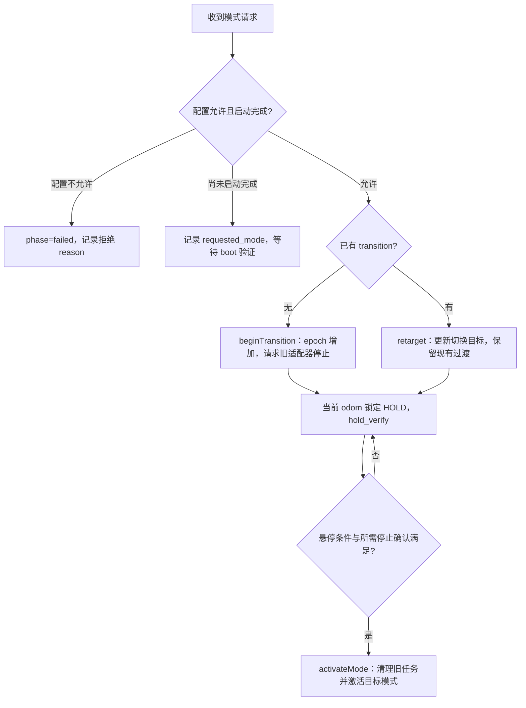

# Planner Runtime 状态与 reason 完整对照

核对日期：2026-09-20。基于当前工作区源码（Git 基线 `61b605e`，包含未提交改动），不是对某台正在运行设备的状态采样。发行包、旧二进制或运行时参数不同，实际行为可能不同。

本文覆盖 `/planner/status` 的全部字段、枚举、各模式的状态流转与 `reason` 生成分支；同时覆盖会透传到该字段的内部 Gate 原因，以及 `/planner/target_exploration/status` 的结果投影。底层优化器、探索前端和检测器的所有日志不属于同一个 `reason` 协议，本文在排查入口中说明它们与上层状态的关系。

## 1. 阅读顺序与重要区别

建议依次查看：`active_mode_str` → `requested_mode_str` → `phase_str` → `task_result_str` → `command_owner_str` → `ready_for_new_task` / `stable_hover` → `reason`，并结合消息时间和任务编号。

| 容易混淆的状态 | 实际含义 |
|---|---|
| `command_owner_str=hold` | 网关授权 HOLD 保持位置；不表示任务模式已经变成 `hold`。探索/导航等待输入时也会如此。 |
| `active_mode_str=hold` | Supervisor 已经激活 HOLD 模式。 |
| `phase_str=hold_verify` | 处于交接验证阶段；可能在等静止条件、持续时间，也可能在等导航工作线程停止确认。 |
| `phase_str=stable_hold`、`task_result_str=failed` | 上一个任务失败，但悬停交接已经完成。不是“悬停失败”。 |
| `phase_str=waiting_input`、`ready_for_new_task=False` | 可能在等目标任务的首条轨迹、恢复 ARM 确认或串行交接，不能仅凭 `waiting_input` 发新任务。 |
| `stable_hover=True` | Supervisor 的悬停标志。部分分支直接置位，部分由当前里程计更新；不是独立的、持续有效的轨迹安全证书。 |
| `map_ready=True`、`topology_ready=True` | 地图/拓扑数据已建立；不保证当前目标可达、有 frontier、局部走廊可行或求解能成功。 |
| `accepted_request_id` 更新 | 请求进入了处理分支；配置拒绝分支也会更新它，不等于模式切换成功。 |
| `reason` 包含 `pending; stable hold reached` | 保留了之前失败原因，并追加“已完成悬停”；应以当前结构化字段判断是否仍在等待。 |

`reason` 是可被后续回调覆盖的说明文本，不是错误码枚举，也不是完整事件历史。相同 `reason` 可以跨越不同阶段；不同 `reason` 也可能描述同一状态。上层自动化应以结构化字段与任务编号为准。

源码中存在少量历史注释，例如 `CommandOwner::GATE` 的“关闭本 runtime 输出”描述已经不符合当前内部 Gate 实现。本文按实际执行分支说明：当前 Gate 的指令仍通过统一网关发布。

## 2. `/planner/status` 字段

消息类型：`general_planner/PlannerStatus`。Supervisor 默认以 10 Hz 发布，并使用 latched publisher。刚订阅收到的消息可能是最后一次缓存；需要检查时间戳与持续更新情况。

来源：[消息定义][S1]、[Supervisor][S2]、[共享地图状态][S6]。

| 字段 | 含义及注意事项 |
|---|---|
| `header.stamp` | Supervisor 发布状态时的 ROS 时间，不是原始传感器采样时间。 |
| `header.frame_id` | 最近里程计的坐标系；空时使用 `world`。 |
| `transition_id` | 普通 `beginTransition()`、紧急停止时递增。并非所有内部状态变化都会递增；探索成功验证有独立分支。 |
| `task_epoch` | 当前任务控制代次。切换、新探索任务、部分导航失败恢复时递增，用于过滤迟到状态和指令。不是任务成功次数。 |
| `world_epoch` | 共享世界/地图生命周期代次。普通模式切换保留共享世界，不重建地图。 |
| `map_revision` | `MapManager` 的地图版本。 |
| `topo_revision` | 共享拓扑搜索快照版本。 |
| `accepted_request_id` | 最近处理的模式请求编号。文本请求使用本地自增编号；目标点消息不带该请求编号。 |
| `task_id` | 任务标识。自动生成格式为 `<runtime_session_id>:<task_epoch>:<mode>`，也可来自上层请求。恢复可能保留旧 ID，所以 ID 内的 epoch/模式不一定等于当前字段。 |
| `active_mode` / `active_mode_str` | 当前已激活模式，数值/字符串互为镜像。交接时通常仍是旧模式。 |
| `requested_mode` / `requested_mode_str` | 当前请求或过渡目标模式。紧急停止请求会把目标写为 HOLD。 |
| `phase` / `phase_str` | Supervisor 生命周期阶段。 |
| `mode_state` / `mode_state_str` | 导航/探索/Gate 的诊断子状态。某些过渡或失败分支保留旧值，不能单独作为任务完成依据。 |
| `task_result` / `task_result_str` | 本任务或保留的上一任务结果。失败恢复成功并不一定将其改为成功。 |
| `command_owner` / `command_owner_str` | 授权的控制指令来源，不是模式名的直接复制。网关短时断流兜底时，这个字段也不一定同步变成 HOLD。 |
| `stable_hover` | 悬停状态标志。普通交接需满足持续悬停条件；在部分终态直接置位，后续更新频率取决于模式。 |
| `ready_for_new_task` | 是否已具备开始新任务的协议条件。仍需核对模式、输入类型、里程计和当前结果。state2state 执行中替换目标另有允许路径。 |
| `odom_valid` | 组合 runtime 中为 Supervisor 接收新鲜度与 GlobalMapRuntime 里程计有效性的合取。普通 Supervisor 使用回调接收时间检查，不等价于完整的传感器质量检查。 |
| `map_ready` | 共享地图至少成功更新过，且 `map_revision>0`；当前实现不以地图最近更新时间直接判定持续新鲜度。 |
| `topology_ready` | `map_ready`、`MapManager::topologyReady()` 和有效拓扑版本共同满足。 |
| `speed_mps` | 最近里程计 `twist.linear` 的三维范数，单位 m/s。 |
| `yaw_rate_rps` | 最近里程计 `twist.angular.z`，单位 rad/s。 |
| `reason` | 最近写入的状态说明、动态原因或保留的故障原因。 |

旧的非组合启动方式若没有地图状态 provider，会用里程计有效性代替 `map_ready/topology_ready`。当前 M2 组合 runtime 使用真实共享地图 provider。

## 3. 全部枚举

来源：[状态枚举与字符串映射][S3]。

### 3.1 模式

| 数值 | 字符串 | 用途 | 正常等待 / 执行时的 owner |
|---|---|---|---|
| 0 | `hold` | 固定位置保持，等待下一模式请求 | HOLD |
| 1 | `state2state` | 点到点导航，可在执行中更新目标 | HOLD / STATE2STATE |
| 2 | `exploration` | coverage 探索 | HOLD / EXPLORATION |
| 3 | `emergency_stop` | 紧急停止请求类型，通常转为请求 HOLD | HOLD |
| 4 | `target_exploration` | 朝指定目标的探索 | HOLD / EXPLORATION |
| 5 | `gate` | 内部洞口观测、SE3 规划和穿越 | HOLD / GATE |
| 6 | `tracking` | 连续目标跟踪 | HOLD / STATE2STATE |

文本请求支持别名：`hold/wait/idle`，`state2state/navigation/nav/s2s`，`exploration/explore`，`target_exploration/target-exploration/targetexploration/target_explore/target-explore`，`tracking`，`gate`，`emergency_stop/estop/emergency`。解析会转小写，但不会去除前后空格。未知文本只写警告，不修改状态；结构化消息中的未知模式值落入 HOLD 默认分支。

Runtime 没有独立的 `perching`、`tracking_perching`、`dynamic_takeoff` 模式枚举。底层 FSM 的这些 TaskMode 不等于 `/planner/mode_request_text` 支持的模式。

### 3.2 阶段

| 数值 | `phase_str` | 进入原因 / 如何退出 |
|---|---|---|
| 0 | `boot` | 初始阶段或等待有效里程计；悬停验证后激活初始模式。 |
| 1 | `waiting_input` | 等导航目标、跟踪目标、探索触发、目标探索首条轨迹或 Gate 观测；是否能发新任务还要看 ready。 |
| 2 | `planning` | 已接收任务或适配器报告规划；可能已有轨迹在执行，尤其探索的 `RUNNING` 会映射到此阶段。 |
| 3 | `executing` | 导航执行态、探索明确执行态、Gate 执行。 |
| 4 | `braking` | 模式交接、目标替换、跟踪制动或恢复；不保证所有分支都在执行同一种制动轨迹。 |
| 5 | `hold_verify` | 等悬停持续满足条件、导航停止确认，或 Gate 出口确认。Gate 此时仍可由 GATE 控制。 |
| 6 | `stable_hold` | 普通 HOLD、探索成功/受阻的空闲终态、Gate 完成。 |
| 7 | `failed` | 请求被拒绝、适配器失败或 Gate 失败。是否能重新发任务由后续恢复决定。 |
| 8 | `emergency` | 收到紧急停止，目标设为 HOLD，撤销旧任务并等待交接。 |

`beginTransition()` 内先写 `braking`，同一把锁内随后写 `hold_verify`；正常发布时通常只能看到后者。实际行为是请求旧适配器停止、锁定当前 odom 为 HOLD 锚点，再验证悬停，不应把旧设计文档中的每个阶段当作必然可观察的消息。

### 3.3 任务结果与控制来源

| `task_result` | 字符串 | 说明 |
|---|---|---|
| 0 | `none` | 未产生终态，或新任务/新模式已重置结果。 |
| 1 | `succeeded` | 成功结果。state2state 的空闲 `WAIT_GOAL` 非失败分支也会写入此值，不能仅凭它认定某个新目标已到达。 |
| 2 | `failed` | 规划、指令超时、适配器或 Gate 失败；可能在恢复后仍保留。 |
| 3 | `canceled` | 紧急停止或目标探索替换旧任务时写入。普通模式切换通常重置为 `none`，不统一标成 canceled。 |
| 4 | `blocked` | 探索报告当前可用路径/桥接机会耗尽，保留地图拓扑，可显式重试或换任务。 |

| `command_owner` | 字符串 | 说明 |
|---|---|---|
| 0 | `hold` | 网关固定位置保持。 |
| 1 | `state2state` | 导航适配器来源；tracking 也使用它。 |
| 2 | `exploration` | 探索轨迹服务器来源；两种探索模式共用。 |
| 3 | `gate` | 内部 Gate 提交给网关的指令。 |

### 3.4 全部 `mode_state`

| 数值 | 字符串 | 典型来源 |
|---|---|---|
| 0 | `unknown` | 没有专门映射的适配器状态，如导航 INIT/FAILED 等。 |
| 1 | `s2s_wait_goal` | `WAIT_GOAL`、`TRACKING_LOST`，或导航模式刚激活。 |
| 2 | `s2s_generate_traj` | `GENERATE_TRAJ`。 |
| 3 | `s2s_follow_traj` | `FOLLOW_TRAJ`、`STATIC_TRACKING`、`HOLD_TRACKING`、`TRACKING_BRAKING`。后两者可能对应 phase=braking。 |
| 4 | `s2s_yawing` | `YAWING`。 |
| 5 | `s2s_emer_stop` | 底层 `EMER_STOP`；不等于收到上层 emergency_stop 请求。 |
| 10 | `exp_init` | `INIT`。 |
| 11 | `exp_wait_trigger` | `WAIT_TRIGGER/IDLE` 或探索激活后等待触发。 |
| 12 | `exp_plan_traj` | `PLAN_TRAJ/RUNNING/WAITING_LOCAL_PLAN` 或新探索任务开始。 |
| 13 | `exp_exec_traj` | `EXEC_TRAJ`。 |
| 14 | `exp_reorient` | `REORIENT`。 |
| 15 | `exp_caution` | `CAUTION`。 |
| 16 | `exp_pausing` | `PAUSING` 或目标替换请求。 |
| 17 | `exp_paused` | `PAUSED/SUCCEEDED/BLOCKED`。 |
| 18 | `exp_finish` | `FINISH/FAILED/LAND`。 |
| 19 | `exp_wait_target` | `WAITING_TARGET`。 |
| 20 | `hold_idle` | HOLD 空闲；探索成功调用公共悬停函数时也会短暂设置，再改回 exp_paused。 |
| 30 | `gate_wait_start` | 兼容保留；当前内部 Gate 正常路径不设置。 |
| 31 | `gate_executing` | 内部 Gate 执行。 |
| 32 | `gate_end_verify` | Gate 轨迹结束后确认实际通过洞口并悬停。 |
| 33 | `gate_complete` | Gate 成功终态。 |
| 34 | `gate_wait_observation` | 等稳定洞口观测。 |
| 35 | `gate_planning` | 内部 SE3 求解。 |
| 36 | `gate_failed` | 内部 Gate 失败。 |

## 4. 通用模式切换

模式请求入口：`/planner/mode_request`（结构化）或 `/planner/mode_request_text`（字符串）。正常组合启动配置使用 `serial_handover=false`，导航与探索适配器同时存活，共享世界地图。



正常 `hold → state2state`、`hold → exploration`、`exploration → state2state` 等均可直接请求，没有必须经过 exploration 的模式路由限制。模式切换完成只代表适配器已激活，不代表目标已到达或开始飞行。

### 4.1 通用 reason 对照

表中 `<mode>` 为模式字符串，`<source>` 通常是 `mode_request` 或 `mode_request_text`，`<previous>` 表示之前保存的 reason。除特别注明外，来源为 [Supervisor][S2]。

| reason 原文 / 模板 | 触发条件 | 状态及处理 |
|---|---|---|
| `boot` | 构造函数初始化。 | BOOT/HOLD；等待状态定时器更新。 |
| `waiting for odometry` | 启动尚未完成，Supervisor/共享地图里程计有效性未满足。 | 检查 odom 来源、接收频率、ROS 时钟；不是地图目标不可达的说明。 |
| `boot hover verify` | 启动时有有效里程计，但速度或偏航角速度不满足悬停条件。 | HOLD_VERIFY；条件满足并持续规定时间后启动。 |
| `queued until boot hover ready (<source>)` | 启动未完成时收到模式请求。 | 记录请求，等启动悬停验证；可能被下一次 boot 检查覆盖。 |
| `boot complete` | 启动悬停验证完成，传给 `activateMode()`。 | HOLD/导航可直接显示；探索会追加等待触发后缀，Gate 会覆盖成观测说明。 |
| `braking for <mode> (<cause>)` | `beginTransition()` 开始。 | 函数内部瞬态，通常同一次调用就被 `hold verify for ...` 覆盖。 |
| `hold verify for <mode>` | 已请求旧适配器停止，并尝试按当前 odom 锁定 HOLD。 | 等悬停验证；odom 不可用时锁定可能失败，后续 phase 可为 braking。 |
| `hold verify` | 过渡中此前没有有效 HOLD 锚点，现在静止条件满足并成功走到锁定分支；非 FAILED 结果时写入。 | 开始/继续累计悬停时间。 |
| `retarget transition to <mode>` | 已有 `transition_active_`，新请求的目标不同于原切换目标。 | 请求已处理但尚未完成；不会重新调用 beginTransition，也不会清除旧 FAILED。详见第 10 节。 |
| `mode already active (<source>)` | 请求模式已激活，且处于 WAITING_INPUT/STABLE_HOLD/PLANNING/EXECUTING，或 Gate 出口确认。 | 幂等请求；一般不重新规划。探索暂停终态和 Gate 完成态另有 rearm 分支。 |
| `stable hold reached` | 普通过渡验证完成，结果不是 FAILED，传给目标模式激活。 | 后续 reason 是否保留取决于目标模式。 |
| `<previous>; stable hold reached` | 过渡验证完成，但保留 FAILED 结果。 | 表示悬停已完成；前半段是故障历史。导航还可能等待新 ARM 对应的空闲确认。 |
| `exploration idle after finish` | 探索已报告 SUCCEEDED，悬停验证完成且目标仍为探索类模式。 | 保持探索模式，STABLE_HOLD/EXP_PAUSED、ready=true、result=succeeded。 |
| `emergency_stop from <source>` | 收到 emergency_stop 请求。 | result=canceled、requested=hold、owner=hold，验证后进入 HOLD；不必看到 active=emergency_stop。 |

`braking for ...` 中 `<cause>` 的现有调用来源包括模式请求来源，以及 `rearm exploration`、`rearm gate`、`navigation goal completed`、`navigation planning retries exhausted`、`navigation planning deadline exceeded`、`state2state replan watchdog timeout`、`target exploration first-command deadline exceeded`、`command source timeout`。这些调用标签不一定作为最终 reason 单独发布。

### 4.2 配置拒绝与激活失败

| reason 原文 | 条件 | 应对 |
|---|---|---|
| `navigation fsm disabled (relaunch with enable_navigation:=true or serial_handover:=true)` | 请求 state2state/tracking，但 `navigation_enabled=false` 且非串行交接。 | 核对运行节点实际参数和 launch。这里的 enable_navigation 是历史提示名，当前组合 launch 不一定有同名 arg；不能机械照抄。 |
| `tracking requires serial_handover=false (composed runtime)` | 串行交接配置下请求 tracking。 | 使用组合 runtime。 |
| `gate requires serial_handover=false (composed command gateway)` | 串行交接配置下请求 gate。 | 使用组合网关，避免旧串行控制源冲突。 |
| `exploration node disabled (relaunch with enable_exploration:=true)` | 请求探索类模式但 `exploration_enabled=false`。 | 检查适配器启用配置；同样核实 launch 是否暴露提示中的 arg。 |
| `cannot activate state2state without navigation fsm_node` | 激活导航模式时再次发现导航禁用。 | 内部/初始模式激活防线；字符串也可能出现在 tracking 激活中。 |
| `cannot activate exploration without exploration_node` | 激活探索时发现探索禁用。 | 核对配置和实际启动链路。 |
| `internal gate requires composed command gateway` | 内部激活 Gate 时仍处于串行配置。 | 改用组合配置。 |
| `internal gate runtime unavailable` | 请求 Gate，但 GateRuntime 对象不存在。 | 检查 runtime 构造和节点启动日志。 |

请求拒绝的若干分支只设置 `phase=failed`、请求编号和 reason，并没有统一设置 `task_result=failed` 或撤销旧控制源。因此不能把“请求被拒绝”解读成“旧任务已安全停止”。

## 5. state2state 与 tracking

### 5.1 输入和正常流程

- state2state：激活 → `waiting_input/s2s_wait_goal/owner=hold` → 接收目标 → planning → executing → 目标结束后的悬停验证 → 再次等待目标。
- tracking：激活 → 等新鲜目标 → planning → 连续跟踪；丢失目标可进入制动，再等确认重捕获；恢复轨迹执行期间仍可能继续重规划。
- `/planner/navigation/goal`、`/planner/click_goal` 是普通导航目标入口，`/goal_3d` 默认保留消息中的高度。是否采用普通消息的 z 还取决于底层目标高度策略。
- state2state 允许执行中更新目标，同一导航任务内不强制要求 `ready_for_new_task=true`；但过渡中或失败恢复 ARM 未完成时拒收。
- tracking 不通过 `/planner/click_goal` 触发，使用配置的跟踪目标输入。它的 `command_owner_str=state2state` 是共用导航适配器的正常表现。

### 5.2 reason 对照

| reason 原文 / 模板 | 触发条件 | 状态及后续 |
|---|---|---|
| `navigation goal accepted` | 普通目标通过 Supervisor 的模式/过渡/恢复检查。 | PLANNING、owner=state2state；只代表 Supervisor 已转发，不代表底层已接受或求解成功。 |
| `navigation 3d goal accepted` | 3D 目标入口通过检查。 | 同上，走保留高度的输出话题。 |
| `navigation planning` | 导航状态上报 `GENERATE_TRAJ`。 | PLANNING，开始/继续导航规划期限检查。 |
| `navigation FOLLOW_TRAJ` | 收到 `FOLLOW_TRAJ`。 | EXECUTING，等待执行/重规划状态。 |
| `navigation STATIC_TRACKING` | 收到 `STATIC_TRACKING`。 | EXECUTING；属于导航适配器执行态。 |
| `navigation HOLD_TRACKING` | 收到 HOLD_TRACKING 且未被 tracking 专用分支处理。 | 通用分支为 EXECUTING；当前 active=tracking 时应走下一行专用 reason。 |
| `navigation YAWING` | 收到 `YAWING`。 | EXECUTING，执行偏航动作。 |
| `navigation wait goal` | state2state 收到有效 WAIT_GOAL，没有待确认的新目标派发，且不需保留失败结果。 | WAITING_INPUT、owner=hold、ready=true；当前实现会将 result 写为 succeeded，包括某些初始空闲回报。 |
| `tracking waiting for fresh target` | tracking 收到 WAIT_GOAL，完成必要的停止端点交接且非保留 FAILED。 | WAITING_INPUT、owner=hold、result=none；等待检测/估计输入满足跟踪条件。 |
| `tracking target lost; controlled braking` | tracking 状态上报 TRACKING_BRAKING。 | BRAKING，owner 仍为 state2state，继续采样已提交的制动轨迹。 |
| `tracking recovery command; replanning continues` | tracking 状态上报 HOLD_TRACKING。 | BRAKING，继续输出恢复轨迹并尝试重规划；不等于任务失败或 HOLD 模式。此行为来自当前工作区改动。 |
| `tracking waiting for stationary command endpoint` | tracking 已回报 WAIT_GOAL/TRACKING_LOST，但网关还不能确认静止导航端点，且超时悬停完成条件也未满足。 | 保持 BRAKING/ready=false；检查源指令的速度、加速度、jerk、yaw_dot、接收新鲜度与 QUIESCENT。 |
| `tracking target lost; waiting for confirmed reacquisition` | TRACKING_LOST，停止交接已完成，且没有保留 FAILED。 | WAITING_INPUT、owner=hold，继续等待确认重捕获；模式仍为 tracking。 |
| `navigation planning retries exhausted; verified hold pending` | 有 lifecycle 的导航 FAILED，对应当前任务和目标序号，且任务仍在派发/规划/执行。 | 取消并验证 HOLD，result=failed，随后尝试重新 ARM 同一导航类模式；旧目标不会因恢复自动成功。 |
| `navigation planning deadline exceeded; verified hold pending` | 导航类模式持续处于 PLANNING 达到 `navigation_planning_timeout`；同 epoch/goal sequence 计时。 | 防止规划线程长期不返回；进入失败恢复。 |
| `state2state replan watchdog timeout; verified hold pending` | 收到当前 epoch 的重规划 watchdog；要求 active=state2state、owner=state2state 且未过渡。 | 进入同模式失败恢复。底层通常是在备份轨迹静止端点等待重规划过久时报告。 |

导航重试次数耗尽和 watchdog 都不能仅从上层 reason 推断为“MINCO 算法错误”。具体可能涉及前端路径、走廊、优化、验收或工作线程阻塞，需结合底层日志。

### 5.3 导航停止确认与迟到状态

`/planning/navigation/status` 为 `std_msgs/String`，当前格式：

```text
<state> <task_epoch> <goal_sequence> <ACTIVE|IDLE> <BUSY|QUIESCENT>
```

- `QUIESCENT` 只有同时为 `IDLE` 才被解析成有效空闲确认。
- 不同 `task_epoch`、小于当前记录的 `goal_sequence` 的 lifecycle 状态被忽略。
- 旧格式仅含状态或部分字段可以兼容解析，但不能解除需要明确停止确认的恢复等待。
- FAILED 导航恢复在悬停验证后要求最近 0.5 秒内的 QUIESCENT；重新 ARM 使用新 epoch，以免旧的空闲状态误解锁新任务。
- 本地 `EMER_STOP` 目前只有 mode_state 映射，没有统一的 `navigation EMER_STOP` reason/phase 分支；reason 可能暂时保留旧值，或后续由指令超时分支更新。

## 6. exploration 与 target_exploration

### 6.1 正常流程与输入含义

普通 exploration 的 click_goal 主要是开始 coverage 探索的触发，不是“必须飞到该点”的 state2state 目标。动态 bounding box 控制探索区域；发布 bounding box 不会自动把 HOLD 模式切成 exploration。

target_exploration 的 click_goal 包含任务目标。独立的 `/planner/exploration/target_goal` 默认负责提交/更新目标；在空闲阶段仅提交目标不等于 Supervisor 已启动新任务。底层是否接收目标即启动还受其配置影响，应优先使用统一触发流程。

```text
模式请求 → 悬停验证 → 探索激活、等待触发
  → click_goal / exploration trigger → 新 task_epoch/task_id → START
  → 等待规划 / RUNNING → 执行或重规划
  → SUCCEEDED：验证悬停，保留探索模式空闲
  → BLOCKED：保留拓扑，报告受阻
  → FAILED：失败等待恢复
  → 指令源超时：切换到 HOLD，并保留 FAILED
```

### 6.2 reason 对照

| reason 原文 / 模板 | 触发条件 | 状态及处理 |
|---|---|---|
| `<activation>; waiting for exploration trigger (/planner/click_goal)` | 非串行探索激活完成；activation 通常为 boot complete 或 stable hold reached。 | WAITING_INPUT/EXP_WAIT_TRIGGER、owner=hold、ready=true，等待触发。 |
| `exploration trigger accepted; starting` | 普通探索触发通过检查。 | 创建新 epoch/task_id，发 START；初始由 HOLD 控制，等待适配器回报。 |
| `target exploration goal accepted; starting` | 目标探索触发通过检查并转发目标。 | 同上，并启动目标探索首次规划等待计时。 |
| `target exploration waiting for first verified local trajectory` | active=target_exploration，收到 WAITING_LOCAL_PLAN。 | WAITING_INPUT/EXP_PLAN_TRAJ、owner=hold、ready=false；等待首条可用局部轨迹，不是等用户再次输入。 |
| `exploration RUNNING` | 探索状态上报 RUNNING。 | PLANNING、owner=exploration；当前适配器会把多个内部活动状态汇总为 RUNNING，不能据此判定没有飞行。 |
| `exploration PLAN_TRAJ` | 上报 PLAN_TRAJ。 | PLANNING、owner=exploration。 |
| `exploration EXEC_TRAJ` | 上报 EXEC_TRAJ。 | EXECUTING、owner=exploration。 |
| `exploration REORIENT` | 上报 REORIENT。 | EXECUTING、owner=exploration，执行转向相关动作。 |
| `exploration CAUTION` | 上报 CAUTION。 | PLANNING、owner=exploration，具体恢复原因需查看探索 FSM。 |
| `exploration finished, verifying hover` | 当前任务首次报告 SUCCEEDED。 | 结果先为 succeeded，但 ready=false；锁定终态位置并验证悬停，不能立即派发下一任务。 |
| `exploration idle after finish` | 上一行的验证结束。 | 保留探索模式，STABLE_HOLD/EXP_PAUSED、owner=hold、ready=true。 |
| `target exploration blocked; topo graph retained` | 任一探索类模式报告 BLOCKED。 | STABLE_HOLD、result=blocked、owner=hold、ready=true；字符串虽含 target，也可能来自 coverage 受阻。 |
| `exploration failed` | 当前任务首次上报 FAILED。 | FAILED、ready=false、owner=hold；不自动等价为 active=hold，需要明确恢复/模式请求。 |
| `target replacement requested; pausing active task` | 活跃目标探索接到替换目标。 | BRAKING/EXP_PAUSING、result=canceled，暂保留 exploration 控制，等旧 task_id 的 PAUSED。 |
| `target replacement rejected after PAUSED` | 旧任务 PAUSED 后，转发替换目标的模式/过渡条件不再满足。 | FAILED、owner=hold、ready=false；不是一个“目标坐标碰撞校验失败”专用原因。 |
| `target replacement accepted; starting new task` | 收到旧任务匹配的 PAUSED，替换目标转发成功。 | 新 epoch/task_id，HOLD 交接，重新 START 并等待首条轨迹。 |
| `target exploration first-command deadline exceeded; verified hold pending` | target_exploration 当前 task_id 的首轮等待超过 `exploration_first_command_timeout`。 | 进入同目标探索模式的失败过渡，标记旧失败 task_id 并拒绝其迟到 RUNNING。激活探索分支后会将 task_result 重置 none；失败历史可能只保留在拼接 reason 中。 |

适配器当前 `publishTaskStatus()` 的实际输出映射为：

| 适配器内部条件 | `/planning/exploration/status` 输出 |
|---|---|
| PAUSED 且完成标志有效 | `SUCCEEDED <task_id>` |
| 还在等待任务目标 | `WAITING_TARGET <task_id>` |
| PAUSED 且目标不可达/coverage 受阻 | `BLOCKED <task_id>` |
| 其他 PAUSED | `PAUSED <task_id>` |
| PAUSING 或 FINISH | `PAUSING <task_id>` |
| LAND | `FAILED <task_id>` |
| INIT 或 WAIT_TRIGGER | `IDLE <task_id>` |
| 配置为目标探索且尚未发布本任务轨迹 | `WAITING_LOCAL_PLAN <task_id>` |
| 其他活动状态，包括普通探索首轮规划 | `RUNNING <task_id>` |

所以 Supervisor 支持的 `exploration PLAN_TRAJ/EXEC_TRAJ/...` 是兼容输入分支，当前内置适配器常见的是 `exploration RUNNING`。不能把内部枚举与实际话题输出逐字等同。

### 6.3 状态保留与去重

- 带 task_id 的旧探索状态在 ID 不匹配时被忽略。
- SUCCEEDED/BLOCKED/FAILED 按 task_id 和终态去重，避免反复锁定悬停位置或重开过渡。
- IDLE/WAITING_TARGET/PAUSED/PAUSING 等可能只更新 mode_state，不单独写 reason/phase；此时应同时检查原始状态话题。
- 目标替换期间，重复输入会合并成最后一个目标；只有旧任务匹配的 PAUSED 才允许创建新任务。
- `task_command_started_` 标记适配器已发布轨迹，不等于网关已收到 `PositionCommand`；中间还有 traj_server 链路。

## 7. 指令超时与 HOLD 恢复

来源：[Supervisor][S2]、[网关][S4]、[超时判定策略][S5]。

| reason 模板 | 触发条件 | Supervisor 后果 |
|---|---|---|
| `command source timeout in <mode> (no command received within startup grace=<N>s); verified hold pending` | 当前授权以来一条源指令都没收到，授权持续时间达到启动宽限。 | result=failed；state2state/tracking 过渡回本导航模式以恢复，探索/Gate 过渡到 HOLD。 |
| `command source timeout in <mode> (age=<N>s); verified hold pending` | 当前授权以来收到过源指令，但最后一次指令已过新鲜度阈值且年龄达到持续断流阈值。 | 同上。age 是最后一次接收距今，不是“超过新鲜阈值后额外累计”的时间。 |
| 上述 reason 再追加 `; stable hold reached` | 已完成这次悬停验证并激活目标模式。 | 失败结果可保留；前半句 pending 是历史文本，不代表当前仍未完成。 |

触发监测还要求：phase 为 PLANNING/EXECUTING，或 Gate 的 GATE_END_VERIFY；模式对应的 owner 必须与网关当前授权匹配。普通 BRAKING 不统一使用这条 Supervisor 超时退出路径。

**两层超时不可混用：**

1. 网关认为源不新鲜时，先按当前里程计建立一次兜底 HOLD，等待源恢复；默认新鲜度阈值 `command_timeout=0.30s`。没有首条源指令时也会进入等待源的兜底。
2. Supervisor 在首条等待达到 2.0s，或已启动后最后指令年龄达到 1.0s 时，才在适用阶段退休任务并写上述失败 reason。

网关的 `source timeout` / `source resumed safely` 日志不直接写 `/planner/status.reason`。因此短暂实际输出 HOLD 时，status 仍可能显示 owner=exploration/state2state、phase=planning/executing。

探索链路为：

```text
Exploration FSM
  → /planning/trajectory + /planning/yaw_trajectory
  → highspeed_traj_server
     （需要执行开关、至少一次 heartbeat、可接收的轨迹）
  → /planning/exploration/pos_cmd
  → PlannerCommandGateway
  → /planning/pos_cmd
```

首条指令超时可以来自规划尚未完成、无可用路径、规划失败、轨迹服务器未运行、轨迹格式/ID 被拒收、执行开关未启用、还未收到 heartbeat，或话题连接问题。仅凭该 reason 无法区分这些底层原因。

## 8. Gate 内部任务

当前 Gate 走内部观测/SE3 任务；外部 `/planner/gate/status` 的 START/END 被忽略，只输出警告。不要用旧外部接管协议解释当前 Gate 行为。

### 8.1 正常状态与 reason

| Gate 内部阶段 / reason | Supervisor 表现 | 原因与下一步 |
|---|---|---|
| `waiting for detector aperture observations` | WAITING_INPUT/GATE_WAIT_OBSERVATION/HOLD | `activateMode(gate)` 初始说明。 |
| OBSERVING：`waiting for stable aperture observations` | WAITING_INPUT/GATE_WAIT_OBSERVATION/HOLD | 新任务启动，启用检测，等待任务开始后的连续稳定洞口观测，以及有效 odom/map。 |
| PLANNING：`locked aperture; solving SE3` | PLANNING/GATE_PLANNING/HOLD | 连续观测数量、时效、一致性、odom/map、静止条件满足，锁定洞口并异步求解。 |
| READY：`SE3 trajectory validated` | Supervisor 尝试授权 GATE 并 execute；可能已经显示 EXECUTING | 轨迹已通过验证。启动执行还要再次检查起点和 odom，文本可能短暂落后于阶段。 |
| EXECUTING：`executing internal SE3 gate trajectory` | EXECUTING/GATE_EXECUTING/GATE | 开始发布内部 SE3 指令。 |
| SETTLING：`verifying measured exit and hover` | HOLD_VERIFY/GATE_END_VERIFY/GATE | 参考轨迹到时，但还要用实测位置确认越过墙面、接近终点并持续静止。 |
| SUCCEEDED：`measured gate crossing completed` | 内部 Gate 成功；Supervisor 通常立即转入下一行 | 实测通过和静止持续时间均满足。此内部 reason 不一定能在公开状态中看到。 |
| `gate complete and stable; ready for state2state or exploration` | STABLE_HOLD/GATE_COMPLETE/HOLD、result=succeeded、ready=true | 在实际最终里程计位置接回 HOLD。active_mode 仍为 gate。 |

成功条件不是“轨迹时间到”一项：还包括沿洞口法向的实际穿出距离、距终点小于 `finish_radius`、速度 <0.10 m/s、偏航角速度绝对值 <0.10 rad/s，且持续 `completion_hold_time`。

### 8.2 Gate 运行与执行故障 reason

以下内部故障经 `task.reason` 透传。通常最终为 `phase=failed/mode_state=gate_failed/result=failed/owner=hold`。Gate 失败后的周期分支在当前悬停条件满足时可把 ready 置 true，因此 `failed + ready=true` 也可能出现。

| reason 原文 / 前缀 | 触发条件 | 排查方向 |
|---|---|---|
| `gate odometry unavailable` | Supervisor 更新 Gate 时发现 `odom_valid=false`；优先覆盖其他 Gate 原因。 | 里程计来源、时钟、接收频率。 |
| `gate start state changed before execution` | READY 后 execute 的 epoch/phase/odom/起点静止检查失败。 | 规划与执行之间是否移动；任务是否被取消。 |
| `OBSERVATION_TIMEOUT` | 从 start 起超过 `gate/observation_timeout`，仍未进入规划。 | 检测开关、geometry_valid、stamp、frame、稳定观测计数、odom/map、速度；不只表示“没有检测消息”。 |
| `START_MOVED_DURING_PLANNING` | 求解结束后 odom 不新鲜、frame 改变、位置偏离规划起点 >0.08m 或速度 >0.10m/s。 | 稳定起点、定位和控制延迟。 |
| `SE3_SOLVE_FAILED_OR_TIMEOUT` | SE3 优化返回失败。 | 约束是否可行、求解日志、时间预算。字符串不区分无解与超时。 |
| `ODOMETRY_STALE_OR_FRAME_CHANGED` | EXECUTING/SETTLING 时 Gate 自身 odom 时效或 frame 校验不通过。 | Gate 同时检查接收墙钟时间与消息 ROS stamp。 |
| `EXECUTION_CLOCK_TIMEOUT` | 执行 ROS 时间回退超过 0.01s，或墙钟执行时间超过轨迹总长 + finish_timeout + 2s。 | 仿真 /clock 暂停、跳变或执行超时。 |
| `TRACKING_ERROR ...` | 实际位置相对当前参考，或延迟匹配参考的误差超过 tracking_error。 | 控制器跟踪、坐标系、反馈延迟。后缀含 t、matched_t、receipt_age、error、lateral、measured/reference。 |
| `GATE_LATERAL_TRACKING_ERROR ...` | 实测或匹配参考处于洞口附近时，横向误差超过 near_gate_lateral_error。 | 洞口附近横向跟踪与反馈；该阈值比一般位置误差严格。 |
| `MEASURED_CORRIDOR_VIOLATION ...` | 以实测位置和姿态计算的机体椭球不能被任一走廊单元包住。 | 实际机体与走廊边界冲突；参考轨迹通过不代表实测通过。 |
| `MAP_COLLISION_OR_UNKNOWN measured_body` | 实际机体地图检查失败。 | 结合下方 MAP_* 后缀区分占据、未知和出图。 |
| `INVALID_COMMAND` | 当前轨迹采样不能通过 SE3 flatness 映射生成指令。 | 数值异常、导数/动力学映射。 |
| `EXIT_NOT_REACHED` | 轨迹结束后超过 finish_timeout，尚未满足实际穿出与终点静止条件。 | 是否真正越过洞口、终点误差、悬停是否持续满足。 |
| 任意 `std::exception::what()` | 异步规划 worker 抛出异常，且仍属于当前 generation/PLANNING。 | 查节点异常上下文；这是开放字符串来源，无法枚举所有库异常文本。 |

### 8.3 Gate 几何、轨迹与地图验收 reason

来源：[Gate 前端][S9]、[Gate runtime][S8]。带 `t=<seconds>` 的模板来自采样验证，可发生在整条轨迹验收或执行中的前视检查。

| reason | 精确触发条件 / 含义 |
|---|---|
| `INVALID_APERTURE` | geometry_valid=false，或边界点数不在 4～64。 |
| `INVALID_START` | 起点或 yaw 非有限数。 |
| `INVALID_NORMAL` | 洞口中心/法向非有限，或法向长度 <1e-6。 |
| `APERTURE_TOO_FAR` | 洞口中心到起点距离超过 max_distance。 |
| `INVALID_WALL_DEPTH` | 实测/配置墙厚非有限、≤0 或 >2.0m。 |
| `START_TOO_CLOSE_TO_GATE` | 起点到洞口的法向距离不足半墙厚 + 机体半径 + margin +0.05m。 |
| `HORIZONTAL_APERTURE_UNSUPPORTED` | 洞口法向与世界 Z 轴过于接近，无法建立当前支持的竖直洞口局部坐标系。 |
| `NON_PLANAR_APERTURE` | 边界点非有限、离洞口平面 >0.04m，或距中心 >5m。 |
| `DEGENERATE_EDGE` | 相邻边界点形成的有效边法向长度 <1e-5。 |
| `CENTER_ON_BOUNDARY` | 中心到某条边的侧向距离绝对值 <0.01m。 |
| `UNORDERED_APERTURE` | 边界绕序相对中心不一致。 |
| `NON_CONVEX_APERTURE` | 顶点违反凸多边形边半空间，容差 0.005m。 |
| `MAP_ANCHOR_OCCUPIED` | 给优化器构造地图约束时，机体锚点与占据体素相交。 |
| `MAP_ANCHOR_MARGIN` | 锚点的机体/地图分离面不能满足安全 margin。 |
| `EMPTY_TRAJECTORY` | 求解结果轨迹为空。 |
| `INVALID_DURATION` | 总时长非有限、≤0 或 >25s。 |
| `CANCELED_OR_TIMEOUT` | 验收期间 should_stop 返回 true；可能是取消、时间预算到或 ROS 关闭。 |
| `NON_FINITE_TRAJECTORY t=<seconds>` | 位置/速度/加速度/jerk 非有限，或 flatness 映射失败。 |
| `DYNAMIC_LIMIT t=<seconds>` | 速度、推力、角速度或倾角超过配置限制（有小数值容差）。 |
| `SE3_CORRIDOR_VIOLATION t=<seconds>` | 含机体形状与 margin 的走廊违反量 >0.001。 |
| `INVALID_VALIDATION_POLICY t=<seconds>` | 验证策略不是 corridor_only 或 corridor_and_map。正常构造阶段通常已拒绝该配置。 |
| `MAP_COLLISION_OR_UNKNOWN t=<seconds>` | corridor_and_map 策略下机体检查失败，或没有可用 body_clear。 |
| `; MAP_OUT_OF_BOUNDS body=[...] voxel=[...] body_z=[...]` | 机体包围范围越出地图边界，作为地图失败后缀追加。 |
| `; MAP_OCCUPIED body=[...] voxel=[...] body_z=[...]` | 机体与占据体素相交。 |
| `; MAP_CENTER_NOT_FREE body=[...] voxel=[...] body_z=[...]` | require_known_free=true 时，机体中心不属于 KNOWN_FREE。 |
| `; MAP_UNKNOWN body=[...] voxel=[...] body_z=[...]` | require_known_free=true 时，机体与未知体素相交。 |

两个容易误解的内部字符串：`OK` 是前端校验成功返回值，不是通常公开的 Gate 状态 reason；`NO_LEVEL_MAP_ANCHOR` 表示没有找到水平姿态地图锚点，但函数返回 true，允许继续用 SE3 姿态求解，不直接判任务失败。不要把这两个字符串当作上述失败表中的终态。

构造异常 `invalid gate configuration`、`gate/validation_policy must be corridor_only or corridor_and_map` 属于启动失败日志，可能导致节点尚未建立 `/planner/status`，不是一个已运行任务的正常 reason。

## 9. 兼容串行交接与目标探索摘要

### 9.1 串行交接 reason

仅 `serial_handover=true` 有效；当前主组合 launch 显式设为 false。

| reason 原文 / 模板 | 条件 |
|---|---|
| `<activation>; serial handover to click-demo fsm` | 激活 state2state，请求 helper 启动独立 click-demo FSM，ready=false。 |
| `<activation>; relaunching exploration stack via serial handover` | 激活探索，等待 helper 重建探索栈，ready=false。 |
| `serial click-demo fsm ready; publish goals to /planner/click_goal` | helper 回报 state2state_ready；关闭当前网关发布，由独立 FSM 接管最终总线。 |
| `serial exploration stack ready; waiting for /planner/exploration/trigger` | helper 回报 exploration_ready；重新启用网关，发布 READY 替换旧 PAUSE，必要时重发 START。 |
| `forwarded click goal to serial fsm` | 串行导航已 ready，Supervisor 转发 click goal。phase=planning，但 ready 仍可为 true。 |
| `serial handover failed: <state>` | helper 状态以 failed 开头。phase=failed、ready=false，网关恢复 HOLD 授权。 |

不要把这些历史分支作为新部署切换的推荐流程。组合 runtime 中 exploration/state2state 模式切换不需要杀节点或重建地图。

### 9.2 `/planner/target_exploration/status`

消息类型 `general_planner/TargetExplorationStatus`，包含 header、task_epoch、task_id、result、reason。其 result 数值与 PlannerStatus 的 task_result **不是同一套枚举**：RUNNING=0、SUCCEEDED=1、FAILED=2、READY=3。

这是任务派发视角的投影，不是轨迹执行验收。来源：[摘要投影][S7]。

| result / reason | 条件（按代码判定优先级） |
|---|---|
| FAILED / `target exploration inactive` | active_mode 不是 target_exploration。其他模式正常工作时也会出现，不代表整个 planner 故障。 |
| FAILED / `recovery required: <planner reason>` | phase=failed/emergency 或 task_result=failed。 |
| FAILED / `target blocked: <planner reason>` | 本 epoch/task_id 首次看到 BLOCKED；保证先报告一次失败再允许重试。 |
| RUNNING / `handover pending: <planner reason>` | boot/transition/target replacement/START retry 仍 busy。 |
| FAILED / `waiting for odometry` | 非 busy 且 odom_valid=false。 |
| FAILED / `waiting for map` | 非 busy、odom 有效但 map_ready=false。 |
| SUCCEEDED / `target reached; next task allowed` | 空闲阶段、ready、stable_hover、当前实时悬停、owner=hold 均满足，且 task_result=succeeded。 |
| READY / `target blocked; retry or another target allowed` | 同上，BLOCKED 已报告过一次，现可重试/换目标。 |
| READY / `ready for a target task` | 同上，非 succeeded/blocked。 |
| FAILED / `target blocked; waiting for recovery` | 已 BLOCKED，但尚未满足可派发条件。 |
| RUNNING / 原样 `<planner reason>` | 其他仍在运行或等待的情况。 |

该投影没有把 topology_ready 纳入 ready 判定；map/odom/悬停通过也不保证新目标有可行路线。上层按本话题派发目标时，只使用 SUCCEEDED 或 READY 作为允许发起下一任务的结果。

## 10. 已观察问题与当前实现边界

以下两条在本次文档核对的源码中仍存在相应路径。本文记录行为与修复方向，没有修改控制逻辑，也没有把静态分析当作现场复现。

### 10.1 `retarget transition to state2state` 长时间不结束

已观察组合：active=exploration、requested=state2state、phase=hold_verify、result=failed、owner=hold、速度为零。

对应路径：

1. 探索指令超时，开始向 HOLD 过渡，并保留 FAILED。
2. 过渡结束前收到 state2state 请求，走 retarget，仅修改目标。
3. timer 中的条件是“目标为导航类 + FAILED + 缺少新鲜导航 QUIESCENT”。它没有限定失败来自导航任务。
4. 当前只给旧 exploration 发了 PAUSE，没有给导航发送匹配本次 epoch 的停止/同步请求；导航旧 epoch 回报会被过滤，可能永久等不到需要的确认。
5. 该分支只把 ready 保持 false，不写新的等待说明，因此 reason 长期留在 retarget，stable_hover 也可能保持 false。

这解释了为什么绕回 exploration 后再切 state2state 可能恢复：避开导航 FAILED 等待条件，探索激活清除任务结果后，再开始一次新的普通切换。它不是模式设计要求。

处理方向：将导航停止等待绑定“实际存在的待取消导航任务/epoch”，并明确其确认协议；不要简单删除导航 worker 停止保护。操作层面可显式请求 HOLD，确认 active=hold、phase=stable_hold、ready=true 后再请求目标模式，以避免在失败过渡中持续 retarget。

### 10.2 普通探索首条指令 2 秒超时

已观察终态：

```yaml
active_mode_str: hold
requested_mode_str: hold
phase_str: stable_hold
mode_state_str: hold_idle
command_owner_str: hold
task_result_str: failed
stable_hover: true
ready_for_new_task: true
reason: "command source timeout in exploration (no command received within startup grace=2.000000s); verified hold pending; stable hold reached"
```

含义是探索失败、悬停恢复已完成。与前一小节卡在 hold_verify 的情况不同。

普通探索在尚未发布第一条轨迹时也会上报 RUNNING，Supervisor 此时即授权 exploration 并开始 2 秒首条指令等待。拓扑等待、全局路径、局部优化、轨迹服务器链路均可能消耗此窗口。目标探索已有 WAITING_LOCAL_PLAN 与独立默认 15 秒等待，但当前覆盖探索没有同样完整的区分。

排查需在新任务触发前开始记录：有没有新轨迹、traj_server 是否运行、执行开关与 heartbeat 是否到达、是否生成 exploration/pos_cmd。不能只看失败后 command_enabled=false，因为这是 PAUSE 的正常后果。

若证明确为规划耗时超过 2 秒，可在允许的 0.5～10 秒范围内临时扩大 source_startup_grace_duration 进行对照验证；若根因是无路径、无 publisher 或轨迹拒收，延长时间不会解决。根治方向是：首轮规划期间保持 HOLD，使用独立有界的规划等待；有效首条指令到达后再交出控制，并保留执行断流监测。

### 10.3 其他状态解释边界

- HOLD 的 stable_hover/ready 会周期更新；若静止条件后来不满足，phase 可能仍保留 stable_hold，而这两个布尔值已为 false。不能只匹配 phase 字符串。
- 普通静态悬停检查使用 odom 的速度字段。若上游始终填零，状态只能反映该输入，不能证明机体物理静止。
- Gate 失败终态可在悬停后 ready=true；配置拒绝的 FAILED 分支却未统一清理旧控制源。两个 FAILED 的处理方式不同。
- 导航 WAIT_GOAL 可将 result 写为 succeeded，即使并无新目标刚完成；完成判断还需跟踪本次派发与生命周期。
- 目标探索首轮超时恢复重新激活探索时会清除 FAILED 结果，但 reason 可能仍拼接旧失败说明。文本和结果字段不是永久一一对应。
- 世界地图和拓扑跨模式保留；切换成功不等于地图被重新建立，也不应该用切换次数解释 map_revision。

## 11. 只写日志、不一定更新 reason 的情况

| 日志/现象 | 条件与含义 |
|---|---|
| `ignore unknown mode_request_text` | 未知模式字符串，包括多余空格造成无法识别；没有新的切换状态。 |
| `drop click goal: boot=... transition=...` | 启动或切换中发送 click goal，直接丢弃。 |
| `drop click goal: mode=... (need exploration or state2state)` | HOLD/tracking/gate 等模式不接受此通用点击入口。 |
| `drop navigation goal: inactive or transitioning` | 当前不是 state2state 或仍在切换。 |
| `drop navigation goal: recovery ARM pending` | 失败恢复尚未完成。 |
| `drop navigation goal: waiting for serial click-demo fsm handover` | 串行 helper 未 ready。 |
| `drop exploration trigger ... ready=0` / `drop exploration trigger while phase=...` | 尚未准备好，或正在规划/执行/交接；目标探索替换有单独受控路径。 |
| `drop target exploration goal: mode=... transition=...` | 专用目标输入不符合当前模式或过渡状态。 |
| `cannot replace target task ...` | 替换要求不成立，例如非目标探索、过渡中或 task_id 为空。 |
| `ignore stale exploration status` | task_id 不匹配；不会解除当前等待。 |
| 导航旧 epoch / 旧 goal_sequence 被忽略 | 当前分支可直接 return，不保证有独立警告或 reason。 |
| `[Fsm] reject ARM until canceled planning returns` | 工作线程仍忙，底层拒绝 ARM；Supervisor reason 未必立即变化。 |
| `[Fsm] defer task-mode switch ...` | 重规划占用 executor，暂不允许替换模式。 |
| `cannot authorize HOLD for ...: current odometry is unavailable` | 无有效新鲜 odom，清除旧锚点；不能据 owner=hold 推断一定正在发布有效保持指令。 |
| `[planner_command_gateway] source timeout ...` | 网关临时兜底，不等于 Supervisor 已判任务失败。 |
| `External gate START/END ignored ...` | 当前内部 Gate 不使用旧 START/END 接管协议。 |

所以“发送目标后 reason 没变”不意味着目标已成功排队。多数拒收并不建立重试队列，需先满足接收条件再明确发送。

## 12. 相关参数与时间基准

### 12.1 Supervisor / 网关

下表为当前代码默认值，实际以节点参数和 launch 覆盖为准。Supervisor 的参数通常位于 `/planner_runtime_node/<name>`；修改 state2state 的算法 YAML 不一定影响这些上层参数。

| 参数 | 默认值 | 范围/用途 |
|---|---|---|
| `hover_speed_threshold` | 0.10 m/s | 限制到 0.01～1.0；三维速度范数。 |
| `hover_yaw_rate_threshold` | 0.10 rad/s | 限制到 0.01～1.0；检查绝对值。 |
| `hover_hold_duration` | 0.50 s | 限制到 0.1～5.0；普通启动/切换需连续满足。 |
| `max_odom_age` | 0.20 s | 限制到 0.05～1.0；Supervisor 接收时间新鲜度。 |
| `global_map/max_odom_age` | 0.20 s | 共享地图状态的里程计时效，范围 0.05～5.0。 |
| `status_rate` | 10 Hz | 限制到 1～50；状态周期与过渡检查。 |
| `exploration_start_retry_period` | 0.50 s | 限制到 0.1～2.0；START 未确认时重发。 |
| `source_startup_grace_duration` | 2.0 s | 限制到 0.5～10.0；授权后首条源指令宽限。 |
| `source_timeout_abort_duration` | 1.0 s | 限制到 0.5～10.0；已有指令后持续断流退休任务。 |
| `command_timeout` | 0.30 s | 网关新鲜度，限制到 0.05～2.0；短时兜底先于 Supervisor 退休任务。 |
| `navigation_planning_timeout` | 5.0 s | PlanningDeadline 有效范围 0.5～60；连续 planning，同 epoch/sequence 计时，退出 planning 或代次变化重新计时。 |
| `exploration_first_command_timeout` | 15.0 s | 有效范围 2～60；当前专用于目标探索首轮等待。 |
| 导航 QUIESCENT 新鲜度 | 0.50 s | 当前 timer 中硬编码，不是同名 ROS 参数。 |

普通悬停持续时间、Supervisor odom 接收时效使用 ROS 时间；网关指令接收/授权年龄、目标探索首轮期限、Gate 大部分看门狗使用墙钟时间；导航 PlanningDeadline 使用 steady clock。仿真 `/clock` 暂停时，不同计时器行为不同，不能只按屏幕 ROS stamp 推算所有超时。

这些参数多数在构造/初始化时读取，运行中 `rosparam set` 不会自动改写已缓存成员。需要从正确 launch 参数或配置设置后重启，且注意节点 `clear_params=true` 会覆盖预先设置的参数。

release 的 `planner_runtime.launch` / `planner_runtime_sim.launch` 暴露了 source_startup_grace_duration 与 source_timeout_abort_duration；源码 `task_planner/launch/planner_runtime.launch` 当前未暴露同名 arg。使用哪个入口，就核对哪个 launch 的转发，不能把一个入口的参数直接假定为另一个入口支持。

### 12.2 Gate 常用默认值

完整配置见 [gate_runtime.yaml][S10]。

| 参数 | 默认值 | 主要影响 |
|---|---|---|
| `gate/stable_observations` | 2 | 连续稳定观测数量。 |
| `gate/observation_timeout` / `observation_max_age` | 20.0 / 2.0 s | 等待观测的总窗口、单次观测时效。 |
| `gate/center_tolerance` / `normal_tolerance` / `area_tolerance` | 0.02 m / 0.05 rad / 0.15 | 观测中心、法向和面积的一致性。 |
| `gate/planning_timeout` | 8.0 s | 求解与验收停止令牌预算。 |
| `gate/odom_timeout` | 0.30 s | Gate 自身接收时间与消息 stamp 检查。 |
| `gate/tracking_error` / `near_gate_lateral_error` | 0.50 / 0.025 m | 一般位置跟踪误差与洞口附近横向误差。 |
| `gate/finish_timeout` / `finish_radius` | 5.0 s / 0.15 m | 实测终点确认窗口与位置容差。 |
| `gate/completion_hold_time` | 0.50 s | 实测穿出后连续静止时间。 |
| `gate/validation_policy` / `require_known_free` | corridor_and_map / true | 同时检查走廊与地图，要求机体范围已知自由。 |
| `gate/feedback_max_delay` | 0.0 s | 有界反馈时间匹配；接收年龄另外补偿。 |

## 13. 现场排查和恢复步骤

### 13.1 先采集，不要只截一条 reason

以下为只读查询；持续观察命令应在不同终端运行。

```bash
rostopic echo -n 1 /planner/status
rostopic hz /planner/status
rostopic echo /planning/navigation/status
rostopic echo /planning/exploration/status
rosnode info /planner_runtime_node
rosnode info /highspeed_traj_server
rosparam get /planner_runtime_node
```

探索首条指令问题，在重试前开始观察：

```bash
rostopic hz /planning/trajectory
rostopic hz /planning/exploration/pos_cmd
rostopic echo /planning/exploration/command_enabled
rostopic hz /planning/heartbeat
rostopic info /planning/exploration/pos_cmd
```

轨迹话题是事件式发布，低频或单次不等于异常；需比较新任务触发时间、轨迹发布时间、首条 pos_cmd 和失败时间。普通 rostopic hz 不显示原始发布历史，应配合日志或 rosbag。

| 观察结果 | 优先检查 |
|---|---|
| requested 未改变、reason 无变化 | 请求话题连接、模式字符串、日志中的 ignore/drop。 |
| requested 已改变，active 仍旧，hold_verify | 连续悬停条件、odom 时效、失败任务的 QUIESCENT/epoch，以及 retarget 已知路径。 |
| state2state + waiting_input + owner=hold | 正常等待导航目标；不要把 owner 当模式。 |
| exploration RUNNING，但本任务没有新轨迹 | 拓扑邻居、frontier/global tour、路径/走廊/求解日志。 |
| 有新轨迹，没有 exploration/pos_cmd | traj_server 存活、remap、command_enabled、heartbeat、轨迹格式和 ID 拒收。 |
| 有源指令，仍报告超时 | 网关订阅的实际话题、ROS master/namespace、接收间隔、授权之后是否收到新指令。 |
| tracking waiting for fresh target | 跟踪检测/估计的新鲜度与确认条件；click_goal 不解决跟踪输入缺失。 |
| Gate observation timeout | 检测是否启用、任务开始后的新 stamp、frame/geometry/stable_count、odom/map 与静止状态。 |
| stable_hold + failed + ready=true | 上一任务失败但已恢复空闲；可以按模式协议开始下一任务。 |

### 13.2 从已完成的 HOLD 恢复

1. 确认状态持续更新，`active_mode=hold`、`phase=stable_hold`、`stable_hover=true`、`ready_for_new_task=true`，并核对 odom 有效。
2. 请求所需模式，例如以下命令会改变任务模式，应在确实准备开始该模式时执行：

   ```bash
   rostopic pub -1 /planner/mode_request_text std_msgs/String "data: 'exploration'"
   ```

3. 等待 active_mode 已变成 exploration、phase=waiting_input、ready=true，再发送探索触发。只在 HOLD 下发送 click_goal 会被丢弃。
4. 若是 state2state，等其模式激活后发送导航目标；若是 tracking，确保跟踪目标输入正常；若是 Gate，检查检测观测链路。
5. 对失败原因做针对性处理后再重试。反复 retarget 或盲目调大超时，不能修复无路径、无数据或断开的控制链路。

## 14. 源码索引与维护

| 引用 | 文件 / 关键函数 |
|---|---|
| [S1][S1] | `PlannerStatus.msg`：完整字段和数值常量。 |
| [S2][S2] | `planner_supervisor.cpp`：handleModeRequest、beginTransition、activateMode、各 adapter 回调、timerCallback、publishStatus。 |
| [S3][S3] | `planner_status.hpp`：枚举、字符串映射、模式别名、导航 lifecycle 解析。 |
| [S4][S4] | `planner_command_gateway.cpp`：源授权、指令时效、显式 HOLD 与超时兜底。 |
| [S5][S5] | `planner_command_gateway_policy.hpp`：首条宽限、持续断流、跟踪超时交接策略。 |
| [S6][S6] | `global_map_runtime.cpp`：odom_valid/map_ready/topology_ready 的真实定义。 |
| [S7][S7] | `target_exploration_status.hpp`：目标任务摘要的全部 result/reason。 |
| [S8][S8] | `gate_runtime.cpp`：Gate 时序、观测/求解/执行失败和动态原因。 |
| [S9][S9] | `gate_frontend.cpp`：几何、SE3 轨迹、地图验收失败字符串。 |
| [S10][S10] | `gate_runtime.yaml`：Gate 参数默认配置。 |
| [S11][S11] | `fsm_utils.cpp`：探索任务 START/PAUSE、publishTaskStatus、受控停止。 |
| [S12][S12] | `traj_server.cpp`：探索多项式转换为 PositionCommand 的先决条件。 |
| [S13][S13] | `fsm_ros1.hpp`：导航状态 publisher、PAUSE/CLEAR/ARM、重规划 watchdog。 |
| [S14][S14] | `planning_retry_policy.hpp`：规划期限和重试限制辅助策略。 |
| [S15][S15] | `task_planner/launch/planner_runtime.launch`：组合启动方式与话题连接。 |

维护时应同时检查 `status_.reason =` 的直接赋值、传入 activateMode/enterStableHold 的字符串、Gate 的 `state.reason/result.reason/fail()` 透传，以及目标探索摘要的 return 分支。只搜索 Supervisor 中的固定文本会漏掉 Gate 动态原因和拼接后缀。

[S1]: ../src/Planner/general_planner/msg/PlannerStatus.msg
[S2]: ../src/Planner/general_planner/src/general_core/planner_runtime/planner_supervisor.cpp
[S3]: ../src/Planner/general_planner/include/general_core/planner_runtime/planner_status.hpp
[S4]: ../src/Planner/general_planner/src/general_core/planner_runtime/planner_command_gateway.cpp
[S5]: ../src/Planner/general_planner/include/general_core/planner_runtime/planner_command_gateway_policy.hpp
[S6]: ../src/Planner/general_planner/src/general_core/planner_runtime/global_map_runtime.cpp
[S7]: ../src/Planner/general_planner/include/general_core/planner_runtime/target_exploration_status.hpp
[S8]: ../src/Planner/general_planner/src/general_core/gate/gate_runtime.cpp
[S9]: ../src/Planner/general_planner/src/general_core/gate/gate_frontend.cpp
[S10]: ../src/Planner/general_planner/config/gate_runtime.yaml
[S11]: ../src/Planner/general_planner/src/general_core/exploration/highspeed/fsm_utils.cpp
[S12]: ../src/Planner/general_planner/src/general_core/exploration/highspeed/traj_server.cpp
[S13]: ../src/Planner/general_planner/include/ros_interface/ros1/fsm_ros1.hpp
[S14]: ../src/Planner/general_planner/include/general_core/planning_retry_policy.hpp
[S15]: ../src/Planner/task_planner/launch/planner_runtime.launch
