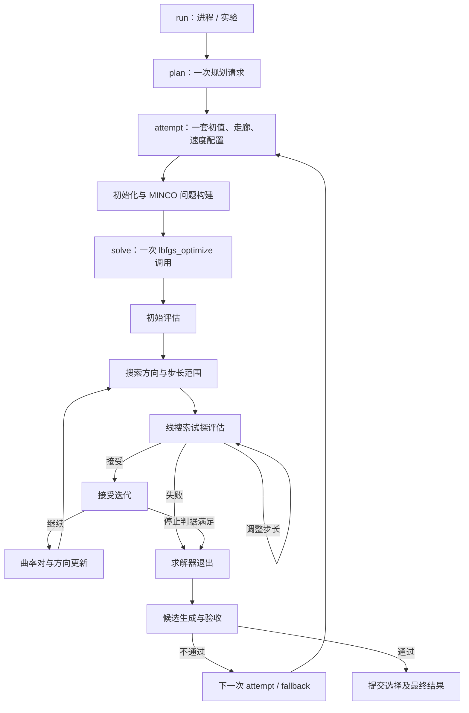

**轨迹优化全过程记录方案（设计稿，2026-09-11）**

本方案基于当前工作区源码，面向 highspeed exploration 主轨迹与 backup，兼容其他 MINCO/L-BFGS 入口。本文只定义记录与分析方案，尚未实现埋点，也没有改变求解或轨迹验收行为。

记录应回答：这是什么问题、从什么初值出发、每次试探发生了什么、为什么接受或拒绝、优化器为什么退出、轨迹为什么被拒绝、后续如何恢复。基础单位是一次规划请求下的完整尝试链，求解器返回码只是其中一层结果。

**当前代码中已经确认的事实。** 路径均相对于 `src/Planner/general_planner/`，行号为设计时定位点，后续编辑可能变化。

| 位置 | 当前行为 | 对记录方案的影响 |
| --- | --- | --- |
| `src/general_core/exploration/highspeed/general_planner_adapter.cpp:1191` | 创建 `ExplorationTrajOpt` 和 `BackupTrajOpt` | 当前探索主链不是名称相似的 `ExpTrajOpt` |
| `src/traj_opt/traj_manager.cpp:3076,3448` | 主轨迹与 backup 直接调用 `lbfgs_optimize`，progress 都是空指针 | 只扩展 `FastLbfgs::Report` 无法覆盖当前主链 |
| `src/traj_opt/traj_manager.cpp:2987,3349` | `evaluateMincoCost` 每次调用增加 `iter_num` | 这个数是函数评估次数，包含线搜索试探，且成功后的复评也会增加它 |
| `src/utils/lbfgs.cpp` | Lewis–Overton 线搜索采用 Armijo 和 **weak Wolfe**，随后进行 cautious update | 按本地实现记录判据，不能套用 strong Wolfe 的公式 |
| `src/utils/lbfgs.cpp` | 线搜索失败时恢复 `x=xp,g=gp`，没有恢复 `fx`；目标函数内部缓存也未由求解器恢复 | 返回的 x、cost 和 MINCO 缓存可能属于不同评估点，必须标明来源 |
| `include/traj_opt/minco/minco_optimizer.hpp` | 已有 energy/time/integral/sample/coefficient 五类 cost 的 last accessor | 可以复用，但还缺 spatial norm 和 boundary extra cost，不能假设五项之和就是总 cost |
| `include/traj_opt/costfunctional_manager/exploration_cost_manager.hpp` | `getPenaltyLog()` 返回采样最大违反量；槽 4 是 tilt，槽 5 当前未使用 | 旧打印把槽 4 标为 Jerk、槽 5 标为 Attract，不能原样作为分析字段 |
| `src/general_core/exploration/highspeed/general_planner_adapter.cpp:136` | 适配层把 `print_optimizer_log`、`save_log_en` 关闭 | 需要独立 trace 配置并在适配层透传，不能依赖旧日志开关 |
| `src/general_core/exploration/highspeed/general_planner_adapter.cpp:1980` | 多档速度重试；优化后再检查动力学、安全、观测目标等 | 求解成功与候选可用必须分别记录 |
| `src/general_core/exploration/highspeed/general_planner_adapter.cpp:2547` | backup MINCO 不可用后可能尝试解析制动 | fallback 成功不能覆盖原始失败；解析制动没有 L-BFGS 迭代 |
| `include/utils/optimization/fast_lbfgs.hpp` | 有累计迭代/线搜索、早停及 fallback 汇总 | 保留其语义；补充每个底层 solve 的独立结果和失败线搜索评估 |

当前主轨迹和 backup 显式设置 `mem_size=256,past=3,min_step=1e-32,g_epsilon=0,delta=rel_cost_tol`，其他项沿用参数结构默认值，包括 `max_linesearch=64,max_iterations=0`。配置快照必须记录最终生效值。`g_epsilon=0` 意味着不能把一般的 `LBFGS_STOP` 解释成“小梯度收敛”。

**一、记录对象及关联关系。**



公共标识建议使用 `run_id,plan_id,attempt_id,solve_id,event_seq`；事件再携带 `iteration_id,line_search_id,trial_id,eval_id`。ID 不依赖 ROS 时间生成，避免仿真时间回退造成重号。记录 ROS 时间用于 rosbag 对齐，steady clock 用于耗时，进程启动 UTC 用于实验目录定位。

| 对象 | 生命周期与定义 |
| --- | --- |
| run | 一个进程实例；带实验 session、场景、车辆/namespace、构建与参数快照 |
| plan | 一次规划请求，从入口到明确结果，包括可能尚未进入优化的失败 |
| attempt | 固定的一套任务输入；主轨迹降速、不同 backup seed、解析制动等各自建立 attempt，带 `parent_attempt_id,retry_reason` |
| solve | 一次真实 `lbfgs_optimize` 调用；FastLbfgs 的 primary/fallback 分别建立 solve，ALM 各内层调用也分别建档 |
| evaluation | 一次真实目标函数评估，标明 `initial/line_search/warm_start_compare/final_recheck/offline_probe`；只有线搜索评估归属 trial |
| accepted iteration | 一次线搜索接受；初始点记为 accepted state 0，不虚构为一次迭代 |
| candidate / trajectory | 求解结果、裁剪结果、backup、最终提交轨迹分别有 ID，并记录来源关系 |

`trajectory_role=exploration_main/backup/other` 与 `solver_kind=lbfgs/analytic/...` 分开。yaw 生成作为规划阶段事件记录，不给没有调用 L-BFGS 的代码伪造迭代。

另设 `objective_revision,decision_layout_id`。权重、ALM 乘子、采样方式、约束集合或变量布局改变时更新版本。跨目标版本、跨 fallback 重启不能直接连接 cost 差或 s/y 曲率；记录实际 memory reset 行为。

对 coverage 额外保存目标 stable ID、approach 坐标、恢复动作、重试序号。参考现有 `CoverageRecoveryIdentity` 同时保留 ID 与 approach 的语义，不能仅靠可能变化的 stable ID 对重复失败分组。地图/topology revision 有则记录，无则明确 unavailable，不伪造版本号。

**二、开始求解前：保存可解释、可重放的问题快照。**

每个 attempt 保存原始输入及实际使用的预处理结果：

- head/tail PVAJ、guide path/guide times、实际初始段时长与中间点、完整 `x0`、初值来源及 warm start 来源轨迹。
- 输入 SFC 和最终归一化/简化后的 H/V 多面体，平面/顶点顺序，piece 到 corridor/overlap 的映射；保留 `preserve_corridor_order`。重放直接使用实际构建出的问题，避免重新枚举顶点改变坐标参数化。
- 多项式阶数、段数、逐段采样数和积分方式、逐段速度约束；动力学上限、惩罚权重、平滑参数、flatness 参数。记录转换后的实际数组及具名语义，不能只留原 YAML。
- 时间映射和空间映射类型、各变量块的 offset/dimension/物理含义、是否 uniform time。空间块维数可能取决于多面体顶点数，不能假设每个 waypoint 恒为三个优化变量。
- backup 的参考轨迹系数/时长、`min_ts,max_ts,heu_ts`、初始终点和终点映射、`weight_ts`。参考轨迹有时是主轨迹裁剪结果，必须保存真实引用对象及其来源。
- 最终生效的全部 L-BFGS 参数；若经过 FastLbfgs，再保存早停、stepbound、fallback 配置和重启初值来源。
- 后验检查的阈值与采样策略、地图/轨迹快照引用。用于优化的界限与用于 commit 的界限分开保存。

run manifest 保存 schema 版本、git commit、相关 dirty diff/未跟踪源码快照、配置 hash、编译器/Eigen/编译选项、可执行文件与相关库的 fingerprint、线程配置。源码与实际运行二进制的对应关系无法确认时标记 unknown，不能拿当前工作区源码冒充运行版本。

初始化失败也应结束 attempt，记录明确阶段，例如 `input_validation/corridor_processing/time_initialization/minco_setup/decision_encoding`，`solver_invoked=false`、`solver_ret=null`。保留实际检查表达式、观测值和阈值，不统一折叠成“MINCO failed”。

**三、每次目标函数评估：cost、梯度和数值状态必须来自同一 eval。**

基础标量每次都记录：`f_total,eval_elapsed_us,finite_x,finite_f,finite_g,gradient_dimension`，梯度 L2/无穷范数、最大绝对梯度所在索引及块；`x` 的范数、分块极值。记录首次观测到非有限值的 stage/index/piece/sample 和上游输入。NaN/Inf 不是 0，缺失也不是 0。

代价分解的一级闭合关系为：

```text
J_total = J_energy + J_time + J_integral + J_sample
        + J_coefficient + J_spatial_norm + J_boundary_extra
```

`J_integral` 再按 cost manager 分解成 corridor、velocity、acceleration、tilt、angular_rate、thrust 等具名项。若未来接入其他求解分支，可再注册 jerk、guide、ESDF、swarm、ALM 等项；disabled、unsupported 与数值为零明确区分。

记录加权后真正进入目标函数的值；保存权重及可用的未加权 penalty。积分分项必须乘上与实际累加相同的 `common_weight=trap_weight*T/K`，不能直接累加样本 cost。一级分项与二级分项是层级关系，统计时不能重复求和。额外记录 `cost_closure_error`，以绝对/相对容差检验分解是否闭合。

当前已有的五个 last accessor 可直接扩展；`decodeDecisionVariables` 中的 norm penalty 和 boundary extra 必须单独补足。为每次评估重置诊断有效位，避免早退时读取上一次的 last cost。

梯度建议分三层采集：

| 层次 | 指标 | 作用与成本 |
| --- | --- | --- |
| 优化变量梯度 | 完整 g，以及时间块、空间块、boundary-extra 块的 L2/inf/max index | 每次评估都能获得；定位哪一块主导搜索 |
| 物理变量梯度 | `dJ/dT,dJ/dP,dJ/dHead,dJ/dTail`，映射前后时间梯度，`dT/dtau`、`dts/deta`、空间映射退化标志 | 从已有 MINCO workspace 复制；识别物理敏感但参数梯度很小等映射问题 |
| 各 cost 项的完整决策梯度 | `g_energy,g_time,g_corridor,...`，分项范数、两两夹角、梯度相消指标 | 通常需要额外独立反传；安排在离线重放/显式深度诊断，不能声称从总梯度直接拆出 |

总梯度还包括 norm penalty、boundary extra 和所有边界链式项。只有在同一 x、同一目标版本下独立得到各项梯度，才能检查 `g_total ≈ sum(g_term)`。可用 `||sum(g_term)|| / sum(||g_term||)` 辅助识别相消，分母为零时标记无定义。

保存两种现有梯度判据时要分别命名：core 使用 `||g||inf/max(1,||x||inf)`，FastLbfgs 使用 `max_i |g_i|/max(1,|x_i|)`。它们并不等价，也都不能直接当作无量纲物理误差。

物理状态至少包括 `T_min,T_max,T_sum`、最短段索引、时长比例、waypoint 位移；backup 加 `ts`、距可行时间区间两端的距离、映射后的 head/tail。基础模式采集已有中间量；空间 Jacobian 的奇异值、MINCO 线性系统条件数等重计算放到离线，线上只记录已有求解状态和异常证据。

**四、约束记录：分清违反量、惩罚代价与后验可行性。**

每类约束记录 `name,enabled,evaluated,residual_definition,unit,bound,raw_max_violation`，必要时加物理量峰值、归一化违反量。最大值附带 `piece_id,sample_id,t_local,t_global,position`；corridor 附带 `corridor_id,plane_id`。被跳过的检查标记 not evaluated。

当前 ExplorationCostManager 中 velocity/acceleration/angular-rate 使用平方模差，tilt 使用角度差，corridor 使用平面残差，thrust 使用中心化平方带残差。这些量不能直接相加或共用一个未经解释的阈值。`max_violation_` 从 0 起取最大值，表示非负超限量，也不能被当成安全裕量。

积分节点上的最大违反量只表明采样结果。后验动力学检查、地图安全检查和其他验证单独记录其方法与分辨率；曲线中的“可行”标签必须说明来自哪一种检查。轨迹几何曲率可在终态或离线另记 `||v×a||/||v||^3`，低速时标记不适用，与下文优化目标的曲率完全分开。

**五、线搜索：失败分析最关键的一层。**

每轮先记录 `base_eval_id,x_base,f_base,g_base` 的引用、搜索方向 d、`||d||,g_base·d`、初始 alpha、实际 step min/max、动态 stepbound 的原始返回值及最终限幅值。方向另带 `steepest_descent/lbfgs_two_loop/cautious_skip` 等来源。

每个 trial 记录：

```text
trial_id, eval_id, alpha_evaluated
f_trial, grad_l2, grad_inf, dg_trial = g_trial · d
mu_before, nu_before, mu_after, nu_after, brackt, touched_max_step
armijo_rhs = f_base + c1 * alpha_evaluated * (g_base · d)
armijo_margin = armijo_rhs - f_trial
weak_wolfe_rhs = c2 * (g_base · d)
weak_wolfe_margin = dg_trial - weak_wolfe_rhs
observed_branch, alpha_proposed_next, line_search_exit_reason
```

有限数情况下两个 margin 均非负才满足当前实现的接受条件。记录实际执行分支以及计算出的判据状态；对非有限数将判据标为 invalid，不能仅根据 C++ 比较结果宣称它满足 Wolfe。当前代码在线搜索显式检查 f 的 NaN/Inf，未对 g 做同等全面检查，初始评估也没有统一 finite guard；观察器应暴露这一事实，若要修复求解行为应另作明确变更。

`alpha_evaluated` 与下一步提出的 alpha 必须分开：最小步长等错误可能发生在提出下一步之后，该步并未执行目标函数评估。搜索方向错误还可能在第一次 trial 之前返回，因此需要独立的 `line_search_end` 事件。

`accepted_iteration` 只能从接受事件计数，`solver_evaluations` 包括初始评估与全部已执行 trial，失败线搜索也必须计入。Warm start 比较、final recheck 和离线 probe 各自计数，不混入求解器评估数。仅接 progress 回调无法获得这套信息。

失败退出时至少保留三个独立对象：

1. `last_accepted_state`：最后接受的 x/f/g 及其 eval ID，包含初始点。
2. `last_trial_state`：最后实际评估的 x/f/g、trial/eval ID、对应物理状态和分项 cost；没有 trial 时为 null。
3. `solver_return_state`：真实返回 x/f/ret，标明其各字段来源；当前 g 不是公开返回参数，需要从 core 观察器捕获。

不要在失败后直接读取 optimizer 缓存，把它贴到回退后的 x 上；也不要为了得到日志默默再评估一次。确需复评时建立独立 `final_recheck`，保留原始证据并明确其状态副作用。

**六、曲率与 L-BFGS 历史更新。**

对相邻接受状态定义 `s_k=x_k-x_(k-1)`、`y_k=g_k-g_(k-1)`。每对记录如下量：

| 指标 | 定义与用途 |
| --- | --- |
| `s_norm,y_norm,sTs,yTs,yTy` | 原始尺度与曲率内积，保留符号 |
| `secant_curvature` | `yTs/sTs`，沿本次位移的割线曲率指标 |
| `sy_cosine` | `yTs/(norm(s)*norm(y))`，观察正交、退化和符号 |
| `rho` | `1/yTs`，仅在分母有效时定义 |
| `h0_scale_candidate` | `yTs/yTy`；区分候选值和真正应用于 two-loop 的值 |
| `cautious_threshold` | 当前代码的 `sTs*norm(g_previous)*cautious_factor` |
| `cautious_margin` | `yTs-cautious_threshold`，同时记录真实 `update_applied` |
| memory 元数据 | update 前后 `bound,end`、写入 slot、是否覆盖旧项、skip 连续次数 |
| 下一方向质量 | `g·d,norm(d),-g·d/(norm(g)*norm(d))` 及 finite 状态 |

所有派生比值都有有效位；零分母、非有限值不能用一个任意 epsilon 掩盖。不要修改原算法的比较阈值来方便记录。

当前 core 在 progress/停止检查之后才更新 s/y；因此终止迭代可能没有执行历史更新。需要分别表示 `pair_observed` 和 `update_applied`，将终止时未执行的更新记为 `not_reached`，不能误计为 cautious skip。当前 cautious 不通过时下一方向使用 `-g`，没有执行 two-loop，代码也没有清空整个 memory；记录实际行为。

这些量是曲率与数值退化的证据，不等于精确 Hessian 特征值或条件数。离线需要时再做方向差分、Hessian-vector probe 或小规模谱估计，并标记估计方法。按时间/空间/边界块记录 `s_block·y_block` 有助定位，但各块有耦合，单块负值不自动证明整体负曲率。

**七、结果分层与失败归因。**

一个通用 `success` 字段不足以描述实际结果。分别保存：

- `initialization_status`：是否成功进入求解。
- `solver_ret_raw,solver_ret_name,stop_origin`：原始码和停止来源。`LBFGS_CANCELED` 在本实现是非负枚举，仍须区分主动早停、重启准备和其他取消；不能只用正负号归类。
- `candidate_status`：MINCO 是否生成可用候选，最后一次校验的数值是否有效。
- `validation_results[]`：各检查的 pass/fail/not_run、证据、阈值、候选与地图版本。
- `attempt_outcome`：accepted/rejected/failed/fallback_used/superseded 等。
- `plan_outcome,selected_candidate_id,committed_trajectory_id`：是否选择并提交、保留旧轨迹、进入停止/恢复等实际结果。

后验检查覆盖当前主链的最大速度/加速度、安全距离/known-free、coverage 观测、边界衔接、yaw、backup 可用性，以及实际 commit 路径中的检查。Backup 还应记录内部 magnitude check、known-free、单调性和解析制动选择。只给真实执行的检查结果赋值，短路跳过的检查不能记 pass。

失败记录包含确定事实和诊断假设两个层次：

| 事实/标签 | 可以给出的证据 | 不能直接下的结论 |
| --- | --- | --- |
| `MAXIMUMLINESEARCH` | 试探次数、Armijo/Wolfe margin、步长/区间演化 | 不能直接说“梯度写错” |
| `MINIMUMSTEP/WIDTHTOOSMALL` | 实际/提出步长、f 与梯度尺度、最后区间 | 不能直接说“已经收敛” |
| `INVALID_FUNCVAL` 或观察到非有限 g | 首个观测 stage、分项、变量/采样点 | 不能只归因于初值差 |
| cautious 连续 skip | `yTs`、阈值和下一方向来源 | 本身不等于求解失败 |
| solver STOP、动力学验收失败 | 原始停止条件、实际峰值与 commit limit | 不能算作 L-BFGS 数值失败 |
| 求解失败但解析 backup 成功 | 两个 attempt 的独立结果和选择事件 | 不能把失败样本从统计中删掉 |

`observed_reason` 永远保留原始事实；`suspected_causes[]` 由离线规则生成，附规则版本、依据 eval/event ID 与证据强弱。支持多个假设，例如时间映射尺度异常、约束激活切换、目标/梯度不一致、积分分辨率影响等；未经差分验证不标记 confirmed gradient bug。

**八、保存方式与运行开销。**

建议使用独立的 `OptimizationTraceRecorder`：优化线程生成记录，写盘线程负责序列化、压缩和目录维护。core 与记录格式不依赖 ROS；ROS diagnostics 只发布低频 summary 和关联 ID，详细数据保存在实验目录，沿用现有 rosbag 脚本的 session/参数快照对齐方式。

```text
optimization_trace/<session>/<run>/
  manifest.json                  schema、参数、构建、场景及 recording policy
  plans.jsonl                    规划开始/结束、选择/提交结果
  attempts.jsonl                 初始化、输入引用、验收与重试关系
  solves.jsonl                   每次底层求解摘要
  events_000001.jsonl             分块保存评估标量、线搜索、曲率等事件
  problems/<attempt_id>/          实际问题快照与引用
  vectors_000001.bin              x/g/d、物理梯度等 float64 payload
  vector_index_000001.jsonl       payload offset、shape、dtype、layout、校验和
```

第一版使用追加式 JSONL + 有版本/长度/校验和的二进制块即可；格式细节在实现时固定。后台压缩已封口 chunk，离线再转换为 Parquet/NPZ 等分析格式。避免在线依赖重型数据分析库或高频创建每评估一个文件。

JSON 中非有限标量使用 `null` 加 `value_state=nan/pos_inf/neg_inf/missing`；二进制保存原始浮点位。矩阵必须明确 row/column-major、shape、单位、系数顺序。日志写入异常不能回调优化器、改变梯度或重新求解。

记录档位建议如下；当前收集分析数据阶段优先启用 `diagnostic`：

| 档位 | 在线收集 | 持久保存策略 |
| --- | --- | --- |
| off | 关闭观察器，不增加诊断计算 | 无 |
| summary | 所有 plan/attempt/solve 的结果、参数引用与计数 | 全量摘要，用于可靠分母 |
| diagnostic | 所有评估标量、接受迭代、线搜索与曲率；暂存每次评估 x/g、每轮方向及所需物理梯度 | 所有失败、异常、验收拒绝、fallback 链保留完整数据；普通成功保留轻量记录并按比例保存完整样本 |
| full | 每个 attempt 保存所有标量和向量，增加选定的样本级证据 | 专用复现场景；额外反传/数值差分仍明确区分于正常评估 |

失败后才开始记录无法恢复失败前历史。`diagnostic` 从 attempt 开始便暂存完整 trace；内存不足时异步转入临时 chunk，直到 plan 的选择/提交结果确定后再决定保留/清理。不是“失败触发后只留最后几步”。保留触发条件包含：任一 solve 失败、候选被拒绝、主过程 fallback、数值异常、最终 plan 失败；链中成功但未被选中的候选也保留到裁决结束。

无界运行、有限内存/磁盘、永不阻塞、绝不丢失不能同时保证。设置每 solve、每 plan、进程总暂存和磁盘预算；优先保留 summary、问题快照、最后接受点、失败试探点及终止事件。超限时记录 `trace_complete=false,dropped_events,dropped_vector_bytes,missing_event_ranges`，不能把截断轨迹当完整数据使用。失败数据优先保留，超配额仍显式标记未保留原因。

每个 solve 采用独立上下文，支持不同实例并发和辅助子求解；回调中的 Eigen 引用只能即时读取，进入队列必须取得独立所有权。规划未作最终选择前，trace handle 不因优化器局部对象析构而丢失。使用作用域结束记录处理正常提前返回；异常退出/进程崩溃通过 begin 无 end、chunk 完整性和 lost-tail 标记识别，不能承诺 SIGKILL 下零丢失。

成功全量样本可先设 5% 的确定性采样率，manifest 保存策略、seed 和 inclusion probability；所有摘要保留。后续估计总体失败率使用全量摘要，分析被抽样保留的向量数据时考虑采样偏差，并按问题规模、速度、场景分层。

向量量级可用 `8*n*N_eval*2` 字节估计全部 x/g，另加每接受轮的 d、物理量和标量事件。例如假设 n=100、300 次评估，仅 x/g 约 0.48 MB；这只是预算示例，不是当前 planner 实测。实现后报告开关前后求解/规划耗时 P50/P95/P99、队列水位、写入带宽、丢弃量；数值结果一致且开销满足实际规划时间预算才适合常开。

**九、代码接入边界。**

| 文件/组件 | 拟增加内容 |
| --- | --- |
| `include/utils/optimization/lbfgs.h` | 独立只读 observer 接口和可选 trace context；现有调用默认不启用，progress 仍负责取消策略 |
| `src/utils/lbfgs.cpp` | 初始评估、方向/stepbound、trial、line-search end、accepted state、cautious/two-loop、所有退出路径的事件 |
| `include/utils/optimization/fast_lbfgs.hpp` | primary/fallback solve ID、原始返回码、restart 来源、早停各判据；不覆盖 core observer、不重复计数 |
| `include/traj_opt/minco/minco_optimizer.hpp` | 当前 eval 的分项 cost、物理梯度、变量布局、映射状态、计算阶段和有效位；补齐 norm/extra cost |
| `include/traj_opt/costfunctional_manager/{exploration_cost_manager,backup_integal_cost_manager}.hpp` | 按各自语义注册具名代价与违反量，记录 argmax；两者不能共用未经定义的数组槽位名称 |
| `include/traj_opt/minco/boundary_mapping.hpp` | backup 的 ts/terminal 映射观测及 extra cost/梯度链诊断，不更改映射数学 |
| `include/traj_opt/traj_manager.h`、`src/traj_opt/traj_manager.cpp` | attempt 生命周期、初始化早退、问题快照、求解结果、final recheck；返回结构化报告供上层关联 |
| highspeed `planner_manager.h` / `general_planner_adapter.cpp` / 必要的 FSM 入口 | plan ID、速度/seed 重试、后验验收、恢复原因、候选来源与 commit outcome |
| 新 recorder 配置与实现、记录脚本 | 异步 sink、预算、session/rosbag 对齐、配置透传 |
| 新离线解析/分析/重放工具 | schema 校验、曲线、失败分组、差分诊断与原问题重放 |

建议接口形态为 `lbfgs_optimize(..., params, observer=nullptr)` 或等价可选上下文；observer 不能取消优化、修改参数或对目标函数重入调用。记录所需的额外统计不要改变原 f/g 累加顺序，已有梯度中间量以只读方式取得。core 负责数学过程，MINCO 层负责目标语义，planner 负责任务与结果，避免把 planner 类型引入通用 L-BFGS。

除了主链，其他直接调用者如 `ESDFTrajOpt`、`PlainTrajOpt`、tracking/perching、SE3 和辅助投影/几何求解，后续各接问题上下文；底层 observer 可复用。辅助求解用 `solver_purpose` 与 parent ID 单列，不能混进主轨迹失败率。`ExpTrajOpt` 的 ALM/phase2/warm start 额外关联 objective revision、外层轮次和各次内层 solve。

第一阶段要一次打通“当前主轨迹 + backup → core 全事件 → MINCO 分解 → 上层验收/提交 → 异步落盘”的最小完整链；第二阶段补可重放工具与离线分项梯度诊断；第三阶段推广其他任务并调优存储。每阶段的字段支持度写入 manifest，不用未实现字段的零值充数。

**十、离线分析和验收标准。**

每次 solve 的报告至少联动画出：总 cost/分项 cost，分块梯度范数，alpha/每轮试探次数，Armijo/Wolfe margin，`yTs/secant_curvature/h0_scale/cautious skip`，时长/违反量及停止事件。cost 横轴明确区分 eval 和 accepted iteration；拒绝 trial 用散点或不同线型，不把试探值伪装成接受路径。

attempt 报告叠加后验拒绝原因；plan 报告展示各速度/seed/primary/fallback 的先后关系和最终选择。统计分别给出初始化失败率、底层 solve 数值失败率、候选后验拒绝率、plan 提交率、fallback 挽救率。保存初值/问题指纹以识别跨 replanning 重复的相同失败，不能把多次高度相关的重试当成完全独立样本。

离线重放分两种能力：冻结优化问题后复算同一 x 的 f/g，与重新运行 L-BFGS；后者在构建/浮点环境变化时不保证 bitwise 相同。重现地图后验判断还需要对应地图/占据状态或足够输入重放，不承诺仅凭 x 与 corridor 就能复现整个 planner。

梯度验证在独立实例中进行：对失败前接受点、失败试探点和同规模成功点，冻结目标，比较 `g·v` 与 `[J(x+h*v)-J(x-h*v)]/(2h)`，使用多个 h、确定性方向以及变量块方向。报告绝对/相对误差、finite 状态和激活变化。必要时在这些点独立反传 cost 分项，追踪时间/空间/boundary 链式项；诊断评估不能计入原始求解过程。

实现时的必要验收场景包括：

1. 相同输入下，trace off/on 的返回码、接受步长序列和输出轨迹一致；耗时变化单独评估。
2. 简单解析目标验证 f/g、trial 与接受迭代的关联、weak Wolfe 判据和 s/y 数值；覆盖初值直接收敛及终止前未更新 memory。
3. 构造可控非有限目标/梯度、线搜索耗尽、步长上下限、区间过窄、非法参数和取消；检查零 trial/零迭代也有完整结束记录。
4. 失败时 last accepted、last trial、实际返回 x/f 和目标函数缓存来源可区分，缺失/失效数据不沿用上次评估。
5. 当前 MINCO 实例的 cost 分解闭合，具名残差与真实公式对应；backup 问题可加载并复算指定 x 的 cost/梯度。
6. 降速后成功、backup 数值失败后解析制动成功、优化 STOP 后验拒绝、未进入 solver、最终未 commit 等路径均保留真实结果链。
7. 记录队列超限、写盘失败、正常关闭和异常截断能被读取器识别，规划不会等待文件 I/O，也不会静默宣称记录完整。

方案完成后的直接产物应是：可定位任意失败的索引、从初值到失败的完整数学过程、与轨迹验收对应的证据，以及能复算该优化问题的快照。仅增加终态 cost/梯度打印，不满足这一目标。
