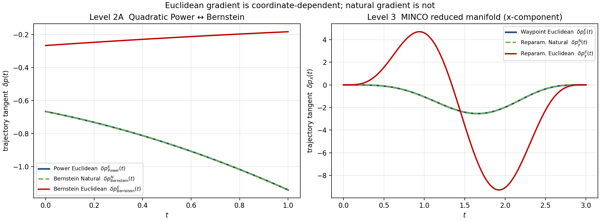
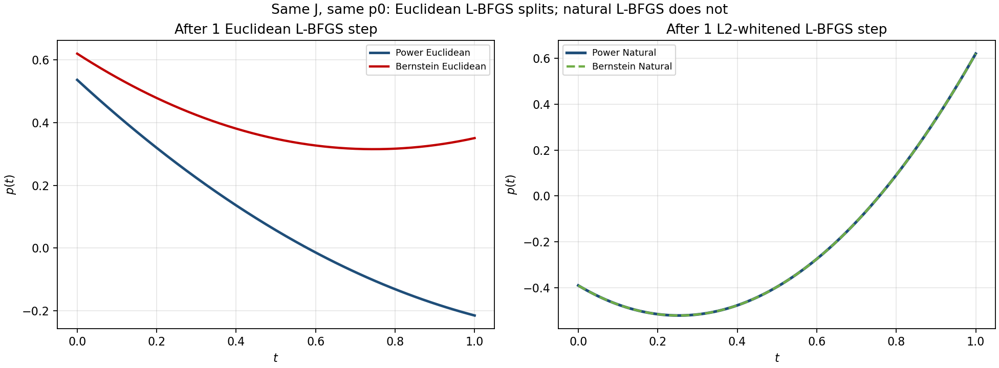

# 欧式梯度的参数化依赖与轨迹多坐标表示：完整实验报告

- **日期**：2026-08-17
- **对应框架**：`Euclidean_Gradient_Basis_Invariance_Validation_Framework.md`
- **自测程序**：
  - `Tests/basis_gradient_invariance_self_test.cpp`（梯度 / 切向层，35/35）
  - `Tests/coordinate_opt_invariance_self_test.cpp`（L-BFGS 优化层，14/14）
- **总检查**：49/49 通过

---

## 0. 一句话结论

同一条物理轨迹、同一个目标函数，只要两套坐标各自把度量设成单位阵 \(G=I\)，它们给出的欧式最陡下降方向映射回轨迹空间后一般不是同一个切向量 \(\delta p(t)\)。把度量按坐标正确 pullback 后，natural gradient 恢复方向不变性。

进一步把同一套 L-BFGS 跑起来以后：

- **路径一定坐标依赖**；
- **非凸或早停时，最终轨迹也可以坐标依赖**；
- 在轨迹 \(L^2\) / MCE 度量下做预条件 L-BFGS 后，中间迭代和终点都重合。

这不是“两套坐标的梯度数字不同”。梯度作为 covector 换基后本来就该变。真正的问题是：各坐标系偷偷使用了不同的欧式几何。

---

## 1. 研究问题

需要验证的基础命题：

\[
\text{同一轨迹}
+
\text{同一目标函数}
+
\text{不同坐标表示}
+
\text{各自使用欧式度量 }I
\quad\Longrightarrow\quad
\delta p_1(t)\neq\delta p_2(t)
\]

即：**Euclidean steepest descent 不具有一般坐标重参数化不变性。**

真正要比较的不是 \(\nabla_a J\) 与 \(\nabla_c J\) 的分量是否相等，而是：

> 两套坐标各自按照 Euclidean gradient 走一步后，对应到公共轨迹空间中的实际切向量是否一致。

正确对照是：

\[
\Phi(t)\,(-\nabla_a J)
\quad\text{vs}\quad
B(t)\,(-\nabla_c J)
\]

若度量随坐标正确变换，则应有

\[
\delta p_a^{N}(t)=\delta p_c^{N}(t).
\]

---

## 2. 实验设计原则

所有对照只允许改变：

\[
\text{coordinate representation / metric}.
\]

必须保持完全一致：真实轨迹、objective、初始轨迹、多项式次数、时间、约束、步长、梯度求值、数值容差。

梯度层实验**不引入** L-BFGS、线搜索、障碍、penalty、自由时间。优化层实验在同一隔离原则下**只额外打开** L-BFGS 及其早停，仍不加入走廊、障碍或时间优化。

验收标准：

| 量 | 期望（不变性应成立） | 期望（欧式应分叉） |
|---|---|---|
| 轨迹最大点态误差 \(e_p\) | \(<10^{-12}\) | — |
| 目标差 \(e_J\) | \(<10^{-12}\) | — |
| 链式法则相对误差 \(e_g\) | \(<10^{-10}\) | — |
| Euclidean 方向 / 轨迹 RMS | — | \(\gg 10^{-10}\) |
| Natural 方向 / 轨迹 RMS | \(<10^{-10}\) | — |

比较函数空间方向时使用

\[
E_{\mathrm{dir}}
=
\left[
\int
\|\delta p_A(t)-\delta p_B(t)\|^2\,dt
\right]^{1/2}
\]

或离散 RMS。**禁止**用 \(\|\nabla_a J-\nabla_c J\|\) 当结论。

---

## 3. 第一部分：梯度 / 切向层（无 L-BFGS）

程序：`basis_gradient_invariance_self_test.cpp`  
结果：35/35 PASS

### 3.1 Level 1 — 纯线性代数

**设定。** \(x=Ay\)，\(A\in\mathrm{GL}(6)\) 非正交（\(\|A^\top A-I\|=13.928\)，\(\det A=-1.189\)），

\[
J(x)=\frac12 x^\top H x.
\]

**结果。**

| 检查量 | 数值 | 期望 | 结果 |
|---|---|---|---|
| gradient chain-rule error | \(0\) | \(<10^{-10}\) | PASS |
| Euclidean direction mismatch | \(6.403109\) | \(\gg 10^{-10}\) | PASS |
| Natural direction mismatch | \(3.082734\times 10^{-15}\) | \(<10^{-10}\) | PASS |

**结论。** 现象在最简单的线性换基里就已经成立，与多项式、MINCO 无关。根因是换坐标后再把新坐标当成欧氏空间，等于偷偷换了“什么叫一步同样大”。

---

### 3.2 Level 2A — 二次 Power \(\leftrightarrow\) Bernstein（解析算例）

**设定。** \(t\in[0,1]\)，

\[
p(t)=1-t+\tfrac12 t^2,
\qquad
a=\begin{bmatrix}1\\-1\\1/2\end{bmatrix},
\qquad
c=Ta=\begin{bmatrix}1\\1/2\\1/2\end{bmatrix}.
\]

\[
T=\begin{bmatrix}1&0&0\\1&1/2&0\\1&1&1\end{bmatrix},
\qquad
\|T^\top T-I\|=3.544.
\]

目标（完全基无关）：

\[
J[p]=\frac12\int_0^1 p(t)^2\,dt.
\]

Power / Bernstein 质量阵分别为 Hilbert 阵与 Bernstein mass。采样 \(N=400\)。

**与解析解逐项核对。**

| 对象 | 解析 | 计算 |
|---|---|---|
| \(\nabla_a J\) | \([2/3,\,7/24,\,11/60]\) | \([0.66666667,\,0.29166667,\,0.18333333]\) |
| \(\nabla_c J\) | \([4/15,\,13/60,\,11/60]\) | \([0.26666667,\,0.21666667,\,0.18333333]\) |
| \(T^{-1}d_c^E\) | \([-4/15,\,1/10,\,-1/60]\) | \([-0.26666667,\,0.1,\,-0.016666667]\) |
| \(T^{-1}d_c^N\) | \(d_a^E\) | 与 \(d_a^E\) 机器精度重合 |
| \(J_a=J_c\) | \(7/30=0.2333\ldots\) | \(0.233333333333\) |

对应轨迹切向：

\[
\delta p_{\mathrm{Power}}^{E}(t)
=
-\frac23-\frac7{24}t-\frac{11}{60}t^2
\]

\[
\delta p_{\mathrm{Bernstein}}^{E}(t)
=
-\frac4{15}+\frac1{10}t-\frac1{60}t^2
\]

**五项检查 + 切向 RMS。**

```text
trajectory equality error       = 2.220446e-16
objective difference            = 2.775558e-17
gradient chain-rule error       = 1.144392e-16

Euclidean direction mismatch    = 5.841066e-01
Natural direction mismatch      = 2.020636e-16

tangent RMS e_E (sampled)       = 6.713134e-01
tangent RMS e_N (sampled)       = 2.173577e-16
```

与框架第 18 节的理想量级完全一致：前三项 \(\sim 10^{-16}\)，欧式 mismatch \(\sim 10^{-1}\)，natural mismatch \(\sim 10^{-16}\)。

**结论。** 轨迹相同、目标相同、反传正确；欧式物理方向显著分叉；度量 pullback 后重合。

---

### 3.3 Level 2B — 七次多项式

**设定。** \(n=7\)，\(T=1\)，

\[
J[p]=\frac12\int_0^1\bigl(p(t)-p_{\mathrm{ref}}(t)\bigr)^2\,dt.
\]

\[
\begin{aligned}
a &= [1,\,-0.6,\,0.35,\,-0.18,\,0.08,\,-0.03,\,0.012,\,-0.004],\\
a_{\mathrm{ref}} &= [0.7,\,-0.2,\,0.1,\,-0.05,\,0.02,\,-0.01,\,0.004,\,-0.001].
\end{aligned}
\]

\(J_a=J_c=1.509326076146\times 10^{-2}\)，\(\|T^\top T-I\|=13.734\)。

| 检查量 | 数值 | 结果 |
|---|---|---|
| trajectory equality error | \(6.661338\times 10^{-16}\) | PASS |
| objective difference | \(1.561251\times 10^{-17}\) | PASS |
| gradient chain-rule error | \(8.142120\times 10^{-17}\) | PASS |
| Euclidean direction mismatch | \(1.636854\times 10^{-1}\) | PASS |
| Natural direction mismatch | \(3.429657\times 10^{-12}\) | PASS |
| tangent RMS \(e_E\) | \(2.043363\times 10^{-1}\) | PASS |
| tangent RMS \(e_N\) | \(4.037947\times 10^{-12}\) | PASS |

**结论。** 不是二次多项式的特例。

---

### 3.4 Level 2C — 三维七次，\(\bar T=T\otimes I_3\)

**设定。** \(p(t)\in\mathbb R^3\)，\(J=\frac12\int_0^1\|p(t)\|^2\,dt\)，决策维数 24。  
\(J_a=J_c=0.7610271929792\)，\(\|d_a^E\|=1.513496\)，\(\|\bar T^{-1}d_c^E\|=0.167653\)。

| 检查量 | 数值 | 结果 |
|---|---|---|
| trajectory equality error | \(8.617648\times 10^{-16}\) | PASS |
| objective difference | \(0\) | PASS |
| gradient chain-rule error | \(1.506679\times 10^{-16}\) | PASS |
| Euclidean direction mismatch | \(9.200065\times 10^{-1}\) | PASS |
| Natural direction mismatch | \(1.415138\times 10^{-11}\) | PASS |
| \(E_{\mathrm{dir}}\) Euclidean | \(1.807356\) | PASS |
| \(E_{\mathrm{dir}}\) Natural | \(2.482316\times 10^{-11}\) | PASS |

**结论。** 三维 Kronecker 扩张后推导不变。应用 \(E_{\mathrm{dir}}\) 比直接比较系数更有物理意义。

---

### 3.5 Level 3 — MINCO-S4 降维流形

**设定。** 不能拿 Bernstein 直接和 MINCO 比不变性：前者是同维完整换基，后者是最优控制消元。正确做法是在**同一个 MCE 流形**上构造两套 reduced 坐标。

- MINCO-S4，3 段，时长固定 \([1,1,1]\)
- 头：\((0,0,1)\)，尾：\((3,1,1.1)\)，速度/加速度/jerk 为 0
- 内点 \(P\in\mathbb R^{3\times 2}\cong\mathbb R^6\)
- 随机非正交 \(R\in\mathrm{GL}(6)\)，\(y=RP\)（\(\det R=7.915\)，\(\|R^\top R-I\|=17.297\)）
- \(J=\frac12\int\|p\|^2\,dt\)（不用 snap 能量当目标，以免和度量混在一起）
- 伴随梯度相对中心差分误差 \(2.985\times 10^{-8}\)

度量对照：

1. 两套坐标都用 \(G=I\)（Euclidean）
2. \(G_P=I\) pullback 到 \(y\)：\(G_y=R^{-T}R^{-1}\)
3. MCE-\(L^2\)：\(G_P=J_F^\top G_{L^2}J_F\)，\(\mathrm{cond}=7.801\)
4. MCE-snap：\(G_P=J_F^\top Q J_F\)，\(\mathrm{cond}=21.84\)

轨迹切向由 MINCO JVP 得到：固定时间下对 waypoint 线性，零边界 + 方向作为内点再 generate 一次。

\(J(P)=J(y)=7.017429604723\)。

| 检查量 | 数值 | 结果 |
|---|---|---|
| trajectory equality error | \(1.233643\times 10^{-13}\) | PASS |
| objective difference | \(3.996803\times 10^{-14}\) | PASS |
| gradient chain-rule error | \(0\) | PASS |
| adjoint vs FD gradient | \(2.985088\times 10^{-8}\) | PASS |
| Euclidean reduced mismatch | \(4.425314\) | PASS |
| Natural（\(G_P=I\) pullback） | \(9.422977\times 10^{-15}\) | PASS |
| MCE-\(L^2\) natural mismatch | \(3.256445\times 10^{-15}\) | PASS |
| MCE-snap natural mismatch | \(2.375354\times 10^{-17}\) | PASS |
| JVP \(E_{\mathrm{dir}}\) Euclidean | \(8.783850\) | PASS |
| JVP \(E_{\mathrm{dir}}\) Natural (\(I\)) | \(2.509034\times 10^{-14}\) | PASS |
| JVP \(E_{\mathrm{dir}}\) Natural (L2/MCE) | \(8.631730\times 10^{-14}\) | PASS |

**结论。** MINCO 消元之后，Euclidean reduced-gradient 仍然依赖 waypoint 怎么编码。\(G_{\mathrm{MCE}}^{-1}\nabla J\) 恢复 reduced-coordinate invariance。

---

### 3.6 切向对照图（梯度层）



左：二次 Power Euclidean（蓝）与 Bernstein Natural（绿虚）完全重合，Bernstein Euclidean（红）明显偏离。  
右：MINCO waypoint Euclidean（蓝）与 reparam Natural（绿虚）重合，reparam 后再当欧氏空间（红）是另一条大幅振荡的切向。

---

## 4. 第二部分：优化层（同一套 L-BFGS）

程序：`coordinate_opt_invariance_self_test.cpp`  
结果：14/14 PASS

梯度层只比较**一个下降方向**。本部分回答：现有 L-BFGS 方案在不同坐标系下，**路径和最终轨迹会不会不一样**。

Natural / 预条件实现：在度量 \(G\) 下做 whitening

\[
z=G^{1/2}x,
\qquad
\nabla_z J=G^{-1/2}\nabla_x J,
\]

然后对 \(z\) 跑普通欧氏 L-BFGS。这等价于在 \(x\) 上走 natural gradient \(d=-G^{-1}\nabla_x J\)。多项式用 Hilbert / Bernstein mass（轨迹 \(L^2\)）；MINCO 用 \(G_{\mathrm{MCE}}=J_F^\top G_{L^2}J_F\)。

目标在 \(L^2\) 上加一个有界振荡，使 \(J\) 强制、但非二次（从而 natural \(\neq\) Newton，且可出现多局部极小）：

\[
J[p]
=
\frac12\int p^2\,dt
+\kappa\int\cos(\omega p)\,dt
\]

多项式：\(\kappa=0.25,\ \omega=6\)。MINCO：\(\frac12\int\|p\|^2+\kappa\int\cos(\omega p_x)\)，\(\kappa=0.25,\ \omega=4\)。

---

### 4.1 OPT-1 — Power ↔ Bernstein，欧氏 L-BFGS

初始仍是 \(p(t)=1-t+\frac12 t^2\)，\(J(p_0)=0.114692741644\)。

| 阶段 | 轨迹 RMS | Power \(J\) | Bernstein \(J\) |
|---|---|---|---|
| 第 1 步 | \(3.336174\times 10^{-1}\) | \(0.113788\) | \(-0.069385\) |
| 第 5 步 | \(6.211255\times 10^{-1}\) | — | — |
| 收满（24 / 14 次） | \(7.973760\times 10^{-1}\) | \(-0.034217\) | \(-0.126734\) |

\(\lvert J^\star_{\mathrm{Power}}-J^\star_{\mathrm{Bernstein}}\rvert=9.251707\times 10^{-2}\)。

两边都收敛，却停在**不同的局部极小**。Bernstein 侧找到了更低的 \(J\)。这不是实现错误：欧氏第一步已经把迭代送进另一条盆地。

---

### 4.2 OPT-2 — 同一问题，\(L^2\)-whitened L-BFGS

| 阶段 | 轨迹 RMS | Power \(J\) | Bernstein \(J\) |
|---|---|---|---|
| 第 1 步 | \(6.348732\times 10^{-15}\) | \(-0.030172\) | \(-0.030172\) |
| 第 5 步 | \(3.770717\times 10^{-15}\) | — | — |
| 收满（11 / 10 次） | \(4.077137\times 10^{-10}\) | \(-0.034217\) | \(-0.034217\) |

每一步的 \(p(t)\) 都重合，因此终点是同一个盆地。

---

### 4.3 OPT-3 — 参数空间早停

判据与 `FastLbfgs` 生产早停同类：写在决策向量上，而不是 \(\|\delta p(t)\|\) 上，

\[
\frac{\|x_k-x_{k-1}\|_\infty}{\max(1,\|x_k\|_\infty)}\le 0.08,
\qquad
\frac{\lvert J_{k-w}-J_k\rvert}{\max(1,\lvert J_k\rvert)}\le 0.05.
\]

| | 停住迭代 | 停住的轨迹 RMS | 停住的 \(J\) |
|---|---|---|---|
| 欧氏 Power / Bernstein | 4 / 4 | \(6.313897\times 10^{-1}\) | \(0.02723\) / \(-0.12403\) |
| Natural Power / Bernstein | 3 / 3 | \(2.795144\times 10^{-15}\) | 两边都是 \(-0.03358\) |

同一套数值阈值，欧氏坐标把**不同的物理轨迹**判成“已经稳了”；度量改对之后，早停点回到同一条 \(p(t)\)。

---

### 4.4 OPT-4 — MINCO-S4，\(P\) vs \(y=RP\)

时间固定、头尾固定。欧氏路径分叉；该实例更接近强凸，收满后终点重合，但迭代次数差三倍。

| | RMS | \(J\) |
|---|---|---|
| 欧氏第 1 步 | \(1.057936\) | \(4.99883\) / \(6.53966\) |
| 欧氏第 5 步 | \(0.997975\) | — |
| 欧氏收满（11 / 34 次） | \(1.138770\times 10^{-8}\) | 两边都是 \(3.7708206516\) |
| Natural 第 1 步 | \(3.388066\times 10^{-14}\) | 两边都是 \(4.9444219262\) |
| Natural 第 5 步 | \(4.787639\times 10^{-14}\) | — |

---

### 4.5 优化层对照图（第 1 步后的 \(p(t)\)）



左：同一 \(J\)、同一 \(p_0\)，一步欧氏 L-BFGS 后 Power 与 Bernstein 给出两条不同的 \(p(t)\)。  
右：\(L^2\)-whitened L-BFGS 一步后两条曲线完全重合。

---

## 5. 总表

### 5.1 梯度层（方向）

| 实验 | 轨迹/目标不变 | 链式法则 | 欧式 mismatch | Natural mismatch |
|---|---|---|---|---|
| Level 1 线性代数 | — | \(0\) | \(6.40\) | \(3.08\times 10^{-15}\) |
| Level 2A 二次多项式 | \(2.22\times 10^{-16}\) / \(2.78\times 10^{-17}\) | \(1.14\times 10^{-16}\) | \(0.584\) | \(2.02\times 10^{-16}\) |
| Level 2B 七次 | \(6.66\times 10^{-16}\) / \(1.56\times 10^{-17}\) | \(8.14\times 10^{-17}\) | \(0.164\) | \(3.43\times 10^{-12}\) |
| Level 2C 三维七次 | \(8.62\times 10^{-16}\) / \(0\) | \(1.51\times 10^{-16}\) | \(0.920\) | \(1.42\times 10^{-11}\) |
| Level 3 MINCO | \(1.23\times 10^{-13}\) / \(4.00\times 10^{-14}\) | \(0\) | \(4.43\) | \(10^{-17}\)–\(10^{-14}\) |

### 5.2 优化层（L-BFGS 路径与终点）

| 实验 | 欧氏第 1 步 RMS | 欧氏第 5 步 RMS | 欧氏终点 RMS | Natural 第 1 步 RMS | Natural 终点 |
|---|---|---|---|---|---|
| Power/Bernstein 非凸 L-BFGS | \(0.334\) | \(0.621\) | \(0.797\)（不同局部极小） | \(6.35\times 10^{-15}\) | \(4.08\times 10^{-10}\) |
| 参数空间早停 | — | — | \(0.631\) | — | \(2.80\times 10^{-15}\) |
| MINCO \(P\) vs \(y=RP\) | \(1.06\) | \(0.998\) | \(1.14\times 10^{-8}\)（收满重合） | \(3.39\times 10^{-14}\) | 第 5 步 \(4.79\times 10^{-14}\) |

---

## 6. 证据链

整组实验按下列链条闭合：

```text
轨迹相等
  → 目标相等
    → covector 按链式法则正确变换
      → Euclidean 物理方向分叉
        → 度量 pullback
          → Natural 物理方向重合
            → 同一现象出现在 MINCO/MCE 降维流形上
              → 欧氏 L-BFGS 路径（及非凸/早停下的终点）坐标依赖
                → L2/MCE 预条件 L-BFGS 路径与终点坐标不变
```

错误或过弱的表述：

\[
\nabla_a J \neq \nabla_c J
\]

这只是正常的坐标变换。

正确表述：

\[
\Phi(t)\,(-\nabla_a J)
\neq
B(t)\,(-\nabla_c J)
\]

并且在度量被正确 pullback 之后

\[
\delta p_a^{N}(t)=\delta p_c^{N}(t).
\]

---

## 7. 对现有 MINCO + Fast L-BFGS 的含义

当前规划器决策链是：

\[
x=[\tau,\xi]
\;\to\;
(T,P)
\;\to\;
p(t)
\;\to\;
J[p]
\;\to\;
\nabla_x J
\;\to\;
\text{欧氏 L-BFGS}
\]

前半段（MINCO 消元、代价累加、伴随反传）是对的。缺的是最后一步的几何：\(\nabla_x J\) 被直接当作 \(x\)-空间欧氏下降信息。

L-BFGS 不是每步都走 \(-\nabla J\)。驻点本身坐标不变（\(\nabla_a J=0\Leftrightarrow\nabla_c J=0\)）。因此：

| 情况 | 路径 | 最终 \(p^\star(t)\) |
|---|---|---|
| 强凸 + 收到真正驻点 | 不同 | 应当相同（OPT-4 收满已验证） |
| 非凸 / 多局部极小 | 不同 | **可以不同**（OPT-1 已验证） |
| 决策空间早停 / 迭代上限 | 不同 | **往往会不同**（OPT-3 已验证） |

`FastLbfgs` 生产早停底线含有

\[
\frac{\|x_k-x_{k-1}\|_\infty}{\max(1,\|x_k\|_\infty)}
\]

这是参数欧氏步长。OPT-3 表明：同一阈值会在不同物理轨迹上触发。代价 \(J\)、violation、物理时间和物理 waypoint 才是坐标不变或接近不变的停机量。

L-BFGS 不会自动变成 MCE：\(H_0=I\) 的第一步就是梯度层已经量过会分叉的那个方向。

---

## 8. 坐标系不同时轨迹优化应该怎么做

原则：**先定几何，再选坐标。** 优化对象是 \(p(t)\in\mathcal V\)，不是某一组系数。

1. 在轨迹空间固定内禀度量，例如 minimum-control / Sobolev：
   \[
   \langle\delta p,\delta q\rangle_{\mathcal T}
   =\int\langle\partial_t^{S}\delta p,\,\partial_t^{S}\delta q\rangle\,dt.
   \]
2. 对 MINCO reduced 坐标 \(P\)（时间固定时）：
   \[
   G_{\mathrm{MCE}}=J_F^\top G_{\mathcal T}J_F.
   \]
3. 任意另一套坐标 \(y=\psi(P)\) 必须用
   \[
   G_y
   =
   \Bigl(\frac{\partial P}{\partial y}\Bigr)^\top
   G_{\mathrm{MCE}}
   \Bigl(\frac{\partial P}{\partial y}\Bigr).
   \]
4. 下降用 natural gradient \(d=-G^{-1}\nabla J\)，工程上等价于 \(z=G^{1/2}x\) 上的普通 L-BFGS。OPT-2 / OPT-4 已验证该做法使路径重合。
5. \(G_{\mathrm{MCE}}\) 是控制能量的内积，**不是**全目标 \(J\)（含障碍、走廊、时间）的 Hessian。Natural gradient \(\neq\) Newton。
6. 时间自由时，\(G\) 必须同时作用在 \((P,T)\) 上；\(\tau=\log T\) 是额外非线性坐标，不能只对 \(P\) 做 natural。
7. 验收必须比较 \(\delta p(t)\) / \(E_{\mathrm{dir}}\)，不能比较梯度分量。

不要开一条“Bernstein 版欧氏 L-BFGS”去和 waypoint 版比最终轨迹：那是两套流形、两套 \(G=I\)，比的不是同一件事。

---

## 9. 本报告没有证明的事

- 没有在真实走廊 / 障碍 / 自由时间场景里比较 MCE natural gradient 与现有 L-BFGS 的规划质量或耗时。
- 没有说 Bernstein 比 Power“更好”或“更差”；OPT-1 里 Bernstein 欧氏跑到了更低的局部极小，只说明盆地选择坐标依赖，不说明哪套基内禀更优。
- 没有说 MINCO 消元本身错误。MINCO 是对的；错的是在消元后的 \(P\) 上继续假装欧氏。
- 没有把 L-BFGS 换成 Riemannian L-BFGS 的完整求解器实现，只验证了 \(G^{1/2}\) 预条件这一充分做法。

---

## 10. 复现

梯度层（只需 Eigen + MINCO 头文件）：

```bash
g++ -O2 -std=c++17 \
  -DROOT_DIR='"<general_planner_source_dir>/"' \
  -I<general_planner_source_dir>/include \
  -I/usr/include/eigen3 \
  Tests/basis_gradient_invariance_self_test.cpp \
  -o /tmp/basis_gradient_invariance_self_test
```

优化层（另链 `src/utils/lbfgs.cpp`）：

```bash
g++ -O2 -std=c++17 \
  -DROOT_DIR='"<general_planner_source_dir>/"' \
  -I<general_planner_source_dir>/include \
  -I/usr/include/eigen3 \
  Tests/coordinate_opt_invariance_self_test.cpp \
  src/utils/lbfgs.cpp \
  -o /tmp/coordinate_opt_invariance_self_test
```

图：

```bash
python3 Tests/plot_basis_gradient_invariance.py
python3 Tests/plot_coordinate_opt_invariance.py
```

数据文件：

- `Tests/basis_invariance_quadratic_tangents.csv`
- `Tests/basis_invariance_minco_tangents.csv`
- `Tests/coordinate_opt_iter1_trajectories.csv`

---

## 11. 收束

欧式梯度的参数化依赖来自隐含的坐标欧式度量，而不是来自轨迹换基本身；正确的内禀度量可以恢复同一轨迹空间中的优化方向不变性。L-BFGS 继承了第一步的这种依赖性：路径必然坐标依赖，非凸或早停时最终轨迹也可以坐标依赖。轨迹优化应在 \((\mathcal V,G_{\mathcal T})\) 上做 Riemannian / natural-gradient 下降；MINCO 只是这个流形的一套坐标。
